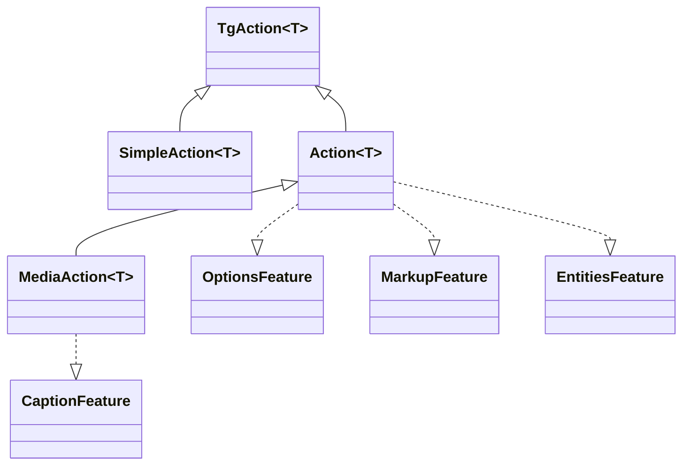

---
---
title: Actions
---

### All requests is Actions
تمام درخواست‌های API تلگرام انواع مختلفی از اینترفیس‌های [`TgAction`](https://vendelieu.github.io/telegram-bot/telegram-bot/eu.vendeli.tgbot.interfaces.action/-tg-action/index.html) هستند که روش‌های متفاوتی مانند [`SendMessageAction`](https://vendelieu.github.io/telegram-bot/telegram-bot/eu.vendeli.tgbot.api.message/-send-message-action/index.html) را پیاده‌سازی می‌کنند، <br/>که به‌صورت توابعی با نوع [`message()`](https://vendelieu.github.io/telegram-bot/telegram-bot/eu.vendeli.tgbot.api.message/message.html) برای راحتی رابط کتابخانه بسته‌بندی شده‌اند.




هر `Action` ممکن است متدهای خاص خود را داشته باشد، بسته به [`Feature`](https://vendelieu.github.io/telegram-bot/telegram-bot/eu.vendeli.tgbot.interfaces.features/-feature/index.html) موجود.

### Features

اقدامات مختلف ممکن است بسته به Telegram Bot Api دارای [`Features`](https://vendelieu.github.io/telegram-bot/telegram-bot/eu.vendeli.tgbot.interfaces.features/-feature/index.html) متفاوتی باشند، از جمله:
[`OptionsFeature`](https://vendelieu.github.io/telegram-bot/telegram-bot/eu.vendeli.tgbot.interfaces.features/-options-feature/index.html)،
[`MarkupFeature`](https://vendelieu.github.io/telegram-bot/telegram-bot/eu.vendeli.tgbot.interfaces.features/-markup-feature/index.html)
[`EntitiesFeature`](https://vendelieu.github.io/telegram-bot/telegram-bot/eu.vendeli.tgbot.interfaces.features/-entities-feature/index.html)
[`CaptionFeature`](https://vendelieu.github.io/telegram-bot/telegram-bot/eu.vendeli.tgbot.interfaces.features/-caption-feature/index.html).

بیایید نگاهی دقیق‌تر به آنها بیندازیم:

### Options
به عنوان مثال، [`OptionsFeature`](https://vendelieu.github.io/telegram-bot/telegram-bot/eu.vendeli.tgbot.interfaces.features/-options-feature/index.html) برای ارسال پارامترهای اختیاری استفاده می‌شود.

هر عمل نوع خاص خود از گزینه‌ها را دارد که می‌توانید آن را در خود `Action` در پارامتر `options` در بخش properties مشاهده کنید. <br/>به عنوان مثال، `sendMessage` شامل یک کلاس داده‌ای [`MessageOptions`](https://vendelieu.github.io/telegram-bot/telegram-bot/eu.vendeli.tgbot.types.options/-message-options/index.html) با پارامترهای مختلف به‌عنوان گزینه‌ها است.

مثال استفاده:

```kotlin
message{ "*Test*" }.options {
    parseMode = ParseMode.Markdown
}.send(user, bot)
```
### Markup

همچنین روشی برای ارسال markupها وجود دارد که تمام انواع [keyboards](https://vendelieu.github.io/telegram-bot/telegram-bot/eu.vendeli.tgbot.interfaces.marker/-keyboard/index.html) را پشتیبانی می‌کند: <br/>[`ReplyKeyboardMarkup`](https://vendelieu.github.io/telegram-bot/telegram-bot/eu.vendeli.tgbot.types.keyboard/-reply-keyboard-markup/index.html)، [`InlineKeyboardMarkup`](https://vendelieu.github.io/telegram-bot/telegram-bot/eu.vendeli.tgbot.types.keyboard/-inline-keyboard-markup/index.html)، [`ForceReply`](https://vendelieu.github.io/telegram-bot/telegram-bot/eu.vendeli.tgbot.types.keyboard/-force-reply/index.html)، [`ReplyKeyboardRemove`](https://vendelieu.github.io/telegram-bot/telegram-bot/eu.vendeli.tgbot.types.keyboard/-reply-keyboard-remove/index.html).

#### Inline Keyboard Markup

این builder به شما امکان می‌دهد دکمه‌های اینلاین را با ترکیبی از پارامترها بسازید.

```kotlin
message{ "Test" }.inlineKeyboardMarkup {
    "name" callback "callbackData"         //
    "buttonName" url "https://google.com"  //--- این دو دکمه در یک ردیف خواهند بود.
    newLine() // یا br()
    "otherButton" webAppInfo "data"       // این در ردیف دیگر خواهد بود

    // می‌توانید سبک متفاوتی را داخل builder استفاده کنید:
    callbackData("buttonName") { "callbackData" }
}.send(user, bot)

```

جزئیات بیشتر می‌توان در [مستندات builder](https://vendelieu.github.io/telegram-bot/telegram-bot/eu.vendeli.tgbot.utils.builders/-inline-keyboard-markup-builder/index.html) مشاهده کرد.

#### Reply Keyboard Markup

این builder به شما امکان می‌دهد دکمه‌های منو را بسازید.

```kotlin
message{ "Test" }.replyKeyboardMarkup {
  + "Menu button"     // می‌توانید دکمه‌ها را با عملگر افزایشی (unary plus) اضافه کنید
  + "Menu button 2"
  br() // رفتن به ردیف دوم
  "Send polls 👀" requestPoll true   // دکمه با پارامتر

  options {
    resizeKeyboard = true
  }
}.send(user, bot)
```

گزینه‌های اضافی قابل اعمال بر کیبورد را می‌توانید در [`ReplyKeyboardMarkupOptions`](https://vendelieu.github.io/telegram-bot/telegram-bot/eu.vendeli.tgbot.types.options/-reply-keyboard-markup-options/index.html) بیابید.

برای جزئیات بیشتر درباره متدها به [مستندات builder](https://vendelieu.github.io/telegram-bot/telegram-bot/eu.vendeli.tgbot.utils.builders/-reply-keyboard-markup-builder/index.html) مراجعه کنید.

معمولاً استفاده از dsl برای جمع‌آوری markupهای کیبورد راحت‌تر است، اما در صورت نیاز می‌توانید markup را به صورت دستی نیز اضافه کنید.

```kotlin
message{ "*Test*" }.markup {
    InlineKeyboardMarkup(
        InlineKeyboardButton("test", callbackData = "testCallback")
    )
}.send(user, bot)

```

```kotlin
message{ "*Test*" }.markup {
    ReplyKeyboardMarkup(
        KeyboardButton("Test menu button")
    )
}.send(user, bot)
```

### Entities
همچنین روشی برای ارسال [`MessageEntity`](https://vendelieu.github.io/telegram-bot/telegram-bot/eu.vendeli.tgbot.types.msg/-message-entity/index.html) وجود دارد.

مثال استفاده:

```kotlin
message{ "Test \$hello" }.replyKeyboardMarkup {
    +"Test menu button"
}.entities {
    5 to 15 url "https://google.com" // افزودن TextLink
    entity(EntityType.Bold, 0, 4)
    entity(EntityType.Cashtag, 5, 5) // بک‌اسلش شمارش نمی‌شود (به‌دلیل استفاده در کامپایلر)
}.send(user, bot)
```

#### Contextual entities.

Entityها می‌توانند از طریق زمینه برخی ساختارها نیز اضافه شوند؛ آن‌ها توسط اینترفیس خاصی به نام [EntitiesContextBuilder](https://vendelieu.github.io/telegram-bot/telegram-bot/eu.vendeli.tgbot.utils.builders/-entities-ctx-builder/index.html) برچسب‌گذاری می‌شوند و در ویژگی caption نیز حضور دارند.

مثال استفاده:

```kotlin
message { "usual text " - bold { "this is bold text" } - " continue usual" }.send(user, bot)
```

تمام انواع [entity types](https://vendelieu.github.io/telegram-bot/telegram-bot/eu.vendeli.tgbot.types.msg/-entity-type/index.html) پشتیبانی می‌شوند.

### Caption
همچنین می‌توانید با متد `caption` برای فایل‌های مدیا کپشن اضافه کنید.

مثال استفاده:

```kotlin
photo { "FILE_ID" }.caption { "Test caption" }.send(user, bot)
```


### See also

* [Bot context](Bot-Context.md)
* [FSM | Conversation handling](FSM-and-Conversation-handling.md)

---