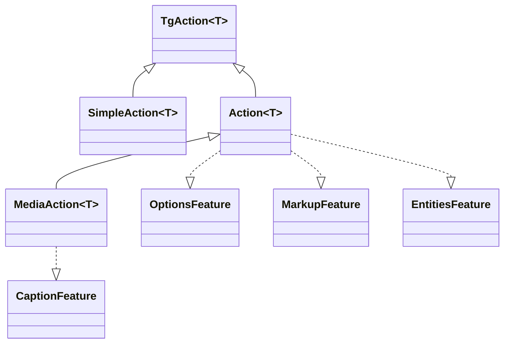

---
---
title: Actions
---

### All requests is Actions
Semua permintaan API telegram adalah berbagai jenis antarmuka [`TgAction`](https://vendelieu.github.io/telegram-bot/telegram-bot/eu.vendeli.tgbot.interfaces.action/-tg-action/index.html) yang mengimplementasikan metode‑metode berbeda seperti [`SendMessageAction`](https://vendelieu.github.io/telegram-bot/telegram-bot/eu.vendeli.tgbot.api.message/-send-message-action/index.html), <br/>yang dibungkus dalam bentuk fungsi tipe [`message()`](https://vendelieu.github.io/telegram-bot/telegram-bot/eu.vendeli.tgbot.api.message/message.html) untuk kemudahan penggunaan antarmuka perpustakaan.




Setiap `Action` dapat memiliki metode‑metode yang tersedia, tergantung pada [`Feature`](https://vendelieu.github.io/telegram-bot/telegram-bot/eu.vendeli.tgbot.interfaces.features/-feature/index.html) yang ada.

### Features

Berbagai aksi dapat memiliki [`Features`](https://vendelieu.github.io/telegram-bot/telegram-bot/eu.vendeli.tgbot.interfaces.features/-feature/index.html) yang berbeda tergantung pada Telegram Bot Api, seperti:
[`OptionsFeature`](https://vendelieu.github.io/telegram-bot/telegram-bot/eu.vendeli.tgbot.interfaces.features/-options-feature/index.html),
[`MarkupFeature`](https://vendelieu.github.io/telegram-bot/telegram-bot/eu.vendeli.tgbot.interfaces.features/-markup-feature/index.html)
[`EntitiesFeature`](https://vendelieu.github.io/telegram-bot/telegram-bot/eu.vendeli.tgbot.interfaces.features/-entities-feature/index.html)
[`CaptionFeature`](https://vendelieu.github.io/telegram-bot/telegram-bot/eu.vendeli.tgbot.interfaces.features/-caption-feature/index.html).

Mari kita lihat lebih dekat.

### Options
Sebagai contoh, [`OptionsFeature`](https://vendelieu.github.io/telegram-bot/telegram-bot/eu.vendeli.tgbot.interfaces.features/-options-feature/index.html) digunakan untuk melewatkan parameter opsional.

Setiap aksi memiliki tipe opsi masing‑masing; Anda dapat melihatnya pada `Action` itu sendiri di parameter `options`, pada bagian properti. <br/>Sebagai contoh, `sendMessage` yang berisi kelas data [`MessageOptions`](https://vendelieu.github.io/telegram-bot/telegram-bot/eu.vendeli.tgbot.types.options/-message-options/index.html) dengan berbagai parameter sebagai opsi.

Contoh penggunaan:

```kotlin
message{ "*Test*" }.options {
    parseMode = ParseMode.Markdown
}.send(user, bot)
```
### Markup

Ada pula metode untuk mengirim markup yang mendukung semua jenis [keyboard](https://vendelieu.github.io/telegram-bot/telegram-bot/eu.vendeli.tgbot.interfaces.marker/-keyboard/index.html): <br/>[`ReplyKeyboardMarkup`](https://vendelieu.github.io/telegram-bot/telegram-bot/eu.vendeli.tgbot.types.keyboard/-reply-keyboard-markup/index.html), [`InlineKeyboardMarkup`](https://vendelieu.github.io/telegram-bot/telegram-bot/eu.vendeli.tgbot.types.keyboard/-inline-keyboard-markup/index.html), [`ForceReply`](https://vendelieu.github.io/telegram-bot/telegram-bot/eu.vendeli.tgbot.types.keyboard/-force-reply/index.html), [`ReplyKeyboardRemove`](https://vendelieu.github.io/telegram-bot/telegram-bot/eu.vendeli.tgbot.types.keyboard/-reply-keyboard-remove/index.html).

#### Inline Keyboard Markup

Builder ini memungkinkan Anda membuat tombol inline dengan kombinasi parameter apa pun.

```kotlin
message{ "Test" }.inlineKeyboardMarkup {
    "name" callback "callbackData"         //
    "buttonName" url "https://google.com"  //--- these two buttons will be in the same row.
    newLine() // or br()
    "otherButton" webAppInfo "data"       // this will be in other row

    // you can also use a different style within the builder:
    callbackData("buttonName") { "callbackData" }
}.send(user, bot)

```

Detail lebih lanjut dapat dilihat pada [dokumentasi builder](https://vendelieu.github.io/telegram-bot/telegram-bot/eu.vendeli.tgbot.utils.builders/-inline-keyboard-markup-builder/index.html).

#### Reply Keyboard Markup

Builder ini memungkinkan Anda membuat tombol menu.

```kotlin
message{ "Test" }.replyKeyboardMarkup {
  + "Menu button"     // you can add buttons by using unary plus operator
  + "Menu button 2"
  br() // go to second row
  "Send polls 👀" requestPoll true   // button with parameter

  options {
    resizeKeyboard = true
  }
}.send(user, bot)
```

Opsi tambahan yang berlaku untuk keyboard dapat dilihat pada [`ReplyKeyboardMarkupOptions`](https://vendelieu.github.io/telegram-bot/telegram-bot/eu.vendeli.tgbot.types.options/-reply-keyboard-markup-options/index.html).

Lihat [dokumentasi builder](https://vendelieu.github.io/telegram-bot/telegram-bot/eu.vendeli.tgbot.utils.builders/-reply-keyboard-markup-builder/index.html) untuk detail lebih lanjut tentang metode‑metodenya.

Biasanya lebih nyaman menggunakan DSL untuk mengumpulkan markup keyboard, tetapi bila diperlukan, Anda juga dapat menambahkan markup secara manual.

```kotlin
message{ "*Test*" }.markup {
    InlineKeyboardMarkup(
        InlineKeyboardButton("test", callbackData = "testCallback")
    )
}.send(user, bot)

```

```kotlin
message{ "*Test*" }.markup {
    ReplyKeyboardMarkup(
        KeyboardButton("Test menu button")
    )
}.send(user, bot)
```

### Entities
Ada juga metode untuk mengirim [`MessageEntity`](https://vendelieu.github.io/telegram-bot/telegram-bot/eu.vendeli.tgbot.types.msg/-message-entity/index.html).

Contoh penggunaan:

```kotlin
message{ "Test \$hello" }.replyKeyboardMarkup {
    +"Test menu button"
}.entities {
    5 to 15 url "https://google.com" // add TextLink
    entity(EntityType.Bold, 0, 4)
    entity(EntityType.Cashtag, 5, 5) // backslash doesn't count (because it's used for compiler)
}.send(user, bot)
```

#### Contextual entities.

Entitas juga dapat ditambahkan melalui konteks beberapa konstruk, yang ditandai dengan antarmuka [EntitiesContextBuilder](https://vendelieu.github.io/telegram-bot/telegram-bot/eu.vendeli.tgbot.utils.builders/-entities-ctx-builder/index.html), dan juga hadir pada fitur caption.

Contoh penggunaan:

```kotlin
message { "usual text " - bold { "this is bold text" } - " continue usual" }.send(user, bot)
```

Semua jenis [entity types](https://vendelieu.github.io/telegram-bot/telegram-bot/eu.vendeli.tgbot.types.msg/-entity-type/index.html) didukung.

### Caption
Selain itu, metode `caption` dapat digunakan untuk menambahkan keterangan pada berkas media.

Contoh penggunaan:

```kotlin
photo { "FILE_ID" }.caption { "Test caption" }.send(user, bot)
```


### See also

* [Bot context](Bot-Context.md)
* [FSM | Conversation handling](FSM-and-Conversation-handling.md)

---