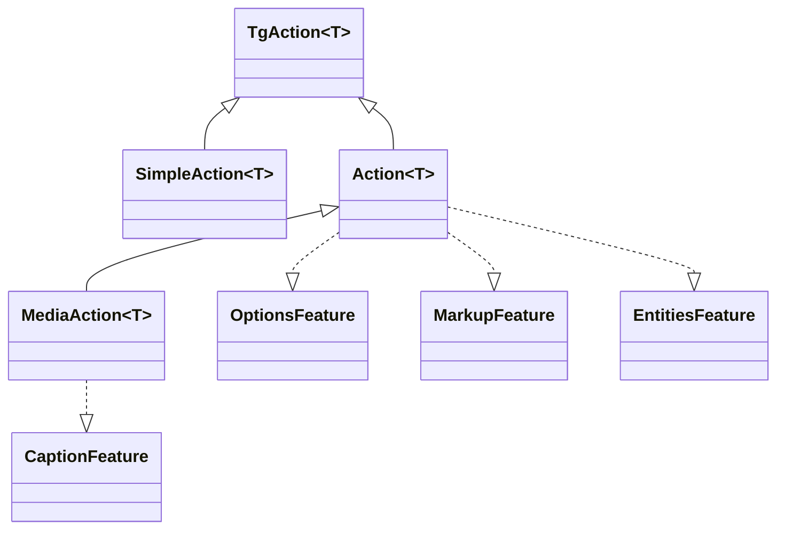

---
---
title: Actions
---

### All requests is Actions
Todas as solicitações da API do telegram são vários tipos de interfaces [`TgAction`](https://vendelieu.github.io/telegram-bot/telegram-bot/eu.vendeli.tgbot.interfaces.action/-tg-action/index.html) que implementam diferentes métodos, como [`SendMessageAction`](https://vendelieu.github.io/telegram-bot/telegram-bot/eu.vendeli.tgbot.api.message/-send-message-action/index.html), <br/>as quais são encapsuladas na forma de funções do tipo [`message()`](https://vendelieu.github.io/telegram-bot/telegram-bot/eu.vendeli.tgbot.api.message/message.html) para conveniência da interface da biblioteca.




Cada `Action` pode ter seus próprios métodos possíveis, dependendo do [`Feature`](https://vendelieu.github.io/telegram-bot/telegram-bot/eu.vendeli.tgbot.interfaces.features/-feature/index.html) disponível.

### Features

Ações diferentes podem ter diferentes [`Features`](https://vendelieu.github.io/telegram-bot/telegram-bot/eu.vendeli.tgbot.interfaces.features/-feature/index.html) dependendo da Telegram Bot Api, tais como:
[`OptionsFeature`](https://vendelieu.github.io/telegram-bot/telegram-bot/eu.vendeli.tgbot.interfaces.features/-options-feature/index.html),
[`MarkupFeature`](https://vendelieu.github.io/telegram-bot/telegram-bot/eu.vendeli.tgbot.interfaces.features/-markup-feature/index.html)
[`EntitiesFeature`](https://vendelieu.github.io/telegram-bot/telegram-bot/eu.vendeli.tgbot.interfaces.features/-entities-feature/index.html)
[`CaptionFeature`](https://vendelieu.github.io/telegram-bot/telegram-bot/eu.vendeli.tgbot.interfaces.features/-caption-feature/index.html).

Vamos analisar cada uma delas com mais detalhes:

### Options
Por exemplo, [`OptionsFeature`](https://vendelieu.github.io/telegram-bot/telegram-bot/eu.vendeli.tgbot.interfaces.features/-options-feature/index.html) é usada para passar parâmetros opcionais.

Cada ação tem seu próprio tipo de opções, que podem ser vistas no próprio `Action` no parâmetro `options`, na seção de propriedades. <br/>Por exemplo, `sendMessage` contém uma data class [`MessageOptions`](https://vendelieu.github.io/telegram-bot/telegram-bot/eu.vendeli.tgbot.types.options/-message-options/index.html) com diferentes parâmetros como opções.

Example usage:

```kotlin
message{ "*Test*" }.options {
    parseMode = ParseMode.Markdown
}.send(user, bot)
```
### Markup

Existe também um método para enviar marcações que oferece suporte a todos os tipos de [keyboards](https://vendelieu.github.io/telegram-bot/telegram-bot/eu.vendeli.tgbot.interfaces.marker/-keyboard/index.html): <br/>[`ReplyKeyboardMarkup`](https://vendelieu.github.io/telegram-bot/telegram-bot/eu.vendeli.tgbot.types.keyboard/-reply-keyboard-markup/index.html), [`InlineKeyboardMarkup`](https://vendelieu.github.io/telegram-bot/telegram-bot/eu.vendeli.tgbot.types.keyboard/-inline-keyboard-markup/index.html), [`ForceReply`](https://vendelieu.github.io/telegram-bot/telegram-bot/eu.vendeli.tgbot.types.keyboard/-force-reply/index.html), [`ReplyKeyboardRemove`](https://vendelieu.github.io/telegram-bot/telegram-bot/eu.vendeli.tgbot.types.keyboard/-reply-keyboard-remove/index.html).

#### Inline Keyboard Markup

Este construtor permite criar botões inline com qualquer combinação de parâmetros.

```kotlin
message{ "Test" }.inlineKeyboardMarkup {
    "name" callback "callbackData"         //
    "buttonName" url "https://google.com"  //--- these two buttons will be in the same row.
    newLine() // or br()
    "otherButton" webAppInfo "data"       // this will be in other row

    // you can also use a different style within the builder:
    callbackData("buttonName") { "callbackData" }
}.send(user, bot)

```

Mais detalhes podem ser vistos na [documentação do construtor](https://vendelieu.github.io/telegram-bot/telegram-bot/eu.vendeli.tgbot.utils.builders/-inline-keyboard-markup-builder/index.html).

#### Reply Keyboard Markup

Este construtor permite criar botões de menu.

```kotlin
message{ "Test" }.replyKeyboardMarkup {
  + "Menu button"     // you can add buttons by using unary plus operator
  + "Menu button 2"
  br() // go to second row
  "Send polls 👀" requestPoll true   // button with parameter

  options {
    resizeKeyboard = true
  }
}.send(user, bot)
```

Opções adicionais aplicáveis ao teclado podem ser vistas em [`ReplyKeyboardMarkupOptions`](https://vendelieu.github.io/telegram-bot/telegram-bot/eu.vendeli.tgbot.types.options/-reply-keyboard-markup-options/index.html).

Veja a [documentação do construtor](https://vendelieu.github.io/telegram-bot/telegram-bot/eu.vendeli.tgbot.utils.builders/-reply-keyboard-markup-builder/index.html) para mais detalhes sobre os métodos.

É principalmente conveniente usar DSL para coletar marcações de teclado, mas, se necessário, você também pode adicionar marcações manualmente.

```kotlin
message{ "*Test*" }.markup {
    InlineKeyboardMarkup(
        InlineKeyboardButton("test", callbackData = "testCallback")
    )
}.send(user, bot)

```

```kotlin
message{ "*Test*" }.markup {
    ReplyKeyboardMarkup(
        KeyboardButton("Test menu button")
    )
}.send(user, bot)
```

### Entities
Também existe um método para enviar [`MessageEntity`](https://vendelieu.github.io/telegram-bot/telegram-bot/eu.vendeli.tgbot.types.msg/-message-entity/index.html).

Example usage:

```kotlin
message{ "Test \$hello" }.replyKeyboardMarkup {
    +"Test menu button"
}.entities {
    5 to 15 url "https://google.com" // add TextLink
    entity(EntityType.Bold, 0, 4)
    entity(EntityType.Cashtag, 5, 5) // backslash doesn't count (because it's used for compiler)
}.send(user, bot)
```

#### Contextual entities.

Entidades também podem ser adicionadas através do contexto de algumas construções, elas são rotuladas com uma interface específica [EntitiesContextBuilder](https://vendelieu.github.io/telegram-bot/telegram-bot/eu.vendeli.tgbot.utils.builders/-entities-ctx-builder/index.html), que também está presente no recurso de legenda.

Example usage:

```kotlin
message { "usual text " - bold { "this is bold text" } - " continue usual" }.send(user, bot)
```

Todos os tipos de [entity types](https://vendelieu.github.io/telegram-bot/telegram-bot/eu.vendeli.tgbot.types.msg/-entity-type/index.html) são suportados.

### Caption
Além disso, o método `caption` pode ser usado para adicionar legendas a arquivos de mídia.

Example usage:

```kotlin
photo { "FILE_ID" }.caption { "Test caption" }.send(user, bot)
```


### See also

* [Bot context](Bot-Context.md)
* [FSM | Conversation handling](FSM-and-Conversation-handling.md)

---