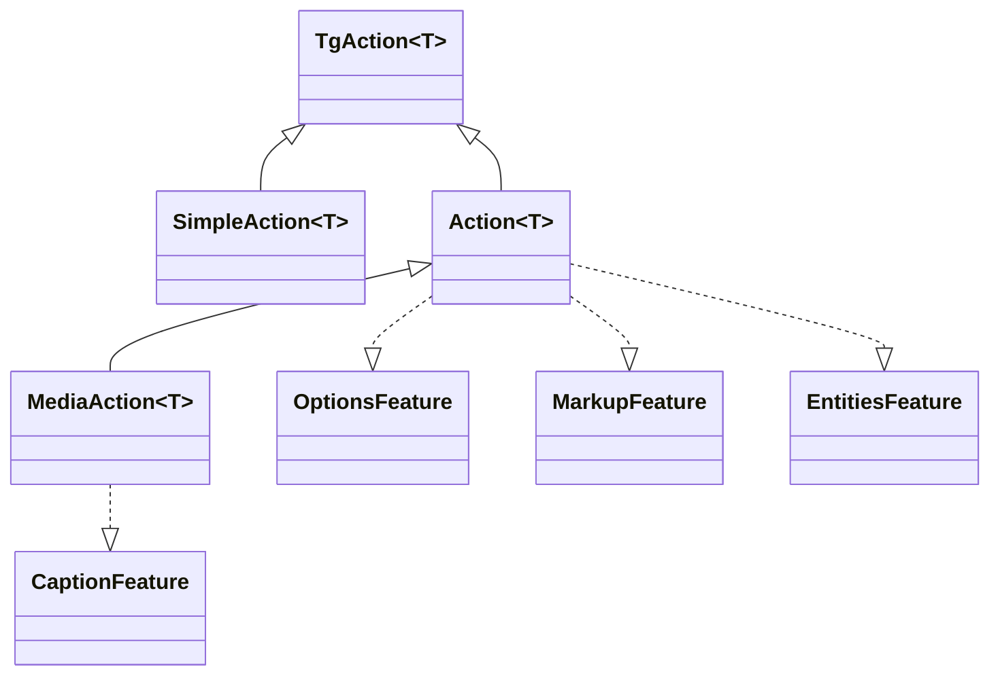

---
---
title: Actions
---

### All requests is Actions
Tất cả các yêu cầu API telegram là các kiểu khác nhau của giao diện [`TgAction`](https://vendelieu.github.io/telegram-bot/telegram-bot/eu.vendeli.tgbot.interfaces.action/-tg-action/index.html) mà triển khai các phương thức khác nhau như [`SendMessageAction`](https://vendelieu.github.io/telegram-bot/telegram-bot/eu.vendeli.tgbot.api.message/-send-message-action/index.html), <br/>được bọc dưới dạng các hàm kiểu [`message()`](https://vendelieu.github.io/telegram-bot/telegram-bot/eu.vendeli.tgbot.api.message/message.html) để tiện lợi cho giao diện thư viện.




Mỗi `Action` có thể có các phương thức khả dụng riêng, tùy thuộc vào [`Feature`](https://vendelieu.github.io/telegram-bot/telegram-bot/eu.vendeli.tgbot.interfaces.features/-feature/index.html) có sẵn.

### Features

Các hành động khác nhau có thể có các [`Features`](https://vendelieu.github.io/telegram-bot/telegram-bot/eu.vendeli.tgbot.interfaces.features/-feature/index.html) khác nhau tùy thuộc vào Telegram Bot Api, chẳng hạn:
[`OptionsFeature`](https://vendelieu.github.io/telegram-bot/telegram-bot/eu.vendeli.tgbot.interfaces.features/-options-feature/index.html),
[`MarkupFeature`](https://vendelieu.github.io/telegram-bot/telegram-bot/eu.vendeli.tgbot.interfaces.features/-markup-feature/index.html)
[`EntitiesFeature`](https://vendelieu.github.io/telegram-bot/telegram-bot/eu.vendeli.tgbot.interfaces.features/-entities-feature/index.html)
[`CaptionFeature`](https://vendelieu.github.io/telegram-bot/telegram-bot/eu.vendeli.tgbot.interfaces.features/-caption-feature/index.html).

Hãy xem xét chi tiết hơn về chúng:

### Options
Ví dụ, [`OptionsFeature`](https://vendelieu.github.io/telegram-bot/telegram-bot/eu.vendeli.tgbot.interfaces.features/-options-feature/index.html) được sử dụng để truyền các tham số tùy chọn.

Mỗi hành động có loại tùy chọn riêng, bạn có thể thấy tương ứng trong chính `Action` trong tham số `options`, ở phần thuộc tính. <br/>Ví dụ, `sendMessage` chứa một lớp dữ liệu [`MessageOptions`](https://vendelieu.github.io/telegram-bot/telegram-bot/eu.vendeli.tgbot.types.options/-message-options/index.html) với các tham số khác nhau dưới dạng tùy chọn.

Ví dụ sử dụng:

```kotlin
message{ "*Test*" }.options {
    parseMode = ParseMode.Markdown
}.send(user, bot)
```
### Markup

Cũng có một phương thức để gửi markup hỗ trợ mọi loại [bàn phím](https://vendelieu.github.io/telegram-bot/telegram-bot/eu.vendeli.tgbot.interfaces.marker/-keyboard/index.html): <br/>[`ReplyKeyboardMarkup`](https://vendelieu.github.io/telegram-bot/telegram-bot/eu.vendeli.tgbot.types.keyboard/-reply-keyboard-markup/index.html), [`InlineKeyboardMarkup`](https://vendelieu.github.io/telegram-bot/telegram-bot/eu.vendeli.tgbot.types.keyboard/-inline-keyboard-markup/index.html), [`ForceReply`](https://vendelieu.github.io/telegram-bot/telegram-bot/eu.vendeli.tgbot.types.keyboard/-force-reply/index.html), [`ReplyKeyboardRemove`](https://vendelieu.github.io/telegram-bot/telegram-bot/eu.vendeli.tgbot.types.keyboard/-reply-keyboard-remove/index.html).

#### Inline Keyboard Markup

Builder này cho phép bạn tạo các nút inline với bất kỳ tổ hợp tham số nào.

```kotlin
message{ "Test" }.inlineKeyboardMarkup {
    "name" callback "callbackData"         //
    "buttonName" url "https://google.com"  //--- these two buttons will be in the same row.
    newLine() // or br()
    "otherButton" webAppInfo "data"       // this will be in other row

    // you can also use a different style within the builder:
    callbackData("buttonName") { "callbackData" }
}.send(user, bot)

```

Chi tiết hơn có thể xem trong [tài liệu builder](https://vendelieu.github.io/telegram-bot/telegram-bot/eu.vendeli.tgbot.utils.builders/-inline-keyboard-markup-builder/index.html).

#### Reply Keyboard Markup

Builder này cho phép bạn tạo các nút menu.

```kotlin
message{ "Test" }.replyKeyboardMarkup {
  + "Menu button"     // you can add buttons by using unary plus operator
  + "Menu button 2"
  br() // go to second row
  "Send polls 👀" requestPoll true   // button with parameter

  options {
    resizeKeyboard = true
  }
}.send(user, bot)
```

Các tùy chọn bổ sung áp dụng cho bàn phím có thể xem trong [`ReplyKeyboardMarkupOptions`](https://vendelieu.github.io/telegram-bot/telegram-bot/eu.vendeli.tgbot.types.options/-reply-keyboard-markup-options/index.html).

Xem [tài liệu builder](https://vendelieu.github.io/telegram-bot/telegram-bot/eu.vendeli.tgbot.utils.builders/-reply-keyboard-markup-builder/index.html) để biết thêm chi tiết về các phương thức.

Thường thì việc sử dụng dsl để thu thập markup bàn phím là thuận tiện, nhưng nếu cần, bạn cũng có thể thêm markup thủ công.

```kotlin
message{ "*Test*" }.markup {
    InlineKeyboardMarkup(
        InlineKeyboardButton("test", callbackData = "testCallback")
    )
}.send(user, bot)

```

```kotlin
message{ "*Test*" }.markup {
    ReplyKeyboardMarkup(
        KeyboardButton("Test menu button")
    )
}.send(user, bot)
```

### Entities
Cũng có một phương thức để gửi [`MessageEntity`](https://vendelieu.github.io/telegram-bot/telegram-bot/eu.vendeli.tgbot.types.msg/-message-entity/index.html).

Ví dụ sử dụng:

```kotlin
message{ "Test \$hello" }.replyKeyboardMarkup {
    +"Test menu button"
}.entities {
    5 to 15 url "https://google.com" // add TextLink
    entity(EntityType.Bold, 0, 4)
    entity(EntityType.Cashtag, 5, 5) // backslash doesn't count (because it's used for compiler)
}.send(user, bot)
```

#### Contextual entities.

Các entity cũng có thể được thêm qua ngữ cảnh của một số cấu trúc, chúng được gắn nhãn bằng một [EntitiesContextBuilder](https://vendelieu.github.io/telegram-bot/telegram-bot/eu.vendeli.tgbot.utils.builders/-entities-ctx-builder/index.html) cụ thể, nó cũng xuất hiện trong tính năng caption.

Ví dụ sử dụng:

```kotlin
message { "usual text " - bold { "this is bold text" } - " continue usual" }.send(user, bot)
```

Tất cả các loại [entity types](https://vendelieu.github.io/telegram-bot/telegram-bot/eu.vendeli.tgbot.types.msg/-entity-type/index.html) đều được hỗ trợ.

### Caption
Ngoài ra, phương thức `caption` có thể được dùng để thêm chú thích vào tệp media.

Ví dụ sử dụng:

```kotlin
photo { "FILE_ID" }.caption { "Test caption" }.send(user, bot)
```


### See also

* [Bot context](Bot-Context.md)
* [FSM | Conversation handling](FSM-and-Conversation-handling.md)

---