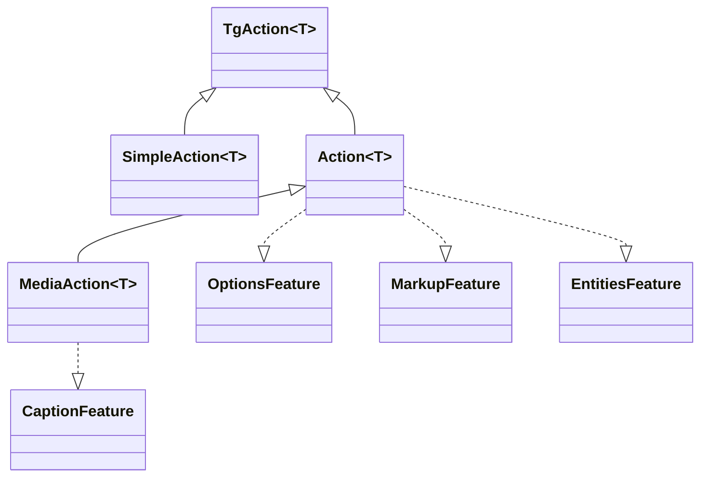

---
---
title: Actions
---

### All requests is Actions
所有 telegram api 请求都是实现不同方法的各种 [`TgAction`](https://vendelieu.github.io/telegram-bot/telegram-bot/eu.vendeli.tgbot.interfaces.action/-tg-action/index.html) 接口，例如 [`SendMessageAction`](https://vendelieu.github.io/telegram-bot/telegram-bot/eu.vendeli.tgbot.api.message/-send-message-action/index.html)，<br/>它们已包装为 [`message()`](https://vendelieu.github.io/telegram-bot/telegram-bot/eu.vendeli.tgbot.api.message/message.html)‑类型函数，以便于库接口的使用。




每个 `Action` 可能拥有其自身的可用方法，这取决于可用的 [`Feature`](https://vendelieu.github.io/telegram-bot/telegram-bot/eu.vendeli.tgbot.interfaces.features/-feature/index.html)。

### Features

不同的 action 可能拥有不同的 [`Features`](https://vendelieu.github.io/telegram-bot/telegram-bot/eu.vendeli.tgbot.interfaces.features/-feature/index.html)，这取决于 Telegram Bot Api，例如：[`OptionsFeature`](https://vendelieu.github.io/telegram-bot/telegram-bot/eu.vendeli.tgbot.interfaces.features/-options-feature/index.html)，[`MarkupFeature`](https://vendelieu.github.io/telegram-bot/telegram-bot/eu.vendeli.tgbot.interfaces.features/-markup-feature/index.html) [`EntitiesFeature`](https://vendelieu.github.io/telegram-bot/telegram-bot/eu.vendeli.tgbot.interfaces.features/-entities-feature/index.html) [`CaptionFeature`](https://vendelieu.github.io/telegram-bot/telegram-bot/eu.vendeli.tgbot.interfaces.features/-caption-feature/index.html)。

让我们更仔细地看看它们：

### Options
例如，[`OptionsFeature`](https://vendelieu.github.io/telegram-bot/telegram-bot/eu.vendeli.tgbot.interfaces.features/-options-feature/index.html) 用于传递可选参数。

每个 action 都有其自己的选项类型，您可以在 `Action` 本身的 `options` 参数的属性部分看到相应的内容。<br/>例如，`sendMessage` 包含一个 [`MessageOptions`](https://vendelieu.github.io/telegram-bot/telegram-bot/eu.vendeli.tgbot.types.options/-message-options/index.html) 数据类，其中的不同参数作为选项使用。

示例用法：

```kotlin
message{ "*Test*" }.options {
    parseMode = ParseMode.Markdown
}.send(user, bot)
```
### Markup

同样还有一个用于发送标记的方式，支持所有类型的 [keyboards](https://vendelieu.github.io/telegram-bot/telegram-bot/eu.vendeli.tgbot.interfaces.marker/-keyboard/index.html)：<br/>[`ReplyKeyboardMarkup`](https://vendelieu.github.io/telegram-bot/telegram-bot/eu.vendeli.tgbot.types.keyboard/-reply-keyboard-markup/index.html)，[`InlineKeyboardMarkup`](https://vendelieu.github.io/telegram-bot/telegram-bot/eu.vendeli.tgbot.types.keyboard/-inline-keyboard-markup/index.html)，[`ForceReply`](https://vendelieu.github.io/telegram-bot/telegram-bot/eu.vendeli.tgbot.types.keyboard/-force-reply/index.html)，[`ReplyKeyboardRemove`](https://vendelieu.github.io/telegram-bot/telegram-bot/eu.vendeli.tgbot.types.keyboard/-reply-keyboard-remove/index.html)。

#### Inline Keyboard Markup

此构造器允许您使用任意组合的参数创建内联按钮。

```kotlin
message{ "Test" }.inlineKeyboardMarkup {
    "name" callback "callbackData"         //
    "buttonName" url "https://google.com"  //--- 这两个按钮将在同一行。
    newLine() // or br()
    "otherButton" webAppInfo "data"       // 这将出现在另一行

    // 也可以在构造器内部使用不同的写法：
    callbackData("buttonName") { "callbackData" }
}.send(user, bot)

```

更多细节请参见构造器[文档](https://vendelieu.github.io/telegram-bot/telegram-bot/eu.vendeli.tgbot.utils.builders/-inline-keyboard-markup-builder/index.html)。

#### Reply Keyboard Markup

此构造器允许您创建菜单按钮。

```kotlin
message{ "Test" }.replyKeyboardMarkup {
  + "Menu button"     // 通过一元加号运算符添加按钮
  + "Menu button 2"
  br() // 换到第二行
  "Send polls 👀" requestPoll true   // 带参数的按钮

  options {
    resizeKeyboard = true
  }
}.send(user, bot)
```

键盘的其他可用选项请参见 [`ReplyKeyboardMarkupOptions`](https://vendelieu.github.io/telegram-bot/telegram-bot/eu.vendeli.tgbot.types.options/-reply-keyboard-markup-options/index.html)。

请查看构造器[文档](https://vendelieu.github.io/telegram-bot/telegram-bot/eu.vendeli.tgbot.utils.builders/-reply-keyboard-markup-builder/index.html)以获取关于方法的更多细节。

使用 DSL 收集键盘标记最为方便，但如有需要，也可以手动添加标记。

```kotlin
message{ "*Test*" }.markup {
    InlineKeyboardMarkup(
        InlineKeyboardButton("test", callbackData = "testCallback")
    )
}.send(user, bot)

```

```kotlin
message{ "*Test*" }.markup {
    ReplyKeyboardMarkup(
        KeyboardButton("Test menu button")
    )
}.send(user, bot)
```

### Entities
同样还有一个用于发送 [`MessageEntity`](https://vendelieu.github.io/telegram-bot/telegram-bot/eu.vendeli.tgbot.types.msg/-message-entity/index.html) 的方法。

示例用法：

```kotlin
message{ "Test \$hello" }.replyKeyboardMarkup {
    +"Test menu button"
}.entities {
    5 to 15 url "https://google.com" // 添加 TextLink
    entity(EntityType.Bold, 0, 4)
    entity(EntityType.Cashtag, 5, 5) // 反斜杠不计入（因为它用于编译器）
}.send(user, bot)
```

#### Contextual entities.

实体也可以通过某些构造的上下文添加，它们由特定的 [EntitiesContextBuilder](https://vendelieu.github.io/telegram-bot/telegram-bot/eu.vendeli.tgbot.utils.builders/-entities-ctx-builder/index.html) 接口标记，也出现在 caption 功能中。

示例用法：

```kotlin
message { "usual text " - bold { "this is bold text" } - " continue usual" }.send(user, bot)
```

支持所有种类的 [entity types](https://vendelieu.github.io/telegram-bot/telegram-bot/eu.vendeli.tgbot.types.msg/-entity-type/index.html)。

### Caption
此外，`caption` 方法可用于为媒体文件添加字幕。

示例用法：

```kotlin
photo { "FILE_ID" }.caption { "Test caption" }.send(user, bot)
```


### See also

* [Bot context](Bot-Context.md)
* [FSM | Conversation handling](FSM-and-Conversation-handling.md)

---