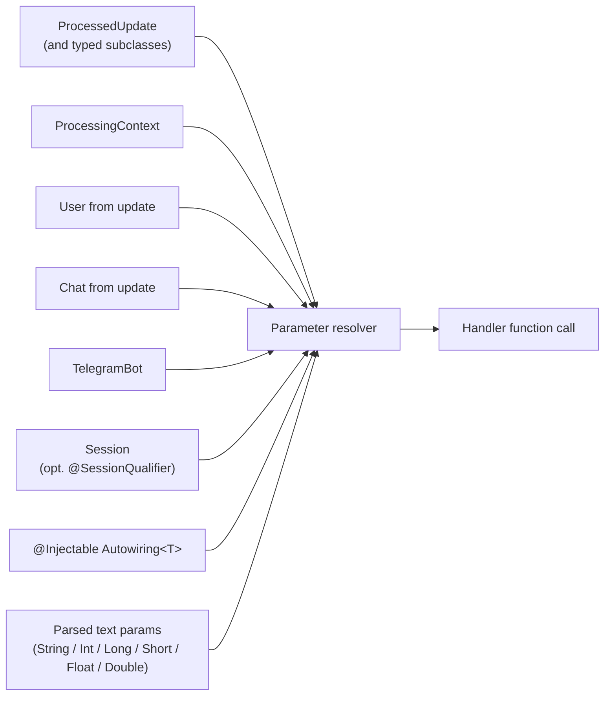

---
---
title: Activity Invocation
---

در هنگام فراخوانی فعالیت، امکان عبور زمینه (context) ربات وجود دارد، زیرا به‌صورت پارامتر در توابع هدف اعلام شده است. 

پارامترهایی که می‌توانند عبور داده شوند عبارتند از: 

* [`ProcessedUpdate`](https://vendelieu.github.io/telegram-bot/telegram-bot/eu.vendeli.tgbot.types.component/-processed-update/index.html) (و تمام زیرکلاس‌های آن، مانند `MessageUpdate`، `CallbackQueryUpdate`، …) - به‌روزرسانی جاری پردازش‌شده.
* [`ProcessingContext`](https://vendelieu.github.io/telegram-bot/telegram-bot/eu.vendeli.tgbot.types.component/-processing-context/index.html) - زمینه سطح پایین مدیریت فعالیت.
* [`User`](https://vendelieu.github.io/telegram-bot/telegram-bot/eu.vendeli.tgbot.types/-user/index.html) - در صورت موجود بودن.
* [`Chat`](https://vendelieu.github.io/telegram-bot/telegram-bot/eu.vendeli.tgbot.types.chat/-chat/index.html) - در صورت موجود بودن.
* [`TelegramBot`](https://vendelieu.github.io/telegram-bot/telegram-bot/eu.vendeli.tgbot/-telegram-bot/index.html) - نمونه فعلی ربات.
* [`Session`](https://vendelieu.github.io/telegram-bot/telegram-bot/eu.vendeli.tgbot.interfaces.session/-session/index.html) *(اضافه شده در نسخه 9.5)* - جلسه برای چت/کاربر فعلی. پارامتر را با [`@SessionQualifier("name")`](https://vendelieu.github.io/telegram-bot/telegram-bot/eu.vendeli.tgbot.annotations/-session-qualifier/index.html) علامت‌گذاری کنید تا یک جلسه نام‌دار مستقل تزریق شود. مقاله [Sessions] را ببینید (Sessions.md).

همچنین می‌توان یک نوع سفارشی برای عبور اضافه کرد. 

برای این کار، کلاسی که `Autowiring<T>` را پیاده‌سازی می‌کند اضافه کنید و آن را با حاشیه‌نویسی [`@Injectable`](https://vendelieu.github.io/telegram-bot/telegram-bot/eu.vendeli.tgbot.annotations/-injectable/index.html) علامت‌گذاری کنید. 

پس از پیاده‌سازی رابط `Autowiring` - `T` برای عبور در توابع هدف در دسترس خواهد بود و از طریق روشی که در رابط توضیح داده شده است، دریافت می‌شود. 

```kotlin
@Injectable
object UserResolver : Autowiring<UserRecord> {
    override suspend fun get(update: ProcessedUpdate, bot: TelegramBot): UserRecord? {
        return userRepository.getUserByTgId(update.user.id)
    }
}
```


پارامترهای دیگر اعلام‌شده در توابع **در پارامترهای تجزیه‌شده جستجو** می‌شوند. 

علاوه بر این، پارامترهای تجزیه‌شده هنگام عبور می‌توانند به برخی انواع تبدیل شوند؛ در ادامه فهرست آن‌ها آورده شده است: 

- `String`
- `Integer`
- `Long`
- `Short`
- `Float`
- `Double`

همچنین توجه داشته باشید که اگر پارامترها اعلام شده باشند ولی موجود نباشند (در پارامترهای تجزیه‌شده یا مثلاً `User` در `Update` موجود نباشد) یا نوع اعلام‌شده با پارامتر دریافت‌شده در تابع منطبق نباشد، **`null`** عبور داده می‌شود، پس مراقب باشید.

در مجموع، در ادامه نمونه‌ای از نحوه تشکیل پارامترهای تابع آورده شده است:



<p align="center">
  
</p>

### See also

* [Update parsing](Update-parsing.md)
* [Activities & Processors](Activites-and-Processors.md)
---