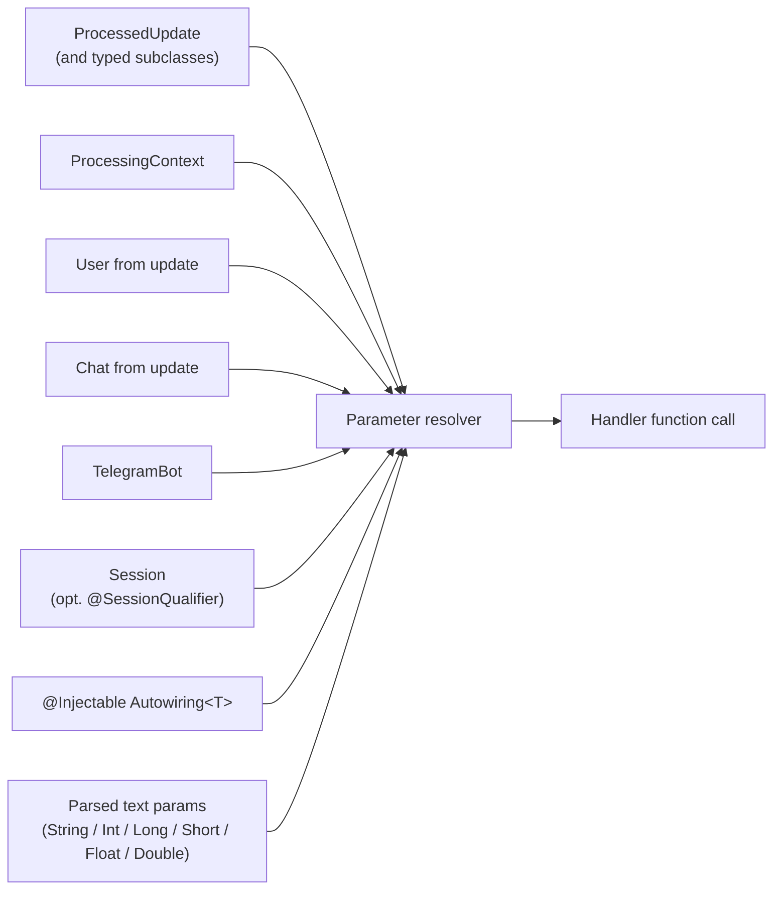

---
---
title: Activity Invocation
---

Durante a invocação de atividades, é possível passar o contexto do bot, pois ele é declarado como parâmetro nas funções alvo. 

Os parâmetros que podem ser passados são: 

* [`ProcessedUpdate`](https://vendelieu.github.io/telegram-bot/telegram-bot/eu.vendeli.tgbot.types.component/-processed-update/index.html) (e todas as suas subclasses, por exemplo `MessageUpdate`, `CallbackQueryUpdate`, …) - atualização de processamento atual.
* [`ProcessingContext`](https://vendelieu.github.io/telegram-bot/telegram-bot/eu.vendeli.tgbot.types.component/-processing-context/index.html) - contexto de baixo nível do manuseio da atividade.
* [`User`](https://vendelieu.github.io/telegram-bot/telegram-bot/eu.vendeli.tgbot.types/-user/index.html) - se presente.
* [`Chat`](https://vendelieu.github.io/telegram-bot/telegram-bot/eu.vendeli.tgbot.types.chat/-chat/index.html) - se presente.
* [`TelegramBot`](https://vendelieu.github.io/telegram-bot/telegram-bot/eu.vendeli.tgbot/-telegram-bot/index.html) - instância atual do bot.
* [`Session`](https://vendelieu.github.io/telegram-bot/telegram-bot/eu.vendeli.tgbot.interfaces.session/-session/index.html) *(adicionado na 9.5)* - sessão para o chat/usuário atual. Anote o parâmetro com [`@SessionQualifier("name")`](https://vendelieu.github.io/telegram-bot/telegram-bot/eu.vendeli.tgbot.annotations/-session-qualifier/index.html) para injetar uma sessão nomeada independente. Veja o artigo [Sessions](Sessions.md).

Também é possível adicionar um tipo personalizado para passagem. 

Para isso, adicione uma classe que implemente [`Autowiring<T>`](https://vendelieu.github.io/telegram-bot/telegram-bot/eu.vendeli.tgbot.interfaces.marker/-autowiring/index.html) e marque-a com a anotação [`@Injectable`](https://vendelieu.github.io/telegram-bot/telegram-bot/eu.vendeli.tgbot.annotations/-injectable/index.html). 

Depois de implementar a interface `Autowiring` – `T` estará disponível para passagem nas funções alvo e será obtido através do método descrito na interface. 

```kotlin
@Injectable
object UserResolver : Autowiring<UserRecord> {
    override suspend fun get(update: ProcessedUpdate, bot: TelegramBot): UserRecord? {
        return userRepository.getUserByTgId(update.user.id)
    }
}
```


Outros parâmetros declarados nas funções serão **procurados** nos parâmetros analisados. 

Além disso, os parâmetros analisados durante a passagem podem ser convertidos para certos tipos, aqui está a lista: 

- `String`
- `Integer`
- `Long`
- `Short`
- `Float`
- `Double`

Além do mais, observe que se os parâmetros forem declarados e estiverem ausentes (ou nos parâmetros analisados ou, por exemplo, `User` estiver ausente em `Update`) ou o tipo declarado não se adequar ao parâmetro recebido na função, **`null`** será passado, portanto tenha cuidado.

Resumindo tudo, abaixo está um exemplo de como os parâmetros de função geralmente são formados:



<p align="center">
  
</p>

### See also

* [Update parsing](Update-parsing.md)
* [Activities & Processors](Activites-and-Processors.md)
---