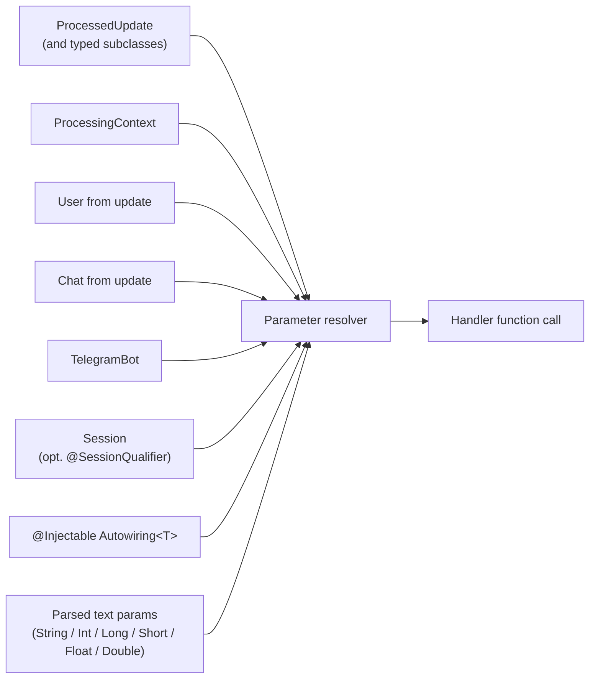

---
---
title: Activity Invocation
---

Во время вызова активности возможно передать контекст бота, так как он объявлен как параметр в целевых функциях. 

Параметры, которые можно передать, следующие: 

* [`ProcessedUpdate`](https://vendelieu.github.io/telegram-bot/telegram-bot/eu.vendeli.tgbot.types.component/-processed-update/index.html) (и все его подклассы, например `MessageUpdate`, `CallbackQueryUpdate`, …) — текущий обрабатываемый апдейт.
* [`ProcessingContext`](https://vendelieu.github.io/telegram-bot/telegram-bot/eu.vendeli.tgbot.types.component/-processing-context/index.html) — низкоуровневый контекст обработки активности.
* [`User`](https://vendelieu.github.io/telegram-bot/telegram-bot/eu.vendeli.tgbot.types/-user/index.html) — если присутствует.
* [`Chat`](https://vendelieu.github.io/telegram-bot/telegram-bot/eu.vendeli.tgbot.types.chat/-chat/index.html) — если присутствует.
* [`TelegramBot`](https://vendelieu.github.io/telegram-bot/telegram-bot/eu.vendeli.tgbot/-telegram-bot/index.html) — текущий экземпляр бота.
* [`Session`](https://vendelieu.github.io/telegram-bot/telegram-bot/eu.vendeli.tgbot.interfaces.session/-session/index.html) *(добавлено в 9.5)* — сессия для текущего чата/пользователя. Аннотируйте параметр с помощью [`@SessionQualifier("name")`](https://vendelieu.github.io/telegram-bot/telegram-bot/eu.vendeli.tgbot.annotations/-session-qualifier/index.html) для внедрения независимой именованной сессии. См. статью [Sessions](Sessions.md).

Также возможно добавить пользовательский тип для передачи. 

Для этого создайте класс, реализующий [`Autowiring<T>`](https://vendelieu.github.io/telegram-bot/telegram-bot/eu.vendeli.tgbot.interfaces.marker/-autowiring/index.html), и пометьте его аннотацией [`@Injectable`](https://vendelieu.github.io/telegram-bot/telegram-bot/eu.vendeli.tgbot.annotations/-injectable/index.html). 

После реализации интерфейса `Autowiring` тип `T` будет доступен для передачи в целевых функциях и будет получен через метод, описанный в интерфейсе. 

```kotlin
@Injectable
object UserResolver : Autowiring<UserRecord> {
    override suspend fun get(update: ProcessedUpdate, bot: TelegramBot): UserRecord? {
        return userRepository.getUserByTgId(update.user.id)
    }
}
```


Другие параметры, объявленные в функциях, будут **поискам** в разобранных параметрах. 

Кроме того, разобранные параметры при передаче могут быть приведены к определённым типам, их список выглядит так: 

- `String`
- `Integer`
- `Long`
- `Short`
- `Float`
- `Double`

Кроме того, обратите внимание, что если параметры объявлены, но отсутствуют (либо в разобранных параметрах, либо, например, `User` отсутствует в `Update`), либо объявленный тип не подходит полученному параметру в функции, **`null`** будет передан, поэтому будьте внимательны.

Подводя итог, ниже приведён пример того, как обычно формируются параметры функции:



<p align="center">
  
</p>

### See also

* [Update parsing](Update-parsing.md)
* [Activities & Processors](Activites-and-Processors.md)
---