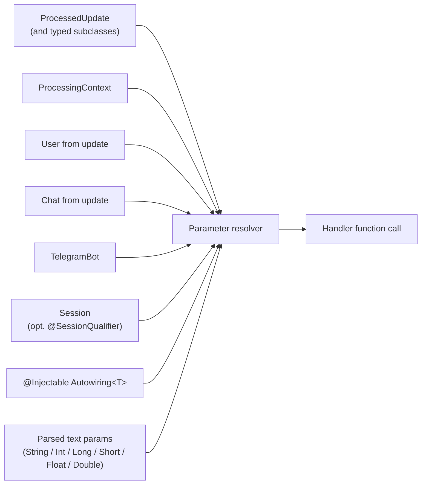

---
---
title: Activity Invocation
---

Trong quá trình gọi activity, có thể truyền ngữ cảnh bot, vì nó được khai báo dưới dạng tham số trong các hàm mục tiêu.

Các tham số có thể được truyền là:

* [`ProcessedUpdate`](https://vendelieu.github.io/telegram-bot/telegram-bot/eu.vendeli.tgbot.types.component/-processed-update/index.html) (và tất cả các lớp con của nó, ví dụ `MessageUpdate`, `CallbackQueryUpdate`, …) - bản cập nhật đang được xử lý.
* [`ProcessingContext`](https://vendelieu.github.io/telegram-bot/telegram-bot/eu.vendeli.tgbot.types.component/-processing-context/index.html) - ngữ cảnh cấp thấp của việc xử lý activity.
* [`User`](https://vendelieu.github.io/telegram-bot/telegram-bot/eu.vendeli.tgbot.types/-user/index.html) - nếu có.
* [`Chat`](https://vendelieu.github.io/telegram-bot/telegram-bot/eu.vendeli.tgbot.types.chat/-chat/index.html) - nếu có.
* [`TelegramBot`](https://vendelieu.github.io/telegram-bot/telegram-bot/eu.vendeli.tgbot/-telegram-bot/index.html) - thể hiện hiện tại của bot.
* [`Session`](https://vendelieu.github.io/telegram-bot/telegram-bot/eu.vendeli.tgbot.interfaces.session/-session/index.html) *(được thêm trong 9.5)* - phiên cho chat/người dùng hiện tại. Ghi chú tham số với [`@SessionQualifier("name")`](https://vendelieu.github.io/telegram-bot/telegram-bot/eu.vendeli.tgbot.annotations/-session-qualifier/index.html) để tiêm một phiên đặt tên độc lập. Xem bài viết [Sessions article](Sessions.md).

Cũng có thể thêm một kiểu tùy chỉnh để truyền.

Để làm điều này, thêm một lớp triển khai [`Autowiring<T>`](https://vendelieu.github.io/telegram-bot/telegram-bot/eu.vendeli.tgbot.interfaces.marker/-autowiring/index.html) và đánh dấu nó bằng annotation [`@Injectable`](https://vendelieu.github.io/telegram-bot/telegram-bot/eu.vendeli.tgbot.annotations/-injectable/index.html).

Sau khi triển khai giao diện `Autowiring` - `T` sẽ khả dụng để truyền trong các hàm mục tiêu và sẽ được lấy thông qua phương pháp mô tả trong giao diện.

```kotlin
@Injectable
object UserResolver : Autowiring<UserRecord> {
    override suspend fun get(update: ProcessedUpdate, bot: TelegramBot): UserRecord? {
        return userRepository.getUserByTgId(update.user.id)
    }
}
```

Các tham số khác được khai báo trong hàm sẽ **được tìm kiếm** trong các tham số đã phân tích.

Thêm vào đó, các tham số đã phân tích khi truyền có thể được ép kiểu sang một số loại cụ thể, danh sách như sau:

- `String`
- `Integer`
- `Long`
- `Short`
- `Float`
- `Double`

Hơn nữa, lưu ý rằng nếu các tham số được khai báo nhưng thiếu (hoặc trong các tham số đã phân tích hoặc ví dụ `User` thiếu trong `Update`) hoặc kiểu khai báo không phù hợp với tham số nhận được trong hàm, **`null`** sẽ được truyền vào, vì vậy hãy cẩn thận.

Tóm lại, dưới đây là một ví dụ về cách các tham số hàm thường được hình thành:



<p align="center">
  
</p>

### See also

* [Update parsing](Update-parsing.md)
* [Activities & Processors](Activites-and-Processors.md)
---