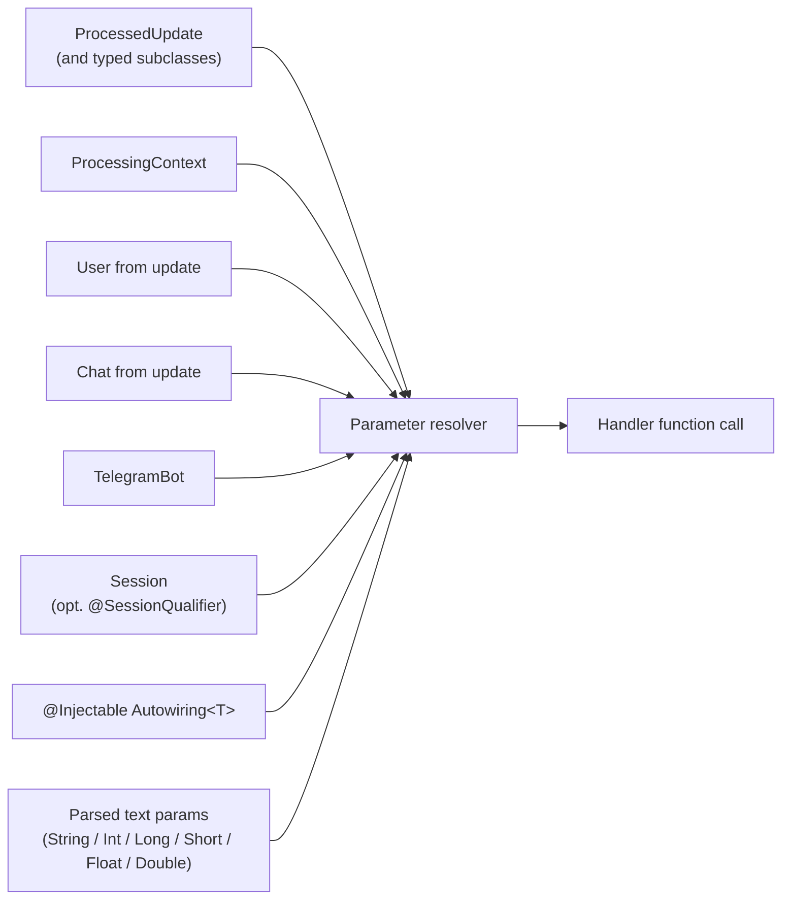

---
---
title: Activity Invocation
---

在活动调用期间，可以传递机器人上下文，因为它在目标函数中声明为参数。

可以传递的参数包括：

* [`ProcessedUpdate`](https://vendelieu.github.io/telegram-bot/telegram-bot/eu.vendeli.tgbot.types.component/-processed-update/index.html)（以及所有子类，例如 `MessageUpdate`、`CallbackQueryUpdate`，……）- 当前处理的更新。
* [`ProcessingContext`](https://vendelieu.github.io/telegram-bot/telegram-bot/eu.vendeli.tgbot.types.component/-processing-context/index.html) - 处理活动的底层上下文。
* [`User`](https://vendelieu.github.io/telegram-bot/telegram-bot/eu.vendeli.tgbot.types/-user/index.html) - 如果存在则传递。
* [`Chat`](https://vendelieu.github.io/telegram-bot/telegram-bot/eu.vendeli.tgbot.types.chat/-chat/index.html) - 如果存在则传递。
* [`TelegramBot`](https://vendelieu.github.io/telegram-bot/telegram-bot/eu.vendeli.tgbot/-telegram-bot/index.html) - 当前机器人实例。
* [`Session`](https://vendelieu.github.io/telegram-bot/telegram-bot/eu.vendeli.tgbot.interfaces.session/-session/index.html) *(在 9.5 中新增)* - 当前聊天/用户的会话。使用 [`@SessionQualifier("name")`](https://vendelieu.github.io/telegram-bot/telegram-bot/eu.vendeli.tgbot.annotations/-session-qualifier/index.html) 注解参数，以注入独立的命名会话。参见 [Sessions article](Sessions.md)。

也可以添加自定义类型进行传递。

为此，添加实现了 [`Autowiring<T>`](https://vendelieu.github.io/telegram-bot/telegram-bot/eu.vendeli.tgbot.interfaces.marker/-autowiring/index.html) 的类，并使用 [`@Injectable`](https://vendelieu.github.io/telegram-bot/telegram-bot/eu.vendeli.tgbot.annotations/-injectable/index.html) 注解标记。

实现了 `Autowiring` 接口后，`T` 将可在目标函数中传递，并通过接口中描述的方法获取。

```kotlin
@Injectable
object UserResolver : Autowiring<UserRecord> {
    override suspend fun get(update: ProcessedUpdate, bot: TelegramBot): UserRecord? {
        return userRepository.getUserByTgId(update.user.id)
    }
}
```

函数中声明的其他参数将在解析的参数中 **搜索**。

此外，在传递过程中解析的参数可以被转换为特定类型，列表如下：

- `String`
- `Integer`
- `Long`
- `Short`
- `Float`
- `Double`

另外，请注意，如果声明的参数缺失（例如在解析的参数中或 `Update` 中缺少 `User`），或声明的类型与函数收到的参数不匹配，**`null`** 将被传递，请谨慎处理。

综上所述，下面是函数参数通常形成方式的示例：



<p align="center">
  
</p>

### See also

* [Update parsing](Update-parsing.md)
* [Activities & Processors](Activites-and-Processors.md)
---