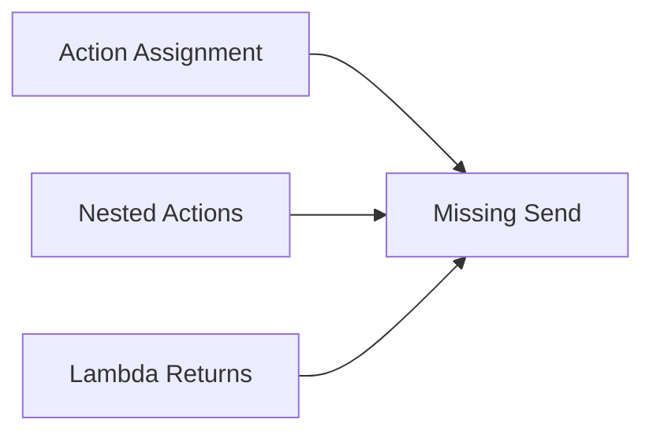
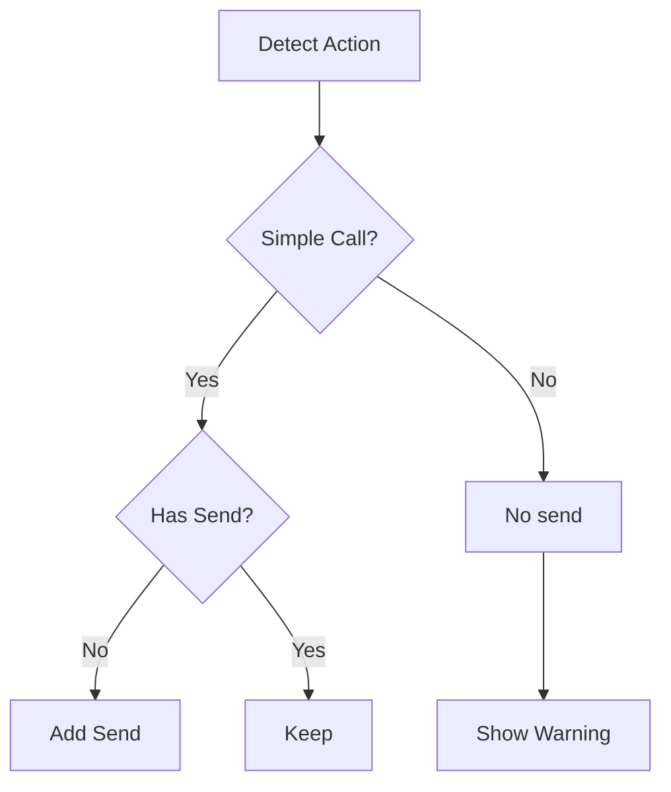

### Aide Compiler Plugin

### Configuration  
Configure Aide in your `build.gradle.kts`:

```kotlin
ktGram {
    // Enable AIDE compiler extensions
    aideEnabled = true
    
    // Automatic .send() chaining (requires aideEnabled=true)
    aideAutoSend = true 
}
```

| Property | Description | Default | Required |
|----------|-------------|---------|----------|
| `aideEnabled` | Enables AIDE compiler features | `true` | Yes for `Aide` to work |
| `aideAutoSend` | Auto-appends `.send()` to action returns | `true` | No |

---

### Usage Example

##### Simple case
```kotlin
@CommandHandler
suspend fun handler(user: User, bot: TelegramBot) {
    // With aideAutoSend=true
    message {
        "Auto-sent message"
    } // ← Compiler adds .send(user, bot)
    
    // Explicit control
    message { 
        "Manual send"
    }.send(user, bot) // ← No auto-add when present
}
```

> [!CAUTION]
> Be aware that even if you do not use an explicit `send`, you still need to have `suspend` function keyword, otherwise you will get an error.

##### Complex Case (Manual Handling Required)

```kotlin
@InputHandler
fun handleInput(user: User, bot: TelegramBot) {
    // Requires manual .send() - will trigger warning
    val savedAction = message {
        "Stored action"
    }
    
    // Valid usage with explicit send
    savedAction.send(user, bot)
}
```

###### Validation Rules

1. Auto-Send Applies When:

    * Action is directly returned from handler
    * No intermediate variable assignment
    * No existing `.send()` call


2. Warnings Generated For:


---

### Feature Behavior

#### When `aideAutoSend=true`



#### Requirements

- Handler must declare parameters:
  - `User` for general actions (simple action require just `TelegramBot`)
  - `TelegramBot` for all actions
- Annotated with `@CommandHandler`, `@InputHandler`, etc (any supported annotation).

