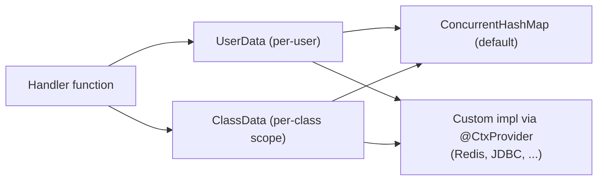

---
---
title: Bot Context
---




ربات می‌تواند قابلیت حفظ برخی داده‌ها را از طریق اینترفیس‌های `UserData` و `ClassData` فراهم کند.

- [`userData`](https://vendelieu.github.io/telegram-bot/telegram-bot/eu.vendeli.tgbot.interfaces.ctx/-user-data/index.html) داده‌ای در سطح کاربر است.
- [`classData`](https://vendelieu.github.io/telegram-bot/telegram-bot/eu.vendeli.tgbot.interfaces.ctx/-class-data/index.html) داده‌ای در سطح کلاس است، یعنی داده تا زمانی که کاربر به یک دستور یا ورودی در کلاس متفاوت حرکت کند، ذخیره می‌شود. (در حالت تابعی مانند داده کاربری عمل می‌کند)

به‌طور پیش‌فرض، پیاده‌سازی از طریق [`ConcurrentHashMap`](https://kotlinlang.org/api/latest/jvm/stdlib/kotlin.collections/java.util.concurrent.-concurrent-map/) ارائه می‌شود اما می‌تواند با استفاده از اینترفیس‌های [`UserData`](https://vendelieu.github.io/telegram-bot/telegram-bot/eu.vendeli.tgbot.interfaces.ctx/-user-data/index.html) و [`ClassData`](https://vendelieu.github.io/telegram-bot/telegram-bot/eu.vendeli.tgbot.interfaces.ctx/-class-data/index.html) به دلخواه شما تغییر یابد.

> [!CAUTION]
> فراموش نکنید که تسک `kspKotlin` یا هر تسک مرتبط ksp دیگری را اجرا کنید تا پیوندهای تولید کد مورد نیاز در دسترس باشند. 

برای تغییر، تنها کافیست زیر پیاده‌سازی خود anotations `@CtxProvider` را اضافه کنید و تسک ksp گرادل (یا ساخت) را اجرا کنید.

```kotlin
@CtxProvider
class MyRedis : UserData<String> {
    // ...
}
```

### See also

* [Home](https://github.com/vendelieu/telegram-bot/wiki)
* [Update parsing](Update-parsing.md)
---