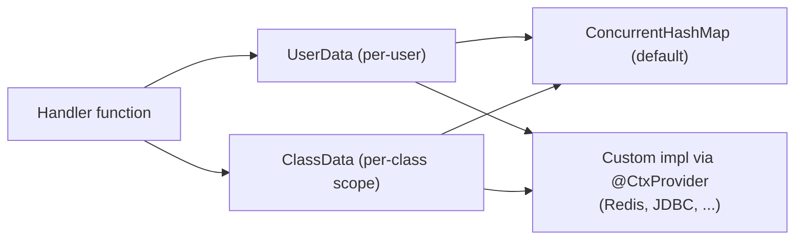

---
---
title: Bot Context
---




Bot `UserData` और `ClassData` इंटरफ़ेस के माध्यम से कुछ डेटा को याद रखने की क्षमता भी प्रदान कर सकता है।

- [`userData`](https://vendelieu.github.io/telegram-bot/telegram-bot/eu.vendeli.tgbot.interfaces.ctx/-user-data/index.html) उपयोगकर्ता‑स्तर का डेटा है।
- [`classData`](https://vendelieu.github.io/telegram-bot/telegram-bot/eu.vendeli.tgbot.interfaces.ctx/-class-data/index.html) क्लास‑स्तर का डेटा है, अर्थात् डेटा तब तक संग्रहीत रहेगा जब तक उपयोगकर्ता किसी अन्य क्लास में स्थित कमांड या इनपुट में नहीं जाता। (फ़ंक्शन मोड में यह उपयोगकर्ता डेटा की तरह काम करेगा)

डिफ़ॉल्ट रूप से, इम्प्लीमेंटेशन [`ConcurrentHashMap`](https://kotlinlang.org/api/latest/jvm/stdlib/kotlin.collections/java.util.concurrent.-concurrent-map/) के माध्यम से प्रदान किया जाता है, लेकिन इसे आप अपने चयन के डेटा स्टोरेज टूल्स का उपयोग करके [`UserData`](https://vendelieu.github.io/telegram-bot/telegram-bot/eu.vendeli.tgbot.interfaces.ctx/-user-data/index.html) और [`ClassData`](https://vendelieu.github.io/telegram-bot/telegram-bot/eu.vendeli.tgbot.interfaces.ctx/-class-data/index.html) इंटरफ़ेस द्वारा बदल सकते हैं।

> [!CAUTION]
> ग्रेडल `kspKotlin`/या कोई भी संबंधित ksp टैस्क चलाना न भूलें ताकि आवश्यक कोडजेन बाइंडिंग उपलब्ध हो सके। 


बदलने के लिए, आपको केवल अपनी इम्प्लीमेंटेशन के तहत `@CtxProvider` एनोटेशन लगाना है और ग्रेडल ksp टैस्क (या बिल्ड) चलाना है।

```kotlin
@CtxProvider
class MyRedis : UserData<String> {
    // ...
}
```

### See also

* [Home](https://github.com/vendelieu/telegram-bot/wiki)
* [Update parsing](Update-parsing.md)
---