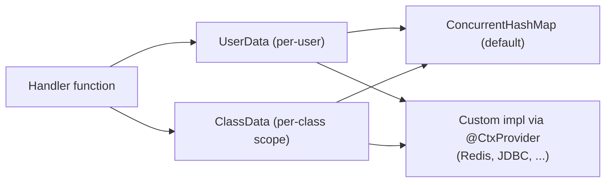

---
---
title: Bot Context
---




Bot juga dapat menyediakan kemampuan untuk mengingat beberapa data melalui antarmuka `UserData` dan `ClassData`.

- [`userData`](https://vendelieu.github.io/telegram-bot/telegram-bot/eu.vendeli.tgbot.interfaces.ctx/-user-data/index.html) adalah data pada tingkat pengguna.
- [`classData`](https://vendelieu.github.io/telegram-bot/telegram-bot/eu.vendeli.tgbot.interfaces.ctx/-class-data/index.html) adalah data pada tingkat kelas, yaitu data akan disimpan sampai pengguna beralih ke perintah atau input yang berada di
  kelas yang berbeda. (dalam mode fungsi akan berfungsi seperti data pengguna)

Secara default, implementasi disediakan melalui [`ConcurrentHashMap`](https://kotlinlang.org/api/latest/jvm/stdlib/kotlin.collections/java.util.concurrent.-concurrent-map/) tetapi dapat diubah ke implementasi Anda sendiri melalui antarmuka [`UserData`](https://vendelieu.github.io/telegram-bot/telegram-bot/eu.vendeli.tgbot.interfaces.ctx/-user-data/index.html) dan [`ClassData`](https://vendelieu.github.io/telegram-bot/telegram-bot/eu.vendeli.tgbot.interfaces.ctx/-class-data/index.html) menggunakan
alat penyimpanan data pilihan Anda.


> [!CAUTION]
> Jangan lupa menjalankan gradle `kspKotlin`/atau tugas ksp yang relevan untuk membuat binding codegen yang diperlukan tersedia. 


Untuk mengubahnya, yang perlu Anda lakukan adalah menambahkan anotasi `@CtxProvider` pada implementasi Anda dan menjalankan tugas gradle ksp (atau build).

```kotlin
@CtxProvider
class MyRedis : UserData<String> {
    // ...
}
```

### See also

* [Home](https://github.com/vendelieu/telegram-bot/wiki)
* [Update parsing](Update-parsing.md)
---