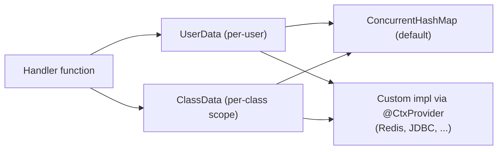

---
---
title: Bot Context
---




봇은 `UserData` 및 `ClassData` 인터페이스를 통해 일부 데이터를 기억하는 기능도 제공할 수 있습니다.

- [`userData`](https://vendelieu.github.io/telegram-bot/telegram-bot/eu.vendeli.tgbot.interfaces.ctx/-user-data/index.html)는 사용자 수준 데이터입니다.
- [`classData`](https://vendelieu.github.io/telegram-bot/telegram-bot/eu.vendeli.tgbot.interfaces.ctx/-class-data/index.html)는 클래스 수준 데이터이며, 즉 사용자가 다른 클래스에 속한 명령어나 입력으로 이동할 때까지 데이터가 저장됩니다. (함수 모드에서는 사용자 데이터처럼 동작합니다)

기본적으로 구현은 [`ConcurrentHashMap`](https://kotlinlang.org/api/latest/jvm/stdlib/kotlin.collections/java.util.concurrent.-concurrent-map/)을 통해 제공되지만, 원하는 데이터 저장 도구를 사용하여 [`UserData`](https://vendelieu.github.io/telegram-bot/telegram-bot/eu.vendeli.tgbot.interfaces.ctx/-user-data/index.html) 및 [`ClassData`](https://vendelieu.github.io/telegram-bot/telegram-bot/eu.vendeli.tgbot.interfaces.ctx/-class-data/index.html) 인터페이스를 통해 교체할 수 있습니다.


> [!CAUTION]
> 필수 코드 생성 바인딩을 사용 가능하게 하려면 gradle `kspKotlin` 혹은 해당하는 ksp 작업을 실행하는 것을 잊지 마세요. 


변경하려면 구현 아래에 `@CtxProvider` 애노테이션을 추가하고 gradle ksp 작업(또는 빌드)을 실행하면 됩니다.

```kotlin
@CtxProvider
class MyRedis : UserData<String> {
    // ...
}
```

### See also

* [Home](https://github.com/vendelieu/telegram-bot/wiki)
* [Update parsing](Update-parsing.md)
---