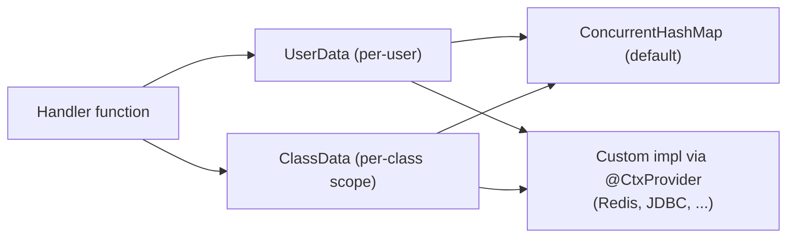

---
---
title: Bot Context
---




O bot também pode fornecer a capacidade de lembrar alguns dados através das interfaces `UserData` e `ClassData`.

- [`userData`](https://vendelieu.github.io/telegram-bot/telegram-bot/eu.vendeli.tgbot.interfaces.ctx/-user-data/index.html) é um dado em nível de usuário.
- [`classData`](https://vendelieu.github.io/telegram-bot/telegram-bot/eu.vendeli.tgbot.interfaces.ctx/-class-data/index.html) é um dado em nível de classe, ou seja, o dado será armazenado até que o usuário mude para um comando ou entrada que esteja em uma
  classe diferente. (no modo função, ele funcionará como dado de usuário)

Por padrão, a implementação é fornecida através de [`ConcurrentHashMap`](https://kotlinlang.org/api/latest/jvm/stdlib/kotlin.collections/java.util.concurrent.-concurrent-map/) mas pode ser alterada para a sua própria implementação via interfaces [`UserData`](https://vendelieu.github.io/telegram-bot/telegram-bot/eu.vendeli.tgbot.interfaces.ctx/-user-data/index.html) e [`ClassData`](https://vendelieu.github.io/telegram-bot/telegram-bot/eu.vendeli.tgbot.interfaces.ctx/-class-data/index.html) usando
as ferramentas de armazenamento de dados de sua escolha.


> [!CAUTION]
> Não se esqueça de executar o gradle `kspKotlin`/ou qualquer tarefa ksp relevante para que os vínculos de geração de código necessários estejam disponíveis. 


Para mudar, tudo o que você precisa fazer é colocar a anotação `@CtxProvider` sob sua implementação e executar a tarefa ksp do gradle (ou build).

```kotlin
@CtxProvider
class MyRedis : UserData<String> {
    // ...
}
```

### See also

* [Home](https://github.com/vendelieu/telegram-bot/wiki)
* [Update parsing](Update-parsing.md)
---