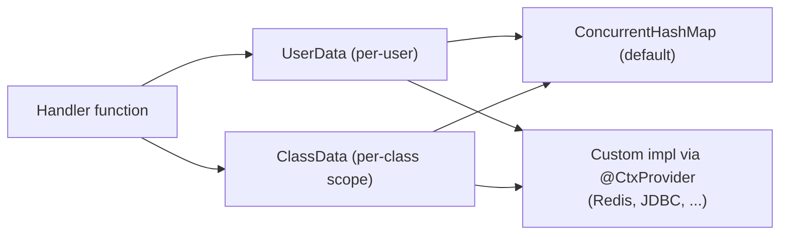

---
---
title: Bot Context
---




Бот также может предоставлять возможность запоминать некоторые данные через интерфейсы `UserData` и `ClassData`.

- [`userData`](https://vendelieu.github.io/telegram-bot/telegram-bot/eu.vendeli.tgbot.interfaces.ctx/-user-data/index.html) — данные уровня пользователя.
- [`classData`](https://vendelieu.github.io/telegram-bot/telegram-bot/eu.vendeli.tgbot.interfaces.ctx/-class-data/index.html) — данные уровня класса, т. е. данные будут храниться, пока пользователь не перейдёт к команде или вводу, находящемуся в другом классе. (в режиме функций будет работать как данные пользователя)

По умолчанию реализация предоставляется через [`ConcurrentHashMap`](https://kotlinlang.org/api/latest/jvm/stdlib/kotlin.collections/java.util.concurrent.-concurrent-map/), но её можно заменить своей через интерфейсы [`UserData`](https://vendelieu.github.io/telegram-bot/telegram-bot/eu.vendeli.tgbot.interfaces.ctx/-user-data/index.html) и [`ClassData`](https://vendelieu.github.io/telegram-bot/telegram-bot/eu.vendeli.tgbot.interfaces.ctx/-class-data/index.html), используя любой выбранный вами инструмент хранения данных.


> [!CAUTION]
> Не забудьте запустить gradle `kspKotlin`/или любую соответствующую задачу ksp, чтобы необходимые привязки генерации кода стали доступными. 


Чтобы изменить, достаточно добавить к вашей реализации аннотацию `@CtxProvider` и запустить задачу ksp Gradle (или собрать проект).

```kotlin
@CtxProvider
class MyRedis : UserData<String> {
    // ...
}
```

### See also

* [Home](https://github.com/vendelieu/telegram-bot/wiki)
* [Update parsing](Update-parsing.md)
---