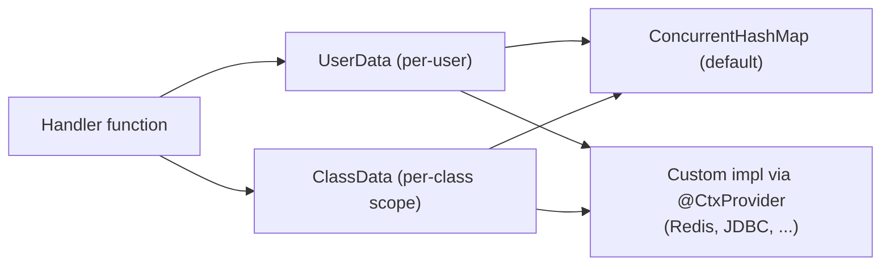

---
---
title: Bot Context
---




Bot cũng có thể cung cấp khả năng ghi nhớ một số dữ liệu thông qua các giao diện `UserData` và `ClassData`.

- [`userData`](https://vendelieu.github.io/telegram-bot/telegram-bot/eu.vendeli.tgbot.interfaces.ctx/-user-data/index.html) là dữ liệu mức người dùng.
- [`classData`](https://vendelieu.github.io/telegram-bot/telegram-bot/eu.vendeli.tgbot.interfaces.ctx/-class-data/index.html) là dữ liệu mức lớp, tức là dữ liệu sẽ được lưu cho tới khi người dùng chuyển sang lệnh hoặc đầu vào thuộc một
  lớp khác. (trong chế độ hàm nó sẽ hoạt động như dữ liệu người dùng)

Mặc định, việc cài đặt được cung cấp thông qua [`ConcurrentHashMap`](https://kotlinlang.org/api/latest/jvm/stdlib/kotlin.collections/java.util.concurrent.-concurrent-map/) nhưng có thể được thay đổi sang thực thi riêng của bạn thông qua các giao diện [`UserData`](https://vendelieu.github.io/telegram-bot/telegram-bot/eu.vendeli.tgbot.interfaces.ctx/-user-data/index.html) và [`ClassData`](https://vendelieu.github.io/telegram-bot/telegram-bot/eu.vendeli.tgbot.interfaces.ctx/-class-data/index.html) sử dụng
công cụ lưu trữ dữ liệu mà bạn chọn.

> [!CAUTION]
> Đừng quên chạy lệnh gradle `kspKotlin`/hoặc bất kỳ task ksp nào liên quan để tạo các ràng buộc codegen cần thiết. 

Để thay đổi, tất cả những gì bạn cần làm là đặt annotation `@CtxProvider` dưới lớp thực thi của bạn và chạy task ksp của gradle (hoặc build).

```kotlin
@CtxProvider
class MyRedis : UserData<String> {
    // ...
}
```

### See also

* [Home](https://github.com/vendelieu/telegram-bot/wiki)
* [Update parsing](Update-parsing.md)
---