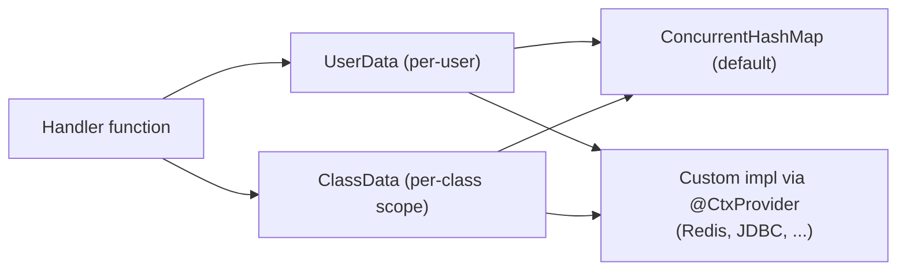

---
---
title: Bot Context
---




Bot 也可以通过 `UserData` 和 `ClassData` 接口提供记忆一些数据的能力。

- [`userData`](https://vendelieu.github.io/telegram-bot/telegram-bot/eu.vendeli.tgbot.interfaces.ctx/-user-data/index.html) 是用户级别的数据。
- [`classData`](https://vendelieu.github.io/telegram-bot/telegram-bot/eu.vendeli.tgbot.interfaces.ctx/-class-data/index.html) 是类级别的数据，即数据会一直保存，直到用户切换到属于不同类的命令或输入。（在函数模式下，它的行为类似于用户数据）

默认实现通过 [`ConcurrentHashMap`](https://kotlinlang.org/api/latest/jvm/stdlib/kotlin.collections/java.util.concurrent.-concurrent-map/) 提供，但可以使用 [`UserData`](https://vendelieu.github.io/telegram-bot/telegram-bot/eu.vendeli.tgbot.interfaces.ctx/-user-data/index.html) 和 [`ClassData`](https://vendelieu.github.io/telegram-bot/telegram-bot/eu.vendeli.tgbot.interfaces.ctx/-class-data/index.html) 接口，结合您选择的数据存储工具自行更换。

> [!CAUTION]
> 别忘了运行 Gradle `kspKotlin` 或其他相关的 ksp 任务，以生成所需的代码绑定。

要更改，只需在实现上添加 `@CtxProvider` 注解并运行 Gradle ksp 任务（或构建）。

```kotlin
@CtxProvider
class MyRedis : UserData<String> {
    // ...
}
```

### See also

* [Home](https://github.com/vendelieu/telegram-bot/wiki)
* [Update parsing](Update-parsing.md)
---