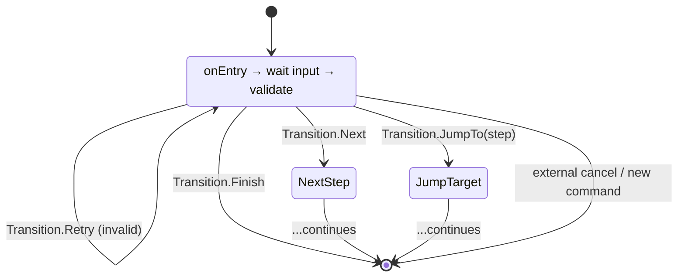

---
---
title: Fsm And Conversation Handling
---

लाइब्रेरी में FSM तंत्र का समर्थन भी शामिल है, जो उपयोगकर्ता इनपुट के क्रमिक प्रोसेसिंग के लिए एक तंत्र है जिसमें गलत इनपुट को संभालने की क्षमता होती है।

> [!NOTE]
> TL;DR: उदाहरण [यहाँ](https://github.com/vendelieu/telegram-bot_template/tree/conversation) देखें।

### In theory

कल्पना करें कि आपको एक उपयोगकर्ता सर्वेक्षण एकत्र करना है, आप एक ही चरण में व्यक्ति का सभी डेटा पूछ सकते हैं, लेकिन यदि किसी पैरामीटर का इनपुट गलत है, तो यह उपयोगकर्ता और हमारे दोनों के लिए कठिन हो जाएगा, और प्रत्येक चरण में कुछ इनपुट डेटा के आधार पर अंतर हो सकता है।

अब कल्पना करें कि डेटा का क्रमवार इनपुट हो, जहाँ बॉट उपयोगकर्ता के साथ डायलॉग मोड में प्रवेश करता है।

<p align="center">
  
</p>



फ़ॉरवर्ड एरो (`Transition.Next`, `Transition.JumpTo`) विज़र्ड को आगे बढ़ाते हैं, `Transition.Retry` उपयोगकर्ता को समान चरण पर रखता है जब तक इनपुट वैध न हो (उदाहरण के लिए, जब उपयोगकर्ता अपनी उम्र के लिये `-100` टाइप करता है), और `Transition.Finish` (या कोई बाहरी कमांड) प्रवाह को पूरी तरह समाप्त कर देता है।

### In practice

विज़र्ड सिस्टम टेलीग्राम बॉट्स में मल्टी‑स्टेप उपयोगकर्ता इंटरैक्शन को सक्षम करता है। यह उपयोगकर्ताओं को चरणों की एक श्रृंखला में मार्गदर्शन करता है, इनपुट को मान्य करता है, स्थिति को संग्रहीत करता है, और चरणों के बीच ट्रांज़िशन करता है।

**Key Benefits:**
- **Type-safe**: स्थिति अभिगमन के लिये कंपाइल‑टाइम प्रकार जाँच
- **Declarative**: चरणों को नेस्टेड क्लास/ऑब्जेक्ट के रूप में परिभाषित करें
- **Flexible**: शर्तात्मक ट्रांज़िशन, जंप और रिट्राई का समर्थन
- **Stateful**: प्लगएबल स्टोरेज बैकएंड के साथ स्वचालित स्थिति स्थायित्व
- **Integrated**: मौजूदा Activity सिस्टम के साथ काम करता है

### Core Concepts

#### WizardStep

एक `WizardStep` विज़र्ड प्रवाह में एकल चरण का प्रतिनिधित्व करता है। प्रत्येक चरण को लागू करना आवश्यक है:

- **`onEntry(ctx: WizardContext)`**: जब उपयोगकर्ता इस चरण में प्रवेश करता है तो कॉल होता है। इसका उपयोग उपयोगकर्ता को प्रॉम्प्ट करने के लिये करें।
- **`onRetry(ctx: WizardContext)`**: जब वैलिडेशन विफल हो और चरण को पुनः प्रयास करना चाहिए तो कॉल होता है। इसका उपयोग त्रुटि संदेश दिखाने के लिये करें।
- **`validate(ctx: WizardContext): Transition`**: वर्तमान इनपुट को मान्य करता है और एक `Transition` लौटाता है जो अगला क्या होगा दर्शाता है।
- **`store(ctx: WizardContext): Any?`** (वैकल्पिक): इस चरण के लिये स्थायी करने हेतु मान लौटाता है। यदि चरण स्थिति संग्रहीत नहीं करता तो `null` लौटाएँ।

```kotlin
object NameStep : WizardStep(isInitial = true) {
    override suspend fun onEntry(ctx: WizardContext) {
        message { "What is your name?" }.send(ctx.user, ctx.bot)
    }
    
    override suspend fun onRetry(ctx: WizardContext) {
        message { "Name cannot be empty. Please try again." }.send(ctx.user, ctx.bot)
    }
    
    override suspend fun validate(ctx: WizardContext): Transition {
        return if (ctx.update.text.isNullOrBlank()) {
            Transition.Retry
        } else {
            Transition.Next
        }
    }
    
    override suspend fun store(ctx: WizardContext): String {
        return ctx.update.text!!
    }
}
```

> [!NOTE]
> यदि कोई चरण प्रारंभिक रूप में चिह्नित नहीं है → पहला घोषित चरण इसे माना जाता है।

#### Transition

एक `Transition` वैलिडेशन के बाद क्या होगा निर्धारित करता है:

- **`Transition.Next`**: क्रम में अगला चरण ले जाएँ
- **`Transition.JumpTo(step: KClass<out WizardStep>)`**: विशिष्ट चरण पर कूदें
- **`Transition.Retry`**: वर्तमान चरण को पुनः प्रयास करें (वैलिडेशन विफल)
- **`Transition.Finish`**: विज़र्ड समाप्त करें

```kotlin
// Conditional jump based on input
override suspend fun validate(ctx: WizardContext): Transition {
    val age = ctx.update.text?.toIntOrNull()
    return when {
        age == null -> Transition.Retry
        age < 18 -> Transition.JumpTo(UnderageStep::class)
        else -> Transition.Next
    }
}
```

#### WizardContext

`WizardContext` उपलब्ध कराता है:
- **`user: User`**: वर्तमान उपयोगकर्ता
- **`update: ProcessedUpdate`**: वर्तमान अपडेट
- **`bot: TelegramBot`**: बॉट इंस्टेंस
- **`userReference: UserChatReference`**: स्थिति संग्रहीत करने हेतु उपयोगकर्ता और चैट आईडी संदर्भ

प्लस प्रकार‑सुरक्षित स्थिति अभिगमन मेथड (KSP द्वारा जेनरेट किए गए)।

---

### Defining a Wizard

#### Basic Structure

एक विज़र्ड को क्लास या ऑब्जेक्ट के रूप में परिभाषित किया जाता है जिसमें `@WizardHandler` एनोटेशन होता है:

```kotlin
@WizardHandler(trigger = ["/survey"])
object SurveyWizard {
    object NameStep : WizardStep(isInitial = true) {
        // ... step implementation
    }
    
    object AgeStep : WizardStep {
        // ... step implementation
    }
    
    object FinishStep : WizardStep {
        // ... step implementation
    }
}
```

#### Annotation Parameters

**`@WizardHandler`** स्वीकार करता है:
- **`trigger: Array<String>`**: कमांड्स जो विज़र्ड शुरू करते हैं (जैसे, `["/start", "/survey"]`)
- **`scope: Array<UpdateType>`**: सुनने के लिये अपडेट प्रकार (डिफ़ॉल्ट: `[UpdateType.MESSAGE]`)
- **`stateManagers: Array<KClass<out WizardStateManager<*>>>`**: चरण डेटा संग्रहीत करने के लिये स्टेट मैनेजर क्लासेज़

---

### State Management

#### WizardStateManager

स्थिति `WizardStateManager<T>` इम्प्लेमेंटेशन्स द्वारा संग्रहीत की जाती है। प्रत्येक मैनेजर एक विशिष्ट प्रकार को संभालता है:

```kotlin
interface WizardStateManager<T : Any> {
    suspend fun get(key: KClass<out WizardStep>, reference: UserChatReference): T?
    suspend fun set(key: KClass<out WizardStep>, reference: UserChatReference, value: T)
    suspend fun del(key: KClass<out WizardStep>, reference: UserChatReference)
}
```

देखें: [MapStateManager<T>](https://vendelieu.github.io/telegram-bot/telegram-bot/eu.vendeli.tgbot.implementations/-map-state-manager/index.html), [MapStringStateManager](https://vendelieu.github.io/telegram-bot/telegram-bot/eu.vendeli.tgbot.implementations/-map-string-state-manager/index.html), [MapIntStateManager](https://vendelieu.github.io/telegram-bot/telegram-bot/eu.vendeli.tgbot.implementations/-map-int-state-manager/index.html), [MapLongStateManager](https://vendelieu.github.io/telegram-bot/telegram-bot/eu.vendeli.tgbot.implementations/-map-long-state-manager/index.html).

#### Automatic Matching

KSP `store()` रिटर्न टाइप के आधार पर चरणों को स्टेट मैनेजर्स से मिलाता है:

```kotlin
@WizardHandler(
    trigger = ["/survey"],
    stateManagers = [StringStateManager::class, IntStateManager::class]
)
object SurveyWizard {
    object NameStep : WizardStep(isInitial = true) {
        override suspend fun store(ctx: WizardContext): String {
            return ctx.update.text!! // Matches StringStateManager
        }
    }
    
    object AgeStep : WizardStep {
        override suspend fun store(ctx: WizardContext): Int {
            return ctx.update.text!!.toInt() // Matches IntStateManager
        }
    }
}
```

#### Per-Step Override

विशिष्ट चरण के लिये स्टेट मैनेजर को `@WizardHandler.StateManager` द्वारा ओवरराइड करें:

```kotlin
@WizardHandler(
    trigger = ["/survey"],
    stateManagers = [DefaultStateManager::class]
)
object SurveyWizard {
    object NameStep : WizardStep(isInitial = true) {
        // Uses DefaultStateManager
    }
    
    @WizardHandler.StateManager(CustomStateManager::class)
    object AgeStep : WizardStep {
        // Uses CustomStateManager instead
    }
}
```

---

### Type-Safe State Access

KSP प्रत्येक चरण के लिये जो स्थिति संग्रहीत करता है, `WizardContext` पर प्रकार‑सुरक्षित एक्सटेंशन फ़ंक्शन जेनरेट करता है।

#### Generated Functions

एक चरण जो `String` संग्रहीत करता है, उसके लिये:

```kotlin
// Generated automatically by KSP
suspend inline fun <reified S : WizardStep> WizardContext.getState(): String?
suspend inline fun <reified S : WizardStep> WizardContext.setState(value: String)
suspend inline fun <reified S : WizardStep> WizardContext.delState()
```

#### Usage

```kotlin
object FinishStep : WizardStep {
    override suspend fun onEntry(ctx: WizardContext) {
        // Type-safe access - returns String? (nullable)
        val name: String? = ctx.getState<NameStep>()
        
        // Type-safe access - returns Int? (nullable)
        val age: Int? = ctx.getState<AgeStep>()
        
        val summary = buildString {
            appendLine("Name: $name")
            appendLine("Age: $age")
        }
        
        message { summary }.send(ctx.user, ctx.bot)
    }
    
    override suspend fun onRetry(ctx: WizardContext) = Unit
    
    override suspend fun validate(ctx: WizardContext): Transition {
        return Transition.Finish
    }
}
```

#### Fallback Methods

यदि प्रकार‑सुरक्षित मेथड उपलब्ध नहीं हैं, तो फॉलबैक मेथड का प्रयोग करें:

```kotlin
// Fallback - returns Any?
val name = ctx.getState(NameStep::class)

// Fallback - accepts Any?
ctx.setState(NameStep::class, "John")
ctx.delState(NameStep::class)
```

---

### Complete Example

#### User Registration Wizard

```kotlin
@WizardHandler(
    trigger = ["/register"],
    stateManagers = [StringStateManager::class, IntStateManager::class]
)
object RegistrationWizard {
    object NameStep : WizardStep(isInitial = true) {
        override suspend fun onEntry(ctx: WizardContext) {
            message { "What is your name?" }.send(ctx.user, ctx.bot)
        }
        
        override suspend fun onRetry(ctx: WizardContext) {
            message { "Please enter a valid name." }.send(ctx.user, ctx.bot)
        }
        
        override suspend fun validate(ctx: WizardContext): Transition {
            val name = ctx.update.text?.trim()
            return if (name.isNullOrBlank() || name.length < 2) {
                Transition.Retry
            } else {
                Transition.Next
            }
        }
        
        override suspend fun store(ctx: WizardContext): String {
            return ctx.update.text!!.trim()
        }
    }
    
    object AgeStep : WizardStep {
        override suspend fun onEntry(ctx: WizardContext) {
            message { "How old are you?" }.send(ctx.user, ctx.bot)
        }
        
        override suspend fun onRetry(ctx: WizardContext) {
            message { "Please enter a valid age (must be a number)." }.send(ctx.user, ctx.bot)
        }
        
        override suspend fun validate(ctx: WizardContext): Transition {
            val age = ctx.update.text?.toIntOrNull()
            return when {
                age == null -> Transition.Retry
                age < 0 || age > 150 -> Transition.Retry
                age < 18 -> Transition.JumpTo(UnderageStep::class)
                else -> Transition.Next
            }
        }
        
        override suspend fun store(ctx: WizardContext): Int {
            return ctx.update.text!!.toInt()
        }
    }
    
    object UnderageStep : WizardStep {
        override suspend fun onEntry(ctx: WizardContext) {
            message { 
                "Sorry, you must be 18 or older to register." 
            }.send(ctx.user, ctx.bot)
        }
        
        override suspend fun onRetry(ctx: WizardContext) = Unit
        
        override suspend fun validate(ctx: WizardContext): Transition {
            return Transition.Finish
        }
    }
    
    object ConfirmationStep : WizardStep {
        override suspend fun onEntry(ctx: WizardContext) {
            // Type-safe state access
            val name: String? = ctx.getState<NameStep>()
            val age: Int? = ctx.getState<AgeStep>()
            
            val confirmation = buildString {
                appendLine("Please confirm your information:")
                appendLine("Name: $name")
                appendLine("Age: $age")
                appendLine()
                appendLine("Reply 'yes' to confirm or 'no' to start over.")
            }
            
            message { confirmation }.send(ctx.user, ctx.bot)
        }
        
        override suspend fun onRetry(ctx: WizardContext) {
            message { "Please reply 'yes' or 'no'." }.send(ctx.user, ctx.bot)
        }
        
        override suspend fun validate(ctx: WizardContext): Transition {
            val response = ctx.update.text?.lowercase()?.trim()
            return when (response) {
                "yes" -> Transition.Finish
                "no" -> Transition.JumpTo(NameStep::class) // Start over
                else -> Transition.Retry
            }
        }
    }
    
    object FinishStep : WizardStep {
        override suspend fun onEntry(ctx: WizardContext) {
            val name: String? = ctx.getState<NameStep>()
            val age: Int? = ctx.getState<AgeStep>()
            
            // Save to database, send confirmation, etc.
            message { 
                "Registration complete! Welcome, $name (age $age)." 
            }.send(ctx.user, ctx.bot)
        }
        
        override suspend fun onRetry(ctx: WizardContext) = Unit
        
        override suspend fun validate(ctx: WizardContext): Transition {
            return Transition.Finish
        }
    }
}
```

---

### Advanced Features

#### Conditional Transitions

शर्तात्मक प्रवाह के लिये `Transition.JumpTo` का प्रयोग करें:

```kotlin
override suspend fun validate(ctx: WizardContext): Transition {
    val choice = ctx.update.text?.lowercase()
    return when (choice) {
        "premium" -> Transition.JumpTo(PremiumStep::class)
        "basic" -> Transition.JumpTo(BasicStep::class)
        else -> Transition.Retry
    }
}
```

#### Stateless Steps

चरण को स्थिति संग्रहीत करने की आवश्यकता नहीं है। `store()` से `null` लौटाएँ (या जैसा है वैसा छोड़ दें):

```kotlin
object ConfirmationStep : WizardStep {
    override suspend fun store(ctx: WizardContext): Any? = null
    // ... rest of implementation
}
```

#### Custom State Managers

कस्टम स्टोरेज (डेटाबेस, Redis, आदि) के लिये `WizardStateManager<T>` इम्प्लीमेंट करें:

```kotlin
class DatabaseStateManager : WizardStateManager<String> {
    override suspend fun get(
        key: KClass<out WizardStep>,
        reference: UserChatReference
    ): String? {
        // Load from database
        return database.getWizardState(reference.userId, key.qualifiedName)
    }
    
    override suspend fun set(
        key: KClass<out WizardStep>,
        reference: UserChatReference,
        value: String
    ) {
        // Save to database
        database.saveWizardState(reference.userId, key.qualifiedName, value)
    }
    
    override suspend fun del(
        key: KClass<out WizardStep>,
        reference: UserChatReference
    ) {
        // Delete from database
        database.deleteWizardState(reference.userId, key.qualifiedName)
    }
}
```

---

### How It Works Internally

#### Code Generation

KSP जेनरेट करता है:

1. **WizardActivity**: `WizardActivity` को विस्तारित करने वाला एक ठोस इम्प्लीमेंटेशन जिसमें हार्डकोडेड चरण होते हैं
2. **Start Activity**: कमांड ट्रिगर को संभालता है और विज़र्ड को शुरू करता है
3. **Input Activity**: विज़र्ड प्रवाह के दौरान उपयोगकर्ता इनपुट को संभालता है
4. **State Accessors**: स्थिति अभिगमन के लिये प्रकार‑सुरक्षित एक्सटेंशन फ़ंक्शन

#### Flow

1. उपयोगकर्ता `/register` भेजता है → Start Activity कॉल होती है
2. Start Activity `WizardContext` बनाता है और `wizardActivity.start(ctx)` को कॉल करता है
3. `start()` प्रारंभिक चरण में प्रवेश करता है और वर्तमान चरण को ट्रैक करने के लिये `inputListener` सेट करता है
4. उपयोगकर्ता संदेश भेजता है → Input Activity कॉल होती है
5. Input Activity `wizardActivity.handleInput(ctx)` को कॉल करती है
6. `handleInput()` इनपुट को वैलिडेट करता है, स्थिति को स्थायी करता है, और अगले चरण में ट्रांज़िशन करता है
7. प्रक्रिया तब तक दोहराई जाती है जब तक `Transition.Finish` नहीं आता

#### State Persistence

- वैध वैलिडेशन के बाद (ट्रांज़िशन से पहले) स्थिति स्थायी की जाती है
- प्रत्येक चरण का `store()` रिटर्न वैल्यू मिलते‑जुलते `WizardStateManager` का उपयोग करके संग्रहीत किया जाता है
- स्थिति उपयोगकर्ता और चैट (`UserChatReference`) के अनुसार स्कोप्ड होती है

---

### Best Practices

#### 1. Always Provide Clear Prompts

```kotlin
override suspend fun onEntry(ctx: WizardContext) {
    message { 
        "Please enter your email address:\n" +
        "(Format: user@example.com)" 
    }.send(ctx.user, ctx.bot)
}
```

#### 2. Handle Validation Errors Gracefully

```kotlin
override suspend fun onRetry(ctx: WizardContext) {
    message { 
        "Invalid email format. Please try again.\n" +
        "Example: user@example.com" 
    }.send(ctx.user, ctx.bot)
}
```

#### 3. Use Type-Safe State Access

जनरेटेड प्रकार‑सुरक्षित मेथड को प्राथमिकता दें:

```kotlin
// ✅ Good - type-safe
val name: String? = ctx.getState<NameStep>()

// ❌ Avoid - loses type safety
val name = ctx.getState(NameStep::class) as? String
```

#### 4. Keep Steps Focused

प्रत्येक चरण में एक ही जिम्मेदारी होनी चाहिए:

```kotlin
// ✅ Good - focused step
object EmailStep : WizardStep {
    // Only handles email collection
}

// ❌ Avoid - too much logic
object PersonalInfoStep : WizardStep {
    // Handles name, email, phone, address...
}
```

#### 5. Use Meaningful Step Names

```kotlin
// ✅ Good
object EmailVerificationStep : WizardStep

// ❌ Avoid
object Step2 : WizardStep
```

#### 6. Clean Up State When Needed

यदि आपको मैन्युअली स्थिति साफ़ करनी हो:

```kotlin
object CancelStep : WizardStep {
    override suspend fun onEntry(ctx: WizardContext) {
        // Clear all wizard state
        ctx.delState<NameStep>()
        ctx.delState<AgeStep>()
        
        message { "Registration cancelled." }.send(ctx.user, ctx.bot)
    }
}
```

---

### Summary

विज़र्ड सिस्टम प्रदान करता है:
- ✅ **Type-safe** स्थिति प्रबंधन के साथ कंपाइल‑टाइम जाँच
- ✅ **Declarative** चरण परिभाषा नेस्टेड क्लास के रूप में
- ✅ **Flexible** शर्तात्मक लॉजिक के साथ ट्रांज़िशन
- ✅ **Automatic** कोड जेनरेशन KSP द्वारा
- ✅ **Integrated** मौजूदा Activity सिस्टम के साथ
- ✅ **Pluggable** स्टेट स्टोरेज बैकएंड

`@WizardHandler` से क्लास को एनोटेट करके और अपने चरणों को नेस्टेड `WizardStep` ऑब्जेक्ट्स के रूप में परिभाषित करके विज़र्ड बनाना शुरू करें!
यदि आपके कोई प्रश्न हैं तो चैट में हमसे संपर्क करें, हम मदद करने में खुशी महसूस करेंगे :)
---