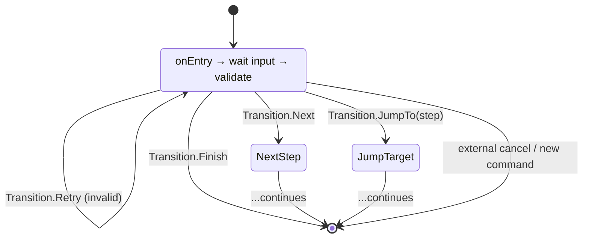

---
---
title: Fsm And Conversation Handling
---

A biblioteca também oferece suporte ao mecanismo FSM, que é um mecanismo para o processamento progressivo da entrada do usuário com tratamento de entrada incorreta.

> [!NOTE]
> TL;DR: Veja o exemplo [lá](https://github.com/vendelieu/telegram-bot_template/tree/conversation).

### In theory

Vamos imaginar uma situação onde você precisa coletar uma pesquisa de usuário, você pode pedir todos os dados de uma pessoa em uma única etapa, mas com entrada incorreta de um dos parâmetros, será difícil tanto para o usuário quanto para nós, e cada etapa pode ter uma diferença dependendo de certos dados de entrada.

Agora imagine a entrada de dados passo a passo, onde o bot entra em modo de diálogo com o usuário.

<p align="center">
  
</p>



Setas avançadas (`Transition.Next`, `Transition.JumpTo`) avançam o assistente, `Transition.Retry` mantém o usuário na mesma etapa até que a entrada seja válida (por exemplo, quando o usuário digita `-100` para a idade), e `Transition.Finish` (ou um comando externo) termina o fluxo completamente.

### In practice

O sistema Wizard permite interações de usuário multietapa em bots do Telegram. Ele orienta os usuários através de uma sequência de etapas, valida entradas, armazena estado e transita entre etapas.

**Key Benefits:**
- **Type-safe**: Compile-time type checking for state access
- **Declarative**: Define steps as nested classes/objects
- **Flexible**: Support for conditional transitions, jumps, and retries
- **Stateful**: Automatic state persistence with pluggable storage backends
- **Integrated**: Works with the existing Activity system

### Core Concepts

#### WizardStep

Um `WizardStep` representa uma única etapa no fluxo do assistente. Cada etapa deve implementar:

- **`onEntry(ctx: WizardContext)`**: chamado quando o usuário entra nesta etapa. Use para solicitar ao usuário.
- **`onRetry(ctx: WizardContext)`**: chamado quando a validação falha e a etapa deve ser repetida. Use para mostrar mensagens de erro.
- **`validate(ctx: WizardContext): Transition`**: valida a entrada atual e retorna um `Transition` indicando o que acontece a seguir.
- **`store(ctx: WizardContext): Any?`** (opcional): retorna o valor a ser persistido para esta etapa. Retorne `null` se a etapa não armazenar estado.

```kotlin
object NameStep : WizardStep(isInitial = true) {
    override suspend fun onEntry(ctx: WizardContext) {
        message { "What is your name?" }.send(ctx.user, ctx.bot)
    }
    
    override suspend fun onRetry(ctx: WizardContext) {
        message { "Name cannot be empty. Please try again." }.send(ctx.user, ctx.bot)
    }
    
    override suspend fun validate(ctx: WizardContext): Transition {
        return if (ctx.update.text.isNullOrBlank()) {
            Transition.Retry
        } else {
            Transition.Next
        }
    }
    
    override suspend fun store(ctx: WizardContext): String {
        return ctx.update.text!!
    }
}
```

> [!NOTE]
> If some step is not marked as initial -> first declared step is considered as.

#### Transition

Um `Transition` determina o que acontece após a validação:

- **`Transition.Next`**: Move para a próxima etapa na sequência
- **`Transition.JumpTo(step: KClass<out WizardStep>)`**: Salta para uma etapa específica
- **`Transition.Retry`**: Repete a etapa atual (validação falhou)
- **`Transition.Finish`**: Finaliza o assistente

```kotlin
// Conditional jump based on input
override suspend fun validate(ctx: WizardContext): Transition {
    val age = ctx.update.text?.toIntOrNull()
    return when {
        age == null -> Transition.Retry
        age < 18 -> Transition.JumpTo(UnderageStep::class)
        else -> Transition.Next
    }
}
```

#### WizardContext

`WizardContext` fornece acesso a:
- **`user: User`**: O usuário atual
- **`update: ProcessedUpdate`**: A atualização atual
- **`bot: TelegramBot`**: A instância do bot
- **`userReference: UserChatReference`**: Referência de usuário e chat para armazenamento de estado

Além dos métodos de acesso ao estado tipados (gerados por KSP).

---

### Defining a Wizard

#### Basic Structure

Um assistente é definido como uma classe ou objeto anotado com `@WizardHandler`:

```kotlin
@WizardHandler(trigger = ["/survey"])
object SurveyWizard {
    object NameStep : WizardStep(isInitial = true) {
        // ... step implementation
    }
    
    object AgeStep : WizardStep {
        // ... step implementation
    }
    
    object FinishStep : WizardStep {
        // ... step implementation
    }
}
```

#### Annotation Parameters

**`@WizardHandler`** aceita:
- **`trigger: Array<String>`**: Comandos que iniciam o assistente (ex.: `["/start", "/survey"]`)
- **`scope: Array<UpdateType>`**: Tipos de atualização para escutar (padrão: `[UpdateType.MESSAGE]`)
- **`stateManagers: Array<KClass<out WizardStateManager<*>>>`**: Classes de gerenciadores de estado para armazenar dados das etapas

---

### State Management

#### WizardStateManager

O estado é armazenado usando implementações de `WizardStateManager<T>`. Cada gerenciador lida com um tipo específico:

```kotlin
interface WizardStateManager<T : Any> {
    suspend fun get(key: KClass<out WizardStep>, reference: UserChatReference): T?
    suspend fun set(key: KClass<out WizardStep>, reference: UserChatReference, value: T)
    suspend fun del(key: KClass<out WizardStep>, reference: UserChatReference)
}
```

Veja também: [MapStateManager<T>](https://vendelieu.github.io/telegram-bot/telegram-bot/eu.vendeli.tgbot.implementations/-map-state-manager/index.html), [MapStringStateManager](https://vendelieu.github.io/telegram-bot/telegram-bot/eu.vendeli.tgbot.implementations/-map-string-state-manager/index.html), [MapIntStateManager](https://vendelieu.github.io/telegram-bot/telegram-bot/eu.vendeli.tgbot.implementations/-map-int-state-manager/index.html), [MapLongStateManager](https://vendelieu.github.io/telegram-bot/telegram-bot/eu.vendeli.tgbot.implementations/-map-long-state-manager/index.html).

#### Automatic Matching

KSP combina etapas com gerenciadores de estado com base no tipo de retorno de `store()`:

```kotlin
@WizardHandler(
    trigger = ["/survey"],
    stateManagers = [StringStateManager::class, IntStateManager::class]
)
object SurveyWizard {
    object NameStep : WizardStep(isInitial = true) {
        override suspend fun store(ctx: WizardContext): String {
            return ctx.update.text!! // Matches StringStateManager
        }
    }
    
    object AgeStep : WizardStep {
        override suspend fun store(ctx: WizardContext): Int {
            return ctx.update.text!!.toInt() // Matches IntStateManager
        }
    }
}
```

#### Per-Step Override

Sobrescreva o gerenciador de estado para uma etapa específica usando `@WizardHandler.StateManager`:

```kotlin
@WizardHandler(
    trigger = ["/survey"],
    stateManagers = [DefaultStateManager::class]
)
object SurveyWizard {
    object NameStep : WizardStep(isInitial = true) {
        // Uses DefaultStateManager
    }
    
    @WizardHandler.StateManager(CustomStateManager::class)
    object AgeStep : WizardStep {
        // Uses CustomStateManager instead
    }
}
```

---

### Type-Safe State Access

KSP gera funções de extensão tipadas em `WizardContext` para cada etapa que armazena estado.

#### Generated Functions

Para uma etapa que armazena um `String`:

```kotlin
// Generated automatically by KSP
suspend inline fun <reified S : WizardStep> WizardContext.getState(): String?
suspend inline fun <reified S : WizardStep> WizardContext.setState(value: String)
suspend inline fun <reified S : WizardStep> WizardContext.delState()
```

#### Usage

```kotlin
object FinishStep : WizardStep {
    override suspend fun onEntry(ctx: WizardContext) {
        // Type-safe access - returns String? (nullable)
        val name: String? = ctx.getState<NameStep>()
        
        // Type-safe access - returns Int? (nullable)
        val age: Int? = ctx.getState<AgeStep>()
        
        val summary = buildString {
            appendLine("Name: $name")
            appendLine("Age: $age")
        }
        
        message { summary }.send(ctx.user, ctx.bot)
    }
    
    override suspend fun onRetry(ctx: WizardContext) = Unit
    
    override suspend fun validate(ctx: WizardContext): Transition {
        return Transition.Finish
    }
}
```

#### Fallback Methods

Se os métodos tipados não estiverem disponíveis, use os métodos de fallback:

```kotlin
// Fallback - returns Any?
val name = ctx.getState(NameStep::class)

// Fallback - accepts Any?
ctx.setState(NameStep::class, "John")
ctx.delState(NameStep::class)
```

---

### Complete Example

#### User Registration Wizard

```kotlin
@WizardHandler(
    trigger = ["/register"],
    stateManagers = [StringStateManager::class, IntStateManager::class]
)
object RegistrationWizard {
    object NameStep : WizardStep(isInitial = true) {
        override suspend fun onEntry(ctx: WizardContext) {
            message { "What is your name?" }.send(ctx.user, ctx.bot)
        }
        
        override suspend fun onRetry(ctx: WizardContext) {
            message { "Please enter a valid name." }.send(ctx.user, ctx.bot)
        }
        
        override suspend fun validate(ctx: WizardContext): Transition {
            val name = ctx.update.text?.trim()
            return if (name.isNullOrBlank() || name.length < 2) {
                Transition.Retry
            } else {
                Transition.Next
            }
        }
        
        override suspend fun store(ctx: WizardContext): String {
            return ctx.update.text!!.trim()
        }
    }
    
    object AgeStep : WizardStep {
        override suspend fun onEntry(ctx: WizardContext) {
            message { "How old are you?" }.send(ctx.user, ctx.bot)
        }
        
        override suspend fun onRetry(ctx: WizardContext) {
            message { "Please enter a valid age (must be a number)." }.send(ctx.user, ctx.bot)
        }
        
        override suspend fun validate(ctx: WizardContext): Transition {
            val age = ctx.update.text?.toIntOrNull()
            return when {
                age == null -> Transition.Retry
                age < 0 || age > 150 -> Transition.Retry
                age < 18 -> Transition.JumpTo(UnderageStep::class)
                else -> Transition.Next
            }
        }
        
        override suspend fun store(ctx: WizardContext): Int {
            return ctx.update.text!!.toInt()
        }
    }
    
    object UnderageStep : WizardStep {
        override suspend fun onEntry(ctx: WizardContext) {
            message { 
                "Sorry, you must be 18 or older to register." 
            }.send(ctx.user, ctx.bot)
        }
        
        override suspend fun onRetry(ctx: WizardContext) = Unit
        
        override suspend fun validate(ctx: WizardContext): Transition {
            return Transition.Finish
        }
    }
    
    object ConfirmationStep : WizardStep {
        override suspend fun onEntry(ctx: WizardContext) {
            // Type-safe state access
            val name: String? = ctx.getState<NameStep>()
            val age: Int? = ctx.getState<AgeStep>()
            
            val confirmation = buildString {
                appendLine("Please confirm your information:")
                appendLine("Name: $name")
                appendLine("Age: $age")
                appendLine()
                appendLine("Reply 'yes' to confirm or 'no' to start over.")
            }
            
            message { confirmation }.send(ctx.user, ctx.bot)
        }
        
        override suspend fun onRetry(ctx: WizardContext) {
            message { "Please reply 'yes' or 'no'." }.send(ctx.user, ctx.bot)
        }
        
        override suspend fun validate(ctx: WizardContext): Transition {
            val response = ctx.update.text?.lowercase()?.trim()
            return when (response) {
                "yes" -> Transition.Finish
                "no" -> Transition.JumpTo(NameStep::class) // Start over
                else -> Transition.Retry
            }
        }
    }
    
    object FinishStep : WizardStep {
        override suspend fun onEntry(ctx: WizardContext) {
            val name: String? = ctx.getState<NameStep>()
            val age: Int? = ctx.getState<AgeStep>()
            
            // Save to database, send confirmation, etc.
            message { 
                "Registration complete! Welcome, $name (age $age)." 
            }.send(ctx.user, ctx.bot)
        }
        
        override suspend fun onRetry(ctx: WizardContext) = Unit
        
        override suspend fun validate(ctx: WizardContext): Transition {
            return Transition.Finish
        }
    }
}
```

---

### Advanced Features

#### Conditional Transitions

Use `Transition.JumpTo` for fluxos condicionais:

```kotlin
override suspend fun validate(ctx: WizardContext): Transition {
    val choice = ctx.update.text?.lowercase()
    return when (choice) {
        "premium" -> Transition.JumpTo(PremiumStep::class)
        "basic" -> Transition.JumpTo(BasicStep::class)
        else -> Transition.Retry
    }
}
```

#### Stateless Steps

Etapas não precisam armazenar estado. Basta retornar `null` de `store()` (ou deixar como está):

```kotlin
object ConfirmationStep : WizardStep {
    override suspend fun store(ctx: WizardContext): Any? = null
    // ... rest of implementation
}
```

#### Custom State Managers

Implemente `WizardStateManager<T>` para armazenamento personalizado (banco de dados, Redis, etc.):

```kotlin
class DatabaseStateManager : WizardStateManager<String> {
    override suspend fun get(
        key: KClass<out WizardStep>,
        reference: UserChatReference
    ): String? {
        // Load from database
        return database.getWizardState(reference.userId, key.qualifiedName)
    }
    
    override suspend fun set(
        key: KClass<out WizardStep>,
        reference: UserChatReference,
        value: String
    ) {
        // Save to database
        database.saveWizardState(reference.userId, key.qualifiedName, value)
    }
    
    override suspend fun del(
        key: KClass<out WizardStep>,
        reference: UserChatReference
    ) {
        // Delete from database
        database.deleteWizardState(reference.userId, key.qualifiedName)
    }
}
```

---

### How It Works Internally

#### Code Generation

KSP gera:

1. **WizardActivity**: Uma implementação concreta que estende `WizardActivity` com etapas codificadas
2. **Start Activity**: Lida com o disparo do comando e inicia o assistente
3. **Input Activity**: Lida com a entrada do usuário durante o fluxo do assistente
4. **State Accessors**: Funções de extensão tipadas para acesso ao estado

#### Flow

1. Usuário envia `/register` → Start Activity é invocada
2. Start Activity cria `WizardContext` e chama `wizardActivity.start(ctx)`
3. `start()` entra na etapa inicial e define `inputListener` para rastrear a etapa atual
4. Usuário envia uma mensagem → Input Activity é invocada
5. Input Activity chama `wizardActivity.handleInput(ctx)`
6. `handleInput()` valida a entrada, persiste o estado e transita para a próxima etapa
7. O processo se repete até que `Transition.Finish` seja retornado

#### State Persistence

- O estado é persistido após validação bem‑sucedida (antes da transição)
- O valor retornado por `store()` de cada etapa é salvo usando o `WizardStateManager` correspondente
- O estado é escopado por usuário e chat (`UserChatReference`)

---

### Best Practices

#### 1. Always Provide Clear Prompts

```kotlin
override suspend fun onEntry(ctx: WizardContext) {
    message { 
        "Please enter your email address:\n" +
        "(Format: user@example.com)" 
    }.send(ctx.user, ctx.bot)
}
```

#### 2. Handle Validation Errors Gracefully

```kotlin
override suspend fun onRetry(ctx: WizardContext) {
    message { 
        "Invalid email format. Please try again.\n" +
        "Example: user@example.com" 
    }.send(ctx.user, ctx.bot)
}
```

#### 3. Use Type-Safe State Access

Prefer generated type-safe methods:

```kotlin
// ✅ Good - type-safe
val name: String? = ctx.getState<NameStep>()

// ❌ Avoid - loses type safety
val name = ctx.getState(NameStep::class) as? String
```

#### 4. Keep Steps Focused

Cada etapa deve ter uma única responsabilidade:

```kotlin
// ✅ Good - focused step
object EmailStep : WizardStep {
    // Only handles email collection
}

// ❌ Avoid - too much logic
object PersonalInfoStep : WizardStep {
    // Handles name, email, phone, address...
}
```

#### 5. Use Meaningful Step Names

```kotlin
// ✅ Good
object EmailVerificationStep : WizardStep

// ❌ Avoid
object Step2 : WizardStep
```

#### 6. Clean Up State When Needed

Se precisar limpar o estado manualmente:

```kotlin
object CancelStep : WizardStep {
    override suspend fun onEntry(ctx: WizardContext) {
        // Clear all wizard state
        ctx.delState<NameStep>()
        ctx.delState<AgeStep>()
        
        message { "Registration cancelled." }.send(ctx.user, ctx.bot)
    }
}
```

---

### Summary

O sistema Wizard fornece:
- ✅ **Type-safe** state management with compile-time checking
- ✅ **Declarative** step definitions as nested classes
- ✅ **Flexible** transitions with conditional logic
- ✅ **Automatic** code generation via KSP
- ✅ **Integrated** with the existing Activity system
- ✅ **Pluggable** state storage backends

Comece a construir assistentes anotando uma classe com `@WizardHandler` e definindo suas etapas como objetos `WizardStep` aninhados!
if you have any questions contact us in chat, we will be glad to help :)
---