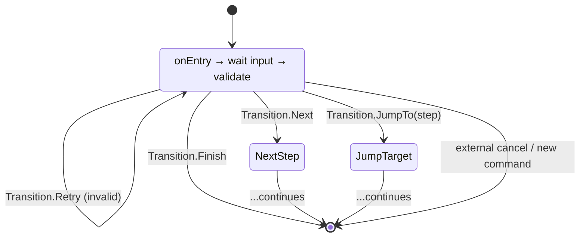

---
---
title: Fsm And Conversation Handling
---

Thư viện cũng hỗ trợ cơ chế FSM, là một cơ chế để xử lý dần đầu vào của người dùng cùng với việc xử lý lỗi đầu vào.

> [!NOTE]
> TL;DR: Xem ví dụ [tại đây](https://github.com/vendelieu/telegram-bot_template/tree/conversation).

### In theory

Hãy tưởng tượng một trường hợp bạn cần thu thập khảo sát người dùng, bạn có thể hỏi tất cả dữ liệu của một người trong một bước, nhưng nếu có đầu vào sai của một trong các tham số, sẽ gây khó khăn cho cả người dùng và chúng ta, và mỗi bước có thể có sự khác biệt tùy thuộc vào một số dữ liệu đầu vào.

Bây giờ hãy tưởng tượng việc nhập dữ liệu theo từng bước, nơi bot chuyển sang chế độ đối thoại với người dùng.

<p align="center">
  
</p>



Các mũi tên tiến (`Transition.Next`, `Transition.JumpTo`) tiến hành wizard, `Transition.Retry` giữ người dùng ở cùng bước cho đến khi đầu vào hợp lệ (ví dụ, khi người dùng nhập `-100` cho tuổi), và `Transition.Finish` (hoặc một lệnh bên ngoài) kết thúc toàn bộ luồng.

### In practice

Hệ thống Wizard cho phép tương tác nhiều bước với người dùng trong bot Telegram. Nó hướng dẫn người dùng qua một chuỗi các bước, xác thực đầu vào, lưu trữ trạng thái và chuyển đổi giữa các bước.

**Lợi ích Chính:**
- **Type-safe**: Kiểm tra kiểu tại thời điểm biên dịch cho việc truy cập trạng thái
- **Declarative**: Định nghĩa các bước dưới dạng lớp/đối tượng lồng nhau
- **Flexible**: Hỗ trợ chuyển tiếp có điều kiện, nhảy và thử lại
- **Stateful**: Tự động lưu trữ trạng thái với các backend lưu trữ có thể cắm vào
- **Integrated**: Hoạt động cùng hệ thống Activity hiện có

### Core Concepts

#### WizardStep

Một `WizardStep` đại diện cho một bước duy nhất trong luồng wizard. Mỗi bước phải triển khai:

- **`onEntry(ctx: WizardContext)`**: Được gọi khi người dùng vào bước này. Dùng để nhắc người dùng.
- **`onRetry(ctx: WizardContext)`**: Được gọi khi xác thực thất bại và bước cần thử lại. Dùng để hiển thị thông báo lỗi.
- **`validate(ctx: WizardContext): Transition`**: Xác thực đầu vào hiện tại và trả về `Transition` chỉ ra những gì sẽ xảy ra tiếp theo.
- **`store(ctx: WizardContext): Any?`** (tùy chọn): Trả về giá trị cần lưu cho bước này. Trả về `null` nếu bước không lưu trạng thái.

```kotlin
object NameStep : WizardStep(isInitial = true) {
    override suspend fun onEntry(ctx: WizardContext) {
        message { "What is your name?" }.send(ctx.user, ctx.bot)
    }
    
    override suspend fun onRetry(ctx: WizardContext) {
        message { "Name cannot be empty. Please try again." }.send(ctx.user, ctx.bot)
    }
    
    override suspend fun validate(ctx: WizardContext): Transition {
        return if (ctx.update.text.isNullOrBlank()) {
            Transition.Retry
        } else {
            Transition.Next
        }
    }
    
    override suspend fun store(ctx: WizardContext): String {
        return ctx.update.text!!
    }
}
```

> [!NOTE]
> Nếu một bước không được đánh dấu là initial -> bước khai báo đầu tiên sẽ được coi là như vậy.

#### Transition

Một `Transition` xác định những gì sẽ xảy ra sau khi xác thực:

- **`Transition.Next`**: Chuyển sang bước tiếp theo trong chuỗi
- **`Transition.JumpTo(step: KClass<out WizardStep>)`**: Nhảy đến một bước cụ thể
- **`Transition.Retry`**: Thử lại bước hiện tại (xác thực thất bại)
- **`Transition.Finish`**: Kết thúc wizard

```kotlin
// Conditional jump based on input
override suspend fun validate(ctx: WizardContext): Transition {
    val age = ctx.update.text?.toIntOrNull()
    return when {
        age == null -> Transition.Retry
        age < 18 -> Transition.JumpTo(UnderageStep::class)
        else -> Transition.Next
    }
}
```

#### WizardContext

`WizardContext` cung cấp quyền truy cập tới:
- **`user: User`**: Người dùng hiện tại
- **`update: ProcessedUpdate`**: Cập nhật hiện tại
- **`bot: TelegramBot`**: Thực thể bot
- **`userReference: UserChatReference`**: Tham chiếu ID người dùng và chat để lưu trữ trạng thái

Cộng với các phương thức truy cập trạng thái an toàn kiểu (được KSP sinh ra).

---

### Defining a Wizard

#### Basic Structure

Một wizard được định nghĩa dưới dạng lớp hoặc đối tượng được chú thích bằng `@WizardHandler`:

```kotlin
@WizardHandler(trigger = ["/survey"])
object SurveyWizard {
    object NameStep : WizardStep(isInitial = true) {
        // ... step implementation
    }
    
    object AgeStep : WizardStep {
        // ... step implementation
    }
    
    object FinishStep : WizardStep {
        // ... step implementation
    }
}
```

#### Annotation Parameters

**`@WizardHandler`** chấp nhận:
- **`trigger: Array<String>`**: Các lệnh khởi động wizard (vd., `["/start", "/survey"]`)
- **`scope: Array<UpdateType>`**: Các loại cập nhật để lắng nghe (mặc định: `[UpdateType.MESSAGE]`)
- **`stateManagers: Array<KClass<out WizardStateManager<*>>>`**: Các lớp quản lý trạng thái để lưu dữ liệu bước

---

### State Management

#### WizardStateManager

Trạng thái được lưu bằng các triển khai `WizardStateManager<T>`. Mỗi manager xử lý một kiểu cụ thể:

```kotlin
interface WizardStateManager<T : Any> {
    suspend fun get(key: KClass<out WizardStep>, reference: UserChatReference): T?
    suspend fun set(key: KClass<out WizardStep>, reference: UserChatReference, value: T)
    suspend fun del(key: KClass<out WizardStep>, reference: UserChatReference)
}
```

Xem thêm: [MapStateManager<T>](https://vendelieu.github.io/telegram-bot/telegram-bot/eu.vendeli.tgbot.implementations/-map-state-manager/index.html), [MapStringStateManager](https://vendelieu.github.io/telegram-bot/telegram-bot/eu.vendeli.tgbot.implementations/-map-string-state-manager/index.html), [MapIntStateManager](https://vendelieu.github.io/telegram-bot/telegram-bot/eu.vendeli.tgbot.implementations/-map-int-state-manager/index.html), [MapLongStateManager](https://vendelieu.github.io/telegram-bot/telegram-bot/eu.vendeli.tgbot.implementations/-map-long-state-manager/index.html).

#### Automatic Matching

KSP khớp các bước với các manager dựa trên kiểu trả về của `store()`:

```kotlin
@WizardHandler(
    trigger = ["/survey"],
    stateManagers = [StringStateManager::class, IntStateManager::class]
)
object SurveyWizard {
    object NameStep : WizardStep(isInitial = true) {
        override suspend fun store(ctx: WizardContext): String {
            return ctx.update.text!! // Matches StringStateManager
        }
    }
    
    object AgeStep : WizardStep {
        override suspend fun store(ctx: WizardContext): Int {
            return ctx.update.text!!.toInt() // Matches IntStateManager
        }
    }
}
```

#### Per-Step Override

Ghi đè quản lý trạng thái cho một bước cụ thể bằng `@WizardHandler.StateManager`:

```kotlin
@WizardHandler(
    trigger = ["/survey"],
    stateManagers = [DefaultStateManager::class]
)
object SurveyWizard {
    object NameStep : WizardStep(isInitial = true) {
        // Uses DefaultStateManager
    }
    
    @WizardHandler.StateManager(CustomStateManager::class)
    object AgeStep : WizardStep {
        // Uses CustomStateManager instead
    }
}
```

---

### Type-Safe State Access

KSP sinh ra các hàm mở rộng an toàn kiểu trên `WizardContext` cho mỗi bước lưu trạng thái.

#### Generated Functions

Đối với một bước lưu `String`:

```kotlin
// Generated automatically by KSP
suspend inline fun <reified S : WizardStep> WizardContext.getState(): String?
suspend inline fun <reified S : WizardStep> WizardContext.setState(value: String)
suspend inline fun <reified S : WizardStep> WizardContext.delState()
```

#### Usage

```kotlin
object FinishStep : WizardStep {
    override suspend fun onEntry(ctx: WizardContext) {
        // Type-safe access - returns String? (nullable)
        val name: String? = ctx.getState<NameStep>()
        
        // Type-safe access - returns Int? (nullable)
        val age: Int? = ctx.getState<AgeStep>()
        
        val summary = buildString {
            appendLine("Name: $name")
            appendLine("Age: $age")
        }
        
        message { summary }.send(ctx.user, ctx.bot)
    }
    
    override suspend fun onRetry(ctx: WizardContext) = Unit
    
    override suspend fun validate(ctx: WizardContext): Transition {
        return Transition.Finish
    }
}
```

#### Fallback Methods

Nếu các phương thức an toàn kiểu không có, dùng các phương thức dự phòng:

```kotlin
// Fallback - returns Any?
val name = ctx.getState(NameStep::class)

// Fallback - accepts Any?
ctx.setState(NameStep::class, "John")
ctx.delState(NameStep::class)
```

---

### Complete Example

#### User Registration Wizard

```kotlin
@WizardHandler(
    trigger = ["/register"],
    stateManagers = [StringStateManager::class, IntStateManager::class]
)
object RegistrationWizard {
    object NameStep : WizardStep(isInitial = true) {
        override suspend fun onEntry(ctx: WizardContext) {
            message { "What is your name?" }.send(ctx.user, ctx.bot)
        }
        
        override suspend fun onRetry(ctx: WizardContext) {
            message { "Please enter a valid name." }.send(ctx.user, ctx.bot)
        }
        
        override suspend fun validate(ctx: WizardContext): Transition {
            val name = ctx.update.text?.trim()
            return if (name.isNullOrBlank() || name.length < 2) {
                Transition.Retry
            } else {
                Transition.Next
            }
        }
        
        override suspend fun store(ctx: WizardContext): String {
            return ctx.update.text!!.trim()
        }
    }
    
    object AgeStep : WizardStep {
        override suspend fun onEntry(ctx: WizardContext) {
            message { "How old are you?" }.send(ctx.user, ctx.bot)
        }
        
        override suspend fun onRetry(ctx: WizardContext) {
            message { "Please enter a valid age (must be a number)." }.send(ctx.user, ctx.bot)
        }
        
        override suspend fun validate(ctx: WizardContext): Transition {
            val age = ctx.update.text?.toIntOrNull()
            return when {
                age == null -> Transition.Retry
                age < 0 || age > 150 -> Transition.Retry
                age < 18 -> Transition.JumpTo(UnderageStep::class)
                else -> Transition.Next
            }
        }
        
        override suspend fun store(ctx: WizardContext): Int {
            return ctx.update.text!!.toInt()
        }
    }
    
    object UnderageStep : WizardStep {
        override suspend fun onEntry(ctx: WizardContext) {
            message { 
                "Sorry, you must be 18 or older to register." 
            }.send(ctx.user, ctx.bot)
        }
        
        override suspend fun onRetry(ctx: WizardContext) = Unit
        
        override suspend fun validate(ctx: WizardContext): Transition {
            return Transition.Finish
        }
    }
    
    object ConfirmationStep : WizardStep {
        override suspend fun onEntry(ctx: WizardContext) {
            // Type-safe state access
            val name: String? = ctx.getState<NameStep>()
            val age: Int? = ctx.getState<AgeStep>()
            
            val confirmation = buildString {
                appendLine("Please confirm your information:")
                appendLine("Name: $name")
                appendLine("Age: $age")
                appendLine()
                appendLine("Reply 'yes' to confirm or 'no' to start over.")
            }
            
            message { confirmation }.send(ctx.user, ctx.bot)
        }
        
        override suspend fun onRetry(ctx: WizardContext) {
            message { "Please reply 'yes' or 'no'." }.send(ctx.user, ctx.bot)
        }
        
        override suspend fun validate(ctx: WizardContext): Transition {
            val response = ctx.update.text?.lowercase()?.trim()
            return when (response) {
                "yes" -> Transition.Finish
                "no" -> Transition.JumpTo(NameStep::class) // Start over
                else -> Transition.Retry
            }
        }
    }
    
    object FinishStep : WizardStep {
        override suspend fun onEntry(ctx: WizardContext) {
            val name: String? = ctx.getState<NameStep>()
            val age: Int? = ctx.getState<AgeStep>()
            
            // Save to database, send confirmation, etc.
            message { 
                "Registration complete! Welcome, $name (age $age)." 
            }.send(ctx.user, ctx.bot)
        }
        
        override suspend fun onRetry(ctx: WizardContext) = Unit
        
        override suspend fun validate(ctx: WizardContext): Transition {
            return Transition.Finish
        }
    }
}
```

---

### Advanced Features

#### Conditional Transitions

Sử dụng `Transition.JumpTo` cho các luồng có điều kiện:

```kotlin
override suspend fun validate(ctx: WizardContext): Transition {
    val choice = ctx.update.text?.lowercase()
    return when (choice) {
        "premium" -> Transition.JumpTo(PremiumStep::class)
        "basic" -> Transition.JumpTo(BasicStep::class)
        else -> Transition.Retry
    }
}
```

#### Stateless Steps

Các bước không cần lưu trạng thái. Chỉ cần trả về `null` từ `store()` (hoặc giữ nguyên):

```kotlin
object ConfirmationStep : WizardStep {
    override suspend fun store(ctx: WizardContext): Any? = null
    // ... rest of implementation
}
```

#### Custom State Managers

Triển khai `WizardStateManager<T>` cho lưu trữ tùy chỉnh (cơ sở dữ liệu, Redis, v.v.):

```kotlin
class DatabaseStateManager : WizardStateManager<String> {
    override suspend fun get(
        key: KClass<out WizardStep>,
        reference: UserChatReference
    ): String? {
        // Load from database
        return database.getWizardState(reference.userId, key.qualifiedName)
    }
    
    override suspend fun set(
        key: KClass<out WizardStep>,
        reference: UserChatReference,
        value: String
    ) {
        // Save to database
        database.saveWizardState(reference.userId, key.qualifiedName, value)
    }
    
    override suspend fun del(
        key: KClass<out WizardStep>,
        reference: UserChatReference
    ) {
        // Delete from database
        database.deleteWizardState(reference.userId, key.qualifiedName)
    }
}
```

---

### How It Works Internally

#### Code Generation

KSP sinh ra:

1. **WizardActivity**: Một triển khai cụ thể mở rộng `WizardActivity` với các bước được mã hóa cứng
2. **Start Activity**: Xử lý lệnh kích hoạt và khởi động wizard
3. **Input Activity**: Xử lý đầu vào người dùng trong quá trình wizard
4. **State Accessors**: Các hàm mở rộng an toàn kiểu cho việc truy cập trạng thái

#### Flow

1. Người dùng gửi `/register` → Start Activity được gọi
2. Start Activity tạo `WizardContext` và gọi `wizardActivity.start(ctx)`
3. `start()` vào bước ban đầu và đặt `inputListener` để theo dõi bước hiện tại
4. Người dùng gửi tin nhắn → Input Activity được gọi
5. Input Activity gọi `wizardActivity.handleInput(ctx)`
6. `handleInput()` xác thực đầu vào, lưu trạng thái và chuyển sang bước tiếp theo
7. Quá trình lặp lại cho tới khi `Transition.Finish` được trả về

#### State Persistence

- Trạng thái được lưu sau khi xác thực thành công (trước khi chuyển tiếp)
- Giá trị trả về của `store()` của mỗi bước được lưu bằng `WizardStateManager` phù hợp
- Trạng thái được phân vùng theo người dùng và chat (`UserChatReference`)

---

### Best Practices

#### 1. Always Provide Clear Prompts

```kotlin
override suspend fun onEntry(ctx: WizardContext) {
    message { 
        "Please enter your email address:\n" +
        "(Format: user@example.com)" 
    }.send(ctx.user, ctx.bot)
}
```

#### 2. Handle Validation Errors Gracefully

```kotlin
override suspend fun onRetry(ctx: WizardContext) {
    message { 
        "Invalid email format. Please try again.\n" +
        "Example: user@example.com" 
    }.send(ctx.user, ctx.bot)
}
```

#### 3. Use Type-Safe State Access

Ưu tiên các phương thức an toàn kiểu được sinh:

```kotlin
// ✅ Good - type-safe
val name: String? = ctx.getState<NameStep>()

// ❌ Avoid - loses type safety
val name = ctx.getState(NameStep::class) as? String
```

#### 4. Keep Steps Focused

Mỗi bước nên có một trách nhiệm duy nhất:

```kotlin
// ✅ Good - focused step
object EmailStep : WizardStep {
    // Only handles email collection
}

// ❌ Avoid - too much logic
object PersonalInfoStep : WizardStep {
    // Handles name, email, phone, address...
}
```

#### 5. Use Meaningful Step Names

```kotlin
// ✅ Good
object EmailVerificationStep : WizardStep

// ❌ Avoid
object Step2 : WizardStep
```

#### 6. Clean Up State When Needed

Nếu cần xóa trạng thái thủ công:

```kotlin
object CancelStep : WizardStep {
    override suspend fun onEntry(ctx: WizardContext) {
        // Clear all wizard state
        ctx.delState<NameStep>()
        ctx.delState<AgeStep>()
        
        message { "Registration cancelled." }.send(ctx.user, ctx.bot)
    }
}
```

---

### Summary

Hệ thống Wizard cung cấp:
- ✅ **Type-safe** quản lý trạng thái với kiểm tra kiểu tại thời điểm biên dịch
- ✅ **Declarative** định nghĩa bước dưới dạng lớp lồng nhau
- ✅ **Flexible** chuyển tiếp với logic có điều kiện
- ✅ **Automatic** sinh mã qua KSP
- ✅ **Integrated** với hệ thống Activity hiện có
- ✅ **Pluggable** backend lưu trữ trạng thái

Bắt đầu xây dựng wizard bằng cách chú thích lớp bằng `@WizardHandler` và định nghĩa các bước dưới dạng đối tượng `WizardStep` lồng nhau!
if you have any questions contact us in chat, we will be glad to help :)
---