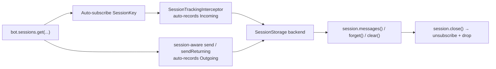

---
---
title: Sessions
---

### Sessions

> Added in `9.5`.

یک **Session** دستگیره‌ای برای یک بخش منطقی گفت‌وگو است. هر پیامی که از طریق آن عبور می‌کند — هم پیام‌های ورودی کاربران و هم پیام‌های خروجی ربات — ثبت می‌شود تا ربات بعداً بتواند آن‌ها را پخش یا **bulk‑delete** کند در یک تماس.

زیرسیستم **همواره فعال** است با تنظیمات پیش‌فرض معقول. ربات‌هایی که هرگز به سشن‌ها دست نمی‌زنند هزینه به‌روزرسانی صفر (پایپلاین اینترسپتور هر زمان که سشن باز نباشد، کوتاه می‌شود) پرداخت می‌کنند.



### Quick start

```kotlin
val session = bot.sessions.get(chatId = chat.id, userId = user.id)

// Both incoming and outgoing are tracked automatically — just send through the session.
with(session) {
    message { "Hi, what's up?" }.send(bot)        // auto-tracked as Outgoing
}

// later — wipe everything we sent and received in this slice
session.clear()
```

ردیابی به‌صورت خودکار در **هر دو** جهت انجام می‌شود:

1. سشن‌ها از [`bot.sessions`](https://vendelieu.github.io/telegram-bot/telegram-bot/eu.vendeli.tgbot.interfaces.session/-session-manager/index.html) که یک `SessionManager` در هر `TelegramBot` در دسترس است، به‌دست می‌آیند.
2. **به‌روزرسانی‌های ورودی** توسط اینترسپتور پایپلاین برای هر کلیدی که سشن باز دارد، ثبت می‌شود.
3. **پیام‌های خروجی** هر زمان که ارسال حاوی سشن باشد، ثبت می‌شوند — چه با عبور صریح سشن (`action.send(to, bot, session)` / `sendReturning(to, bot, session)`) و چه با اجرای ارسال داخل بلوک `with(session) { ... }` (اورلودهای پارامتر زمینه سشن را برای شما عبور می‌دهند).

فراخوانی دستی `session.track(message, Direction.Outgoing)` فقط زمانی لازم است که بخواهید `Message` ای که **از طریق** ارسال آگاهی‌دار از سشن تولید نشده است، ثبت کنید (مثلاً پیام دریافت‌شده از منبع دیگر یا پیامی که قبل از وجود سشن ارسال شده).

### Session keys & strategies

یک [`SessionKey`](https://vendelieu.github.io/telegram-bot/telegram-bot/eu.vendeli.tgbot.types.session/-session-key/index.html) یک سشن منطقی را شناسایی می‌کند. این یک نوع sealed است:

- `SessionKey.Chat(chatId, qualifier?)` — سشن سراسری چت که برای همه اعضای چت مشترک است.
- `SessionKey.ChatUser(chatId, userId, qualifier?)` — سشن مخصوص کاربر داخل یک چت.

پارامتر اختیاری `qualifier` به چند سشن مستقل اجازه می‌دهد برای همان چت/کاربر همزمان وجود داشته باشند (مثلاً `"wizard"` و `"support"`).

یک [`SessionKeyStrategy`](https://vendelieu.github.io/telegram-bot/telegram-bot/eu.vendeli.tgbot.types.session/-session-key-strategy/index.html) تعیین می‌کند کدام کلید برای به‌روزرسانی داده‌شده به‌کار رود. سه استراتژی پیش‌فرض وجود دارد:

| Strategy | Behaviour |
|----------|-----------|
| `SessionKeyStrategy.ChatUser` *(default)* | `ChatUser(chat, user)` وقتی هر دو موجود باشند، در غیراینصورت `Chat(chat)`. |
| `SessionKeyStrategy.Chat` | همیشه `Chat(chat)`. برای ربات‌های نوع broadcast و کانال‌ها مفید است. |
| `SessionKeyStrategy.Auto` | در چت‌های خصوصی `Chat(chat)`، در سایر موارد `ChatUser(chat, user)`. |

`SessionKeyStrategy` یک `fun interface` است — می‌توانید یک پیاده‌سازی سفارشی فراهم کنید اگر به حوزه‌بندی خاصی (مثلاً بر حسب اتصال تجاری یا موضوع) نیاز دارید.

### Tracking direction

هر ورودی به‌عنوان ورودی یا خروجی از طریق [`Direction`](https://vendelieu.github.io/telegram-bot/telegram-bot/eu.vendeli.tgbot.types.session/-direction/index.html) ثبت می‌شود:

- `Direction.Incoming` — دریافت‌شده از کاربر/چت. به‌صورت خودکار توسط `SessionTrackingInterceptor` برای هر کلیدی که سشن باز دارد، ثبت می‌شود.
- `Direction.Outgoing` — ارسال‌شده توسط ربات. به‌صورت خودکار هر زمان که ارسال آگاهی‌دار از سشن باشد، ثبت می‌شود (یا `action.send(to, bot, session)` مستقیم، یا داخل `with(session) { … }`).

`session.track(message, direction)` به‌عنوان راه‌حل پشتیبان برای موارد نادری که هیچ‌یک از مسیرها اعمال نمی‌شود (مثلاً پر کردن یک `Message` که از منبع دیگری به‌دست آمده) استفاده می‌شود.

ورودی‌های ثبت‌شده به‌عنوان مقادیر [`TrackedMessage`](https://vendelieu.github.io/telegram-bot/telegram-bot/eu.vendeli.tgbot.types.session/-tracked-message/index.html) شامل `messageId`، `chatId`، `userId` اختیاری، [`MessageKind`](https://vendelieu.github.io/telegram-bot/telegram-bot/eu.vendeli.tgbot.types.component/-message-kind/index.html)، جهت، `businessConnectionId` اختیاری و زمان‌مهر `Instant` ذخیره می‌شوند.

### Session API

```kotlin
interface Session {
    val key: SessionKey
    val chatId: Long
    val userId: Long?
    val bot: TelegramBot

    suspend fun track(message: Message, direction: Direction = Direction.Outgoing)
    suspend fun track(update: ProcessedUpdate, direction: Direction = Direction.Incoming)
    suspend fun messages(): List<TrackedMessage>

    suspend fun clear(
        bot: TelegramBot = this.bot,
        predicate: (TrackedMessage) -> Boolean = { true },
    ): Int

    suspend fun forget(predicate: (TrackedMessage) -> Boolean = { true }): Int
    suspend fun close()
}
```

- `track` یک پیام را ثبت می‌کند؛ overload دوم یک `ProcessedUpdate` را مستقیماً می‌پذیرد.
- `messages()` یک اسنپ‌شات غیرقابل تغییر برمی‌گرداند.
- `clear()` پیام‌های منطبق **از تلگرام** حذف می‌کند (در دسته‌های ۱۰۰ تایی — محدودیت API `deleteMessages`) و آنها را از ذخیره‌سازی پاک می‌سازد. ذخیره‌سازی صرف‌نظر از نتیجه هر دسته پاک می‌شود، بنابراین خطاهای موقت API باعث نشت ورودی‌ها نمی‌شوند.
- `forget()` فقط ورودی‌ها را از ذخیره‌سازی حذف می‌کند — تلگرام تحت‌تأثیر قرار نمی‌گیرد.
- `close()` اشتراک کلید را از ردیابی خودکار لغو می‌کند و ذخیره‌سازی آن را پاک می‌سازد. این نمونه همچنان قابل استفاده است؛ فراخوانی دوباره `bot.sessions.get(...)` باعث اشتراک‌گذاری مجدد می‌شود.

### Multiple parallel sessions

برای یک چت/کاربر یک سشن مستقل با `qualifier` مشخص کنید:

```kotlin
val wizard  = bot.sessions.get(chat.id, user.id, qualifier = "wizard")
val support = bot.sessions.get(chat.id, user.id, qualifier = "support")
```

در توابع handler‌، مولد کد ktnip به‌صورت خودکار `qualifier` ها را از طریق annotation `@SessionQualifier` تنظیم می‌کند:

```kotlin
@CommandHandler(["/help"])
suspend fun help(
    @SessionQualifier("wizard")  wizard:  Session,
    @SessionQualifier("support") support: Session,
    bot: TelegramBot,
) {
    // wizard و support سشن‌های جداگانه‌ای برای همان chat/user هستند.
}
```

برای سشن پیش‌فرض (بدون qualifier) نیازی به annotation نیست.

### Session-aware sends

دو روش معادل برای ارسال پیام داخل سشن وجود دارد — هر کدام را که در محل فراخوانی بهتر می‌بیندید استفاده کنید:

```kotlin
// 1. پاس کردن صریح سشن:
message { "Confirm with yes/no" }.send(user, bot, session)
photo   { "FILE_ID" }.send(chat, bot, session)

// 2. یا باز کردن بلوک زمینه و حذف پارامتر:
with(session) {
    message { "Confirm with yes/no" }.send(bot)             // هدف chatId سشن
    photo   { "FILE_ID" }.send(to = user, via = bot)
}
```

هر دو مسیر پیام برگشتی را به‌عنوان `Direction.Outgoing` خودکار ردیابی می‌کنند (نگاه کنید به `Action.sendTracked` / `sendReturningTracked`). چون سشن به‌صورت صریح پاس می‌شود (نه از طریق thread‑ یا coroutine‑local) ردیابی هرگز از دست نمی‌رود حتی وقتی هندلرها coroutine فرزند اجرا می‌کنند.

`sendReturning(...)` به همان شکل عمل می‌کند: هر `Message` (یا لیست پیام‌ها) برگشتی قبل از این که `Deferred` فراخواننده کامل شود، در سشن ثبت می‌شود، بنابراین می‌توانید پاسخ را به‌صورت معمولی استفاده کنید.

### Storage backends

[`SessionStorage`](https://vendelieu.github.io/telegram-bot/telegram-bot/eu.vendeli.tgbot.interfaces.session/-session-storage/index.html) یک اینترفیس کوچک است:

```kotlin
interface SessionStorage {
    suspend fun add(key: SessionKey, entry: TrackedMessage)
    suspend fun list(key: SessionKey): List<TrackedMessage>
    suspend fun remove(key: SessionKey, predicate: (TrackedMessage) -> Boolean): Int
    suspend fun clear(key: SessionKey)
}
```

پیش‌فرض `InMemorySessionStorage` است (پشتیبان `ConcurrentHashMap`). می‌توانید برای Redis، JDBC و غیره پیاده‌سازی خود را بنویسید و از طریق بلوک پیکربندی وصل کنید.

### Configuration

```kotlin
val bot = TelegramBot("BOT_TOKEN") {
    sessions {
        keyStrategy   = SessionKeyStrategy.Auto
        storage       = InMemorySessionStorage()
        // managerFactory = SessionManagerFactory { bot, cfg -> CustomSessionManager(bot, cfg) }
    }
}
```

هر سه ویژگی مقدار پیش‌فرض معقول دارند — بلوک `sessions { }` فقط زمانی لازم است که بخواهید چیزی را بازنویسی کنید.

### Performance

`SessionManager.isIdle()` تا زمانی که اولین سشن باز نشود `true` می‌ماند. `SessionTrackingInterceptor` در هر به‌روزرسانی این مقدار را بررسی می‌کند و وقتی idle باشد کوتاه می‌شود، بنابراین ربات‌هایی که هرگز `bot.sessions.get(...)` را صدا نمی‌زنند تنها یک بررسی نقشه در هر به‌روزرسانی پرداخت می‌کنند.

اشتراک‌ها بر پایه predicate هستند: باز کردن سشن برای یک کلید، predicate‌ای ثبت می‌کند که اینترسپتور آن را در به‌روزرسانی‌های بعدی مقایسه می‌کند. `session.close()` predicate را حذف می‌کند.

### Complete example — ephemeral order flow

```kotlin
@CommandHandler(["/order"])
suspend fun startOrder(
    @SessionQualifier("order") order: Session,
    user: User,
    bot: TelegramBot,
) {
    with(order) {
        message { "What would you like to order?" }.send(user, bot)  // auto-tracked
    }
}

@CommandHandler(["/done"])
suspend fun finishOrder(
    @SessionQualifier("order") order: Session,
    user: User,
    bot: TelegramBot,
) {
    // This farewell is sent without the session so it survives clear().
    message { "Order received — wiping our chat history." }.send(user, bot)

    val removed = order.clear()                   // delete every message in this slice
    order.close()                                  // stop tracking until next /order
    println("Cleared $removed messages for ${user.id}")
}
```

پارامتر `@SessionQualifier("order")` این جریان را از هر سشن همزمان دیگر (یک wizard، یک موضوع پشتیبانی، …) که همان کاربر ممکن است اجرا کند، جدا نگه می‌دارد. هر پاسخ کاربر بین `/order` و `/done` توسط اینترسپتور به‌صورت خودکار ثبت می‌شود؛ هر ارسال ربات داخل `with(order) { … }` به‌صورت خودکار توسط overload آگاهی‌دار سشن ثبت می‌شود.

### See also

* [Bot configuration](Bot-configuration.md)
* [Interceptors (middleware)](Interceptors-(middleware.md))
* [FSM and Conversation handling](FSM-and-Conversation-handling.md)
* [Bot context](Bot-Context.md)
* [Handlers](Handlers.md)

---