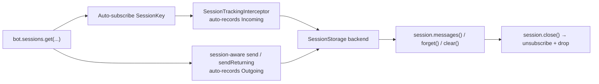

---
---
title: Sessions
---

### Sessions

> Added in `9.5`.

एक **Session** एकल तार्किक बातचीत खंड पर एक हैंडल है। इस पर प्रवाहित होने वाला हर संदेश — चाहे वह इनकमिंग उपयोगकर्ता संदेश हो या आउटगोइंग बॉट संदेश — रिकॉर्ड किया जाता है ताकि बॉट बाद में उन्हें फिर से चलाए या एक कॉल में **bulk-delete** कर सके।

यह सबसिस्टम **always on** है और समझदारी वाले डिफॉल्ट सेटिंग्स के साथ आता है। ऐसे बॉट जो कभी सत्र को छूते नहीं हैं, उन्हें प्रभावी रूप से शून्य प्रति‑अपडेट लागत लगती है (पाइपलाइन इंटरसेप्टर तब शॉर्ट‑सर्किट हो जाता है जब कोई सत्र खुला नहीं होता)।



### Quick start

```kotlin
val session = bot.sessions.get(chatId = chat.id, userId = user.id)

// Both incoming and outgoing are tracked automatically — just send through the session.
with(session) {
    message { "Hi, what's up?" }.send(bot)        // auto-tracked as Outgoing
}

// later — wipe everything we sent and received in this slice
session.clear()
```

ट्रैकिंग **दोनों** दिशाओं में स्वचालित है:

1. सत्र `[`bot.sessions`](https://vendelieu.github.io/telegram-bot/telegram-bot/eu.vendeli.tgbot.interfaces.session/-session-manager/index.html)` से प्राप्त किए जाते हैं, जो प्रत्येक `TelegramBot` पर उपलब्ध `SessionManager` है।
2. **Incoming** अपडेट्स को पाइपलाइन इंटरसेप्टर द्वारा प्रत्येक खुले सत्र सब्सक्रिप्शन वाले कुंजी के लिये रिकॉर्ड किया जाता है।
3. **Outgoing** संदेशों को रिकॉर्ड किया जाता है जब भी भेजे में सत्र उपस्थित होता है — या तो इसे स्पष्ट रूप से पास करके (`action.send(to, bot, session)` / `sendReturning(to, bot, session)`) या `with(session) { ... }` ब्लॉक के अंदर भेजकर (कंटेक्स्ट‑पैरामीटर ओवरलोड सत्र को आपके लिए थ्रेड करता है)।

`session.track(message, Direction.Outgoing)` को हाथ से कॉल करना केवल तभी आवश्यक होता है जब आप ऐसा `Message` रिकॉर्ड करना चाहते हैं जो सत्र‑सचेत भेज के माध्यम से नहीं बना (जैसे कोई संदेश जो किसी अन्य स्रोत से प्राप्त हुआ हो, या सत्र मौजूद होने से पहले भेजा गया हो)।

### Session keys & strategies

एक [`SessionKey`](https://vendelieu.github.io/telegram-bot/telegram-bot/eu.vendeli.tgbot.types.session/-session-key/index.html) तार्किक सत्र को पहचानता है। यह एक sealed type है:

- `SessionKey.Chat(chatId, qualifier?)` — चैट‑व्यापी सत्र जो चैट के सभी उपयोगकर्ताओं के बीच साझा होता है।
- `SessionKey.ChatUser(chatId, userId, qualifier?)` — प्रति‑उपयोगकर्ता सत्र जो एक विशिष्ट उपयोगकर्ता के लिए स्कोप किया जाता है।

वैकल्पिक `qualifier` एक ही चैट/उपयोगकर्ता के लिए कई स्वतंत्र सत्रों को साथ‑साथ चलाने की अनुमति देता है (जैसे `"wizard"` और `"support"`)।

एक [`SessionKeyStrategy`](https://vendelieu.github.io/telegram-bot/telegram-bot/eu.vendeli.tgbot.types.session/-session-key-strategy/index.html) निर्धारित करता है कि किसी अपडेट पर कौन सी कुंजी लागू होती है। तीन रणनीतियां बिल्ट‑इन हैं:

| Strategy | Behaviour |
|----------|-----------|
| `SessionKeyStrategy.ChatUser` *(default)* | `ChatUser(chat, user)` जब दोनों मौजूद हों, अन्यथा `Chat(chat)`। |
| `SessionKeyStrategy.Chat` | हमेशा `Chat(chat)`। ब्रॉडकास्ट‑स्टाइल बॉट और चैनलों के लिये उपयोगी। |
| `SessionKeyStrategy.Auto` | प्राइवेट चैट में `Chat(chat)`, अन्य सभी में `ChatUser(chat, user)`। |

`SessionKeyStrategy` एक `fun interface` है — यदि आपको विशेष स्कोपिंग चाहिए (जैसे व्यवसाय‑कनेक्शन या टॉपिक के आधार पर) तो आप अपना कस्टम इम्प्लीमेंटेशन दे सकते हैं।

### Tracking direction

हर एंट्री को या तो इनकमिंग या आउटगोइंग के रूप में [`Direction`](https://vendelieu.github.io/telegram-bot/telegram-bot/eu.vendeli.tgbot.types.session/-direction/index.html) के माध्यम से रिकॉर्ड किया जाता है:

- `Direction.Incoming` — उपयोगकर्ता/चैट से प्राप्त। प्रत्येक खुले सब्सक्रिप्शन वाली कुंजी के लिये `SessionTrackingInterceptor` द्वारा स्वचालित रूप से रिकॉर्ड किया जाता है।
- `Direction.Outgoing` — बॉट द्वारा भेजा गया। स्वचालित रूप से रिकॉर्ड किया जाता है जब भेजा सत्र‑सचेत हो (या तो `action.send(to, bot, session)` सीधे, या `with(session) { … }` के भीतर)।

`session.track(message, direction)` मैन्युअल रूप से तब उपयोग किया जाता है जब न तो इनकमिंग न ही आउटगोइंग पैथ लागू होते हैं (उदाहरण के लिये किसी बाहरी स्रोत से प्राप्त `Message` को बैक‑फ़िल करना)।

रिकॉर्ड की गई एंट्रीज़ को [`TrackedMessage`](https://vendelieu.github.io/telegram-bot/telegram-bot/eu.vendeli.tgbot.types.session/-tracked-message/index.html) के रूप में संग्रहीत किया जाता है, जिसमें `messageId`, `chatId`, वैकल्पिक `userId`, [`MessageKind`](https://vendelieu.github.io/telegram-bot/telegram-bot/eu.vendeli.tgbot.types.component/-message-kind/index.html), दिशा, वैकल्पिक `businessConnectionId`, तथा `Instant` टाइमस्टैंप शामिल होते हैं।

### Session API

```kotlin
interface Session {
    val key: SessionKey
    val chatId: Long
    val userId: Long?
    val bot: TelegramBot

    suspend fun track(message: Message, direction: Direction = Direction.Outgoing)
    suspend fun track(update: ProcessedUpdate, direction: Direction = Direction.Incoming)
    suspend fun messages(): List<TrackedMessage>

    suspend fun clear(
        bot: TelegramBot = this.bot,
        predicate: (TrackedMessage) -> Boolean = { true },
    ): Int

    suspend fun forget(predicate: (TrackedMessage) -> Boolean = { true }): Int
    suspend fun close()
}
```

- `track` एकल संदेश को रिकॉर्ड करता है; दूसरा ओवरलोड सीधे `ProcessedUpdate` को स्वीकार करता है।
- `messages()` एक अपरिवर्तनीय स्नैपशॉट रिटर्न करता है।
- `clear()` मेल खाते संदेशों को **Telegram** से हटाता है (100 के बैच में — `deleteMessages` API सीमा) और उन्हें स्टोरेज से भी हटाता है। स्टोरेज बैच परिणाम चाहे जैसा भी हो साफ़ किया जाता है, इसलिए अस्थायी API त्रुटियां एंट्रीज़ को हमेशा के लिये नहीं रखतीं।
- `forget()` केवल स्टोरेज से एंट्रीज़ हटाता है — Telegram को कोई बदलाव नहीं होता।
- `close()` कुंजी को ऑटो‑ट्रैकिंग से अनसब्सक्राइब करता है और उसकी स्टोरेज साफ़ करता है। इंस्टेंस फिर भी उपयोग योग्य रहता है; `bot.sessions.get(...)` फिर से कॉल करने पर फिर से सब्सक्राइब हो जाता है।

### Multiple parallel sessions

उसी चैट/उपयोगकर्ता के लिये स्वतंत्र सत्र को संबोधित करने हेतु `qualifier` पास करें:

```kotlin
val wizard  = bot.sessions.get(chat.id, user.id, qualifier = "wizard")
val support = bot.sessions.get(chat.id, user.id, qualifier = "support")
```

हैंडलर फ़ंक्शन्स में ktnip कोड जेनरेटर `@SessionQualifier` एनो्टेशन के द्वारा क्वालिफायर को स्वतः वायर करता है:

```kotlin
@CommandHandler(["/help"])
suspend fun help(
    @SessionQualifier("wizard")  wizard:  Session,
    @SessionQualifier("support") support: Session,
    bot: TelegramBot,
) {
    // wizard and support are isolated sessions for the same chat/user.
}
```

डिफॉल्ट (अभीष्ट) सत्र के लिये एनो्टेशन को छोड़ दें।

### Session-aware sends

संदेश को सत्र में भेजने के दो समकक्ष तरीके हैं — जो भी कॉल साइट पर पढ़ने में बेहतर लगे वह चुनें:

```kotlin
// 1. Pass the session explicitly:
message { "Confirm with yes/no" }.send(user, bot, session)
photo   { "FILE_ID" }.send(chat, bot, session)

// 2. Or open a context block and drop the parameter:
with(session) {
    message { "Confirm with yes/no" }.send(bot)             // targets session.chatId
    photo   { "FILE_ID" }.send(to = user, via = bot)
}
```

दोनों रास्ते लौटाए गए `Message` को `Direction.Outgoing` के रूप में ऑटो‑ट्रैक करते हैं (देखें `Action.sendTracked` / `sendReturningTracked`)। क्योंकि सत्र स्पष्ट रूप से पास किया गया है (थ्रेड‑या कोरूटीन‑लोकल नहीं), हैंडलर द्वारा चाइल्ड कोरूटीन लॉन्च करने पर ट्रैकिंग कभी नहीं खोती।

`sendReturning(...)` भी समान व्यवहार करता है: कोई भी लौटाया गया `Message` (या संदेशों की सूची) सत्र में *कॉलर के* `Deferred` के समाप्त होने से पहले रिकॉर्ड किया जाता है, इसलिए आप सामान्य रूप से प्रतिक्रिया का उपयोग जारी रख सकते हैं।

### Storage backends

[`SessionStorage`](https://vendelieu.github.io/telegram-bot/telegram-bot/eu.vendeli.tgbot.interfaces.session/-session-storage/index.html) एक छोटा इंटरफ़ेस है:

```kotlin
interface SessionStorage {
    suspend fun add(key: SessionKey, entry: TrackedMessage)
    suspend fun list(key: SessionKey): List<TrackedMessage>
    suspend fun remove(key: SessionKey, predicate: (TrackedMessage) -> Boolean): Int
    suspend fun clear(key: SessionKey)
}
```

डिफॉल्ट `InMemorySessionStorage` (`ConcurrentHashMap`‑बैक्ड) है। Redis, JDBC आदि के लिये अपना इम्प्लीमेंटेशन बनाएं और कॉन्फ़िगरेशन ब्लॉक के माध्यम से प्लग‑इन करें।

### Configuration

```kotlin
val bot = TelegramBot("BOT_TOKEN") {
    sessions {
        keyStrategy   = SessionKeyStrategy.Auto
        storage       = InMemorySessionStorage()
        // managerFactory = SessionManagerFactory { bot, cfg -> CustomSessionManager(bot, cfg) }
    }
}
```

तीन गुणों के लिए समझदारी वाले डिफॉल्ट हैं — `sessions { }` ब्लॉक केवल तब आवश्यक है जब आप कुछ ओवरराइड करना चाहते हैं।

### Performance

`SessionManager.isIdle()` `true` रहता है जब तक आप पहला सत्र नहीं खोलते। `SessionTrackingInterceptor` हर अपडेट पर इसे जांचता है और जब idle होता है तो शॉर्ट‑सर्किट कर देता है, इसलिए ऐसे बॉट जो कभी `bot.sessions.get(...)` नहीं बुलाते, उन्हें प्रति अपडेट केवल एक मैप चेक की लागत आती है।

सब्सक्रिप्शन प्रेडिकेट‑आधारित होते हैं: किसी कुंजी के लिये सत्र खोलने पर एक प्रेडिकेट रजिस्टर होता है जिसे इंटरसेप्टर बाद के अपडेट्स से मिलाता है। `session.close()` वह प्रेडिकेट हटा देता है।

### Complete example — ephemeral order flow

```kotlin
@CommandHandler(["/order"])
suspend fun startOrder(
    @SessionQualifier("order") order: Session,
    user: User,
    bot: TelegramBot,
) {
    with(order) {
        message { "What would you like to order?" }.send(user, bot)  // auto-tracked
    }
}

@CommandHandler(["/done"])
suspend fun finishOrder(
    @SessionQualifier("order") order: Session,
    user: User,
    bot: TelegramBot,
) {
    // This farewell is sent without the session so it survives clear().
    message { "Order received — wiping our chat history." }.send(user, bot)

    val removed = order.clear()                   // delete every message in this slice
    order.close()                                  // stop tracking until next /order
    println("Cleared $removed messages for ${user.id}")
}
```

`@SessionQualifier("order")` पैरामीटर इस फ्लो को किसी भी अन्य समवर्ती सत्र (जैसे wizard, support thread, …) से अलग रखता है जो वही उपयोगकर्ता चला सकता है। `/order` और `/done` के बीच हर उपयोगकर्ता उत्तर इंटरसेप्टर द्वारा ऑटो‑रिकॉर्ड होता है; `with(order) { … }` के भीतर बॉट द्वारा भेजा गया हर संदेश सत्र‑सचेत ओवरलोड द्वारा ऑटो‑रिकॉर्ड होता है।

### See also

* [Bot configuration](Bot-configuration.md)
* [Interceptors (middleware)](Interceptors-(middleware.md))
* [FSM and Conversation handling](FSM-and-Conversation-handling.md)
* [Bot context](Bot-Context.md)
* [Handlers](Handlers.md)

---