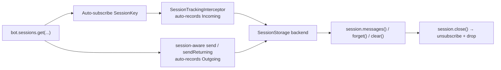

---
---
title: Sessions
---

### Sessions

> Added in `9.5`.

A **Session** is a handle on a single logical conversation slice. Every message that flows through it — both incoming user messages and outgoing bot sends — is recorded so the bot can later replay or **bulk-delete** them in one call.

The subsystem is **always on** with sensible defaults. Bots that never touch sessions pay effectively zero per-update cost (the pipeline interceptor short-circuits whenever no sessions are open).



### Quick start

```kotlin
val session = bot.sessions.get(chatId = chat.id, userId = user.id)

// Both incoming and outgoing are tracked automatically — just send through the session.
with(session) {
    message { "Hi, what's up?" }.send(bot)        // auto-tracked as Outgoing
}

// later — wipe everything we sent and received in this slice
session.clear()
```

Tracking is automatic on **both** directions:

1. Sessions are obtained from [`bot.sessions`](https://vendelieu.github.io/telegram-bot/telegram-bot/eu.vendeli.tgbot.interfaces.session/-session-manager/index.html), a `SessionManager` exposed on every `TelegramBot`.
2. **Incoming** updates are recorded by the pipeline interceptor for every key that has an open session subscription.
3. **Outgoing** messages are recorded whenever the send carries a session — either by passing it explicitly (`action.send(to, bot, session)` / `sendReturning(to, bot, session)`) or by performing the send inside a `with(session) { ... }` block (the context-parameter overloads thread the session through for you).

Calling `session.track(message, Direction.Outgoing)` by hand is only needed when you want to record a `Message` that *wasn't* produced through a session-aware send (e.g. a message obtained from another source, or one sent before the session existed).

### Session keys & strategies

A [`SessionKey`](https://vendelieu.github.io/telegram-bot/telegram-bot/eu.vendeli.tgbot.types.session/-session-key/index.html) identifies a logical session. It is a sealed type:

- `SessionKey.Chat(chatId, qualifier?)` — chat-wide session shared by everyone in the chat.
- `SessionKey.ChatUser(chatId, userId, qualifier?)` — per-user session scoped to a specific user inside a chat.

The optional `qualifier` lets multiple independent sessions coexist for the same chat / user (e.g. `"wizard"` and `"support"` running side-by-side).

A [`SessionKeyStrategy`](https://vendelieu.github.io/telegram-bot/telegram-bot/eu.vendeli.tgbot.types.session/-session-key-strategy/index.html) decides which key applies to a given update. Three strategies are built in:

| Strategy | Behaviour |
|----------|-----------|
| `SessionKeyStrategy.ChatUser` *(default)* | `ChatUser(chat, user)` when both are present, else `Chat(chat)`. |
| `SessionKeyStrategy.Chat` | Always `Chat(chat)`. Useful for broadcast-style bots and channels. |
| `SessionKeyStrategy.Auto` | `Chat(chat)` in private chats, `ChatUser(chat, user)` everywhere else. |

`SessionKeyStrategy` is a `fun interface` — you can supply a custom one if you need exotic scoping (for example, per business connection or per topic).

### Tracking direction

Each entry is recorded as either incoming or outgoing via [`Direction`](https://vendelieu.github.io/telegram-bot/telegram-bot/eu.vendeli.tgbot.types.session/-direction/index.html):

- `Direction.Incoming` — received from the user / chat. Recorded automatically by the `SessionTrackingInterceptor` for every key with an open subscription.
- `Direction.Outgoing` — sent by the bot. Recorded automatically whenever the send is session-aware (either `action.send(to, bot, session)` directly, or inside `with(session) { … }`).

Manual `session.track(message, direction)` is a fallback for the rare cases where neither path applies (e.g. backfilling a `Message` you obtained from somewhere else).

Recorded entries are stored as [`TrackedMessage`](https://vendelieu.github.io/telegram-bot/telegram-bot/eu.vendeli.tgbot.types.session/-tracked-message/index.html) values carrying `messageId`, `chatId`, optional `userId`, [`MessageKind`](https://vendelieu.github.io/telegram-bot/telegram-bot/eu.vendeli.tgbot.types.component/-message-kind/index.html), direction, optional `businessConnectionId`, and an `Instant` timestamp.

### Session API

```kotlin
interface Session {
    val key: SessionKey
    val chatId: Long
    val userId: Long?
    val bot: TelegramBot

    suspend fun track(message: Message, direction: Direction = Direction.Outgoing)
    suspend fun track(update: ProcessedUpdate, direction: Direction = Direction.Incoming)
    suspend fun messages(): List<TrackedMessage>

    suspend fun clear(
        bot: TelegramBot = this.bot,
        predicate: (TrackedMessage) -> Boolean = { true },
    ): Int

    suspend fun forget(predicate: (TrackedMessage) -> Boolean = { true }): Int
    suspend fun close()
}
```

- `track` records a single message; the second overload accepts a `ProcessedUpdate` directly.
- `messages()` returns an immutable snapshot.
- `clear()` deletes matching messages **from Telegram** (in batches of 100 — the `deleteMessages` API limit) and removes them from storage. Storage is wiped regardless of per-batch outcome, so transient API errors don't leak entries forever.
- `forget()` drops entries from storage only — Telegram is not touched.
- `close()` unsubscribes the key from auto-tracking and clears its storage. The instance remains usable; calling `bot.sessions.get(...)` again re-subscribes.

### Multiple parallel sessions

Pass a `qualifier` to address an independent session for the same chat / user:

```kotlin
val wizard  = bot.sessions.get(chat.id, user.id, qualifier = "wizard")
val support = bot.sessions.get(chat.id, user.id, qualifier = "support")
```

In handler functions the ktnip code generator wires qualifiers up automatically via the `@SessionQualifier` annotation:

```kotlin
@CommandHandler(["/help"])
suspend fun help(
    @SessionQualifier("wizard")  wizard:  Session,
    @SessionQualifier("support") support: Session,
    bot: TelegramBot,
) {
    // wizard and support are isolated sessions for the same chat/user.
}
```

Omit the annotation for the default (unqualified) session.

### Session-aware sends

There are two equivalent ways to send a message into a session — pick whichever reads better at the call site:

```kotlin
// 1. Pass the session explicitly:
message { "Confirm with yes/no" }.send(user, bot, session)
photo   { "FILE_ID" }.send(chat, bot, session)

// 2. Or open a context block and drop the parameter:
with(session) {
    message { "Confirm with yes/no" }.send(bot)             // targets session.chatId
    photo   { "FILE_ID" }.send(to = user, via = bot)
}
```

Both routes auto-track the returned `Message` as `Direction.Outgoing` (see `Action.sendTracked` / `sendReturningTracked`). Because the session is passed explicitly (not via a thread- or coroutine-local) tracking can never be lost when handlers launch child coroutines.

`sendReturning(...)` works the same way: any returned `Message` (or list of messages) is recorded into the session *before* the caller's `Deferred` completes, so you can keep using the response normally.

### Storage backends

[`SessionStorage`](https://vendelieu.github.io/telegram-bot/telegram-bot/eu.vendeli.tgbot.interfaces.session/-session-storage/index.html) is a small interface:

```kotlin
interface SessionStorage {
    suspend fun add(key: SessionKey, entry: TrackedMessage)
    suspend fun list(key: SessionKey): List<TrackedMessage>
    suspend fun remove(key: SessionKey, predicate: (TrackedMessage) -> Boolean): Int
    suspend fun clear(key: SessionKey)
}
```

The default is `InMemorySessionStorage` (`ConcurrentHashMap`-backed). Implement your own for Redis, JDBC, etc. and plug it in via the configuration block.

### Configuration

```kotlin
val bot = TelegramBot("BOT_TOKEN") {
    sessions {
        keyStrategy   = SessionKeyStrategy.Auto
        storage       = InMemorySessionStorage()
        // managerFactory = SessionManagerFactory { bot, cfg -> CustomSessionManager(bot, cfg) }
    }
}
```

All three properties have sensible defaults — the `sessions { }` block is only required when you actually want to override something.

### Performance

`SessionManager.isIdle()` is `true` until you open the first session. The `SessionTrackingInterceptor` checks it on every update and short-circuits when idle, so bots that never call `bot.sessions.get(...)` pay only a single map check per update.

Subscriptions are predicate-based: opening a session for a key registers a predicate that the interceptor matches against subsequent updates. `session.close()` removes the predicate.

### Complete example — ephemeral order flow

```kotlin
@CommandHandler(["/order"])
suspend fun startOrder(
    @SessionQualifier("order") order: Session,
    user: User,
    bot: TelegramBot,
) {
    with(order) {
        message { "What would you like to order?" }.send(user, bot)  // auto-tracked
    }
}

@CommandHandler(["/done"])
suspend fun finishOrder(
    @SessionQualifier("order") order: Session,
    user: User,
    bot: TelegramBot,
) {
    // This farewell is sent without the session so it survives clear().
    message { "Order received — wiping our chat history." }.send(user, bot)

    val removed = order.clear()                   // delete every message in this slice
    order.close()                                  // stop tracking until next /order
    println("Cleared $removed messages for ${user.id}")
}
```

The `@SessionQualifier("order")` parameter keeps this flow isolated from any other concurrent session (a wizard, a support thread, …) the same user might run. Every user reply between `/order` and `/done` is auto-recorded by the interceptor; every bot send made inside `with(order) { … }` is auto-recorded by the session-aware overload.

### See also

* [Bot configuration](Bot-configuration.md)
* [Interceptors (middleware)](Interceptors-(middleware.md))
* [FSM and Conversation handling](FSM-and-Conversation-handling.md)
* [Bot context](Bot-Context.md)
* [Handlers](Handlers.md)

---