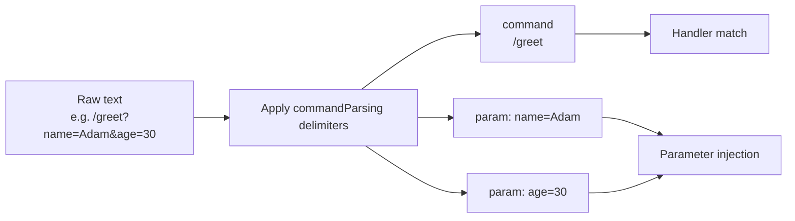

---
---
title: Update Parsing
---

### Text payload

به‌روزرسانی‌های خاصی ممکن است دارای payload متنی باشند که می‌توان برای پردازش بیشتر آن را تجزیه کرد. بیایید نگاهی به آن‌ها بیندازیم:

* `MessageUpdate` -> `message.text`
* `EditedMessageUpdate` -> `editedMessage.text`
* `ChannelPostUpdate` -> `channelPost.text`
* `EditedChannelPostUpdate` -> `editedChannelPost.text`
* `InlineQueryUpdate` -> `inlineQuery.query`
* `ChosenInlineResultUpdate` -> `chosenInlineResult.query`
* `CallbackQueryUpdate` -> `callbackQuery.data`
* `ShippingQueryUpdate` -> `shippingQuery.invoicePayload`
* `PreCheckoutQueryUpdate` -> `preCheckoutQuery.invoicePayload`
* `PollUpdate` -> `poll.question`
* `PurchasedPaidMediaUpdate` -> `purchasedPaidMedia.paidMediaPayload`

از بین به‌روزرسانی‌های فهرست‌شده، یک پارامتر خاص انتخاب شده و به‌عنوان [`TextReference`](https://vendelieu.github.io/telegram-bot/telegram-bot/eu.vendeli.tgbot.types.component/-text-reference/index.html) برای پردازش بیشتر گرفته می‌شود.

### Parsing

پارامترهای انتخاب‌شده با استفاده از جداکننده‌های پیکربندی‌شده مناسب به دستور و پارامترهای آن تجزیه می‌شوند.

پیکربندی را در بلاک [`commandParsing`](https://vendelieu.github.io/telegram-bot/telegram-bot/eu.vendeli.tgbot.types.configuration/-bot-configuration/command-parsing.html) ببینید.

می‌توانید در نمودار زیر ببینید که کدام مؤلفه‌ها به کدام بخش‌های تابع هدف نگاشته می‌شوند.



<p align="center">
  
</p>

### @ParamMapping

همچنین برای راحتی یا در موارد خاص، یک حاشیه‌نویسی به نام [`@ParamMapping`](https://vendelieu.github.io/telegram-bot/telegram-bot/eu.vendeli.tgbot.annotations/-param-mapping/index.html) موجود است.

این امکان را می‌دهد تا نام پارامتر ورودی متن را به هر پارامتری که می‌خواهید نگاشت کنید.

این کار زمانی که داده‌های ورودی شما محدود است، مثلاً `CallbackData` (۶۴ کاراکتر)، مفید است.

مثال استفاده:
`greeting?name=Adam`

```kotlin
@CommandHandler(["greeting"])
suspend fun greeting(@ParamMapping("name") anyParameterName: String, user: User, bot: TelegramBot) {
    message { "Hello, $anyParameterName" }.send(to = user, via = bot)
}
```

همچنین می‌توان از آن برای دریافت پارامترهای بدون نام استفاده کرد، در مواردی که پارسر به گونه‌ای تنظیم شده که نام‌های پارامتر حذف شوند یا حتی وجود نداشته باشند و با الگوی ‘param_n’ عبور کنند، که در آن `n` عدد ترتیبی آن است.

به‌عنوان مثال متن زیر - `myCommand?p1=v1&v2&p3=&p4=v4&p5=` - به‌این شکل تجزیه می‌شود:
* command - `myCommand`
* parameters
  * `p1` = `v1`
  * `param_2` = `v2`
  * `p3` = ``
  * `p4` = `v4`
  * `p5` = ``

همانطور که می‌بینید چون پارامتر دوم نام اعلام‌شده‌ای ندارد، به‌صورت `param_2` نمایش داده می‌شود.

بنابراین می‌توانید نام متغیرها را در callback خلاصه کنید و در کد از نام‌های واضح و خوانا استفاده کنید.

### Deeplink

با توجه به اطلاعات بالا، اگر انتظار دارید deeplink در دستور start شما باشد می‌توانید آن را به‌صورت زیر دریافت کنید:

```kotlin
@CommandHandler(["/start"])
suspend fun start(@ParamMapping("param_1") deeplink: String?, user: User, bot: TelegramBot) {
    message { "deeplink is $deeplink" }.send(to = user, via = bot)
}
```

### Group commands

در پیکربندی `commandParsing` پارامتر [`useIdentifierInGroupCommands`](https://vendelieu.github.io/telegram-bot/telegram-bot/eu.vendeli.tgbot.types.configuration/-command-parsing-configuration/use-identifier-in-group-commands.html) وجود دارد؛ وقتی فعال باشد می‌توانیم از `TelegramBot.identifier` (فراموش نکنید که اگر از پارامتر توضیح‌داده‌شده استفاده می‌کنید آن را تغییر دهید) در فرآیند تطبیق دستور استفاده کنیم؛ این کمک می‌کند تا دستورات مشابه بین چند ربات جداگانه شوند، در غیر این صورت بخش `@MyBot` صرفاً نادیده گرفته می‌شود.

### See also

* [Activity invocation](Activity-invocation.md)
* [Activities & Processors](Activites-and-Processors.md)
* [Actions](Actions.md)

---