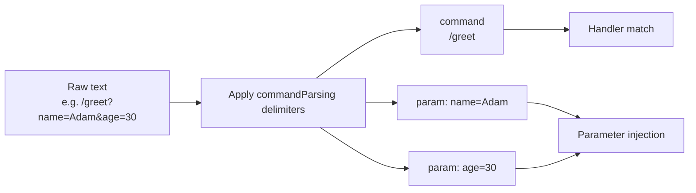

---
---
title: Update Parsing
---

### Text payload

किसी अपडेट में टेक्स्ट पेलोड हो सकता है जिसे आगे की प्रोसेसिंग के लिए पार्स किया जा सकता है। आइए इसे देखें:

* `MessageUpdate` -> `message.text`
* `EditedMessageUpdate` -> `editedMessage.text`
* `ChannelPostUpdate` -> `channelPost.text`
* `EditedChannelPostUpdate` -> `editedChannelPost.text`
* `InlineQueryUpdate` -> `inlineQuery.query`
* `ChosenInlineResultUpdate` -> `chosenInlineResult.query`
* `CallbackQueryUpdate` -> `callbackQuery.data`
* `ShippingQueryUpdate` -> `shippingQuery.invoicePayload`
* `PreCheckoutQueryUpdate` -> `preCheckoutQuery.invoicePayload`
* `PollUpdate` -> `poll.question`
* `PurchasedPaidMediaUpdate` -> `purchasedPaidMedia.paidMediaPayload`

सूचीबद्ध अपडेट्स में से, एक विशेष पैरामीटर चुना जाता है और आगे के पार्सिंग के लिए [`TextReference`](https://vendelieu.github.io/telegram-bot/telegram-bot/eu.vendeli.tgbot.types.component/-text-reference/index.html) में लिया जाता है।

### Parsing

चुने गए पैरामीटर को उपयुक्त रूप से कॉन्फ़िगर किए गए डिलिमीटर के साथ कमांड और उसके पैरामीटर में पार्स किया जाता है।

कॉन्फ़िगरेशन [`commandParsing`](https://vendelieu.github.io/telegram-bot/telegram-bot/eu.vendeli.tgbot.types.configuration/-bot-configuration/command-parsing.html) ब्लॉक देखें।

आप नीचे के आरेख में देख सकते हैं कि कौन से कॉम्पोनेन्ट लक्ष्य फ़ंक्शन के किस भाग से मैप किए गए हैं।



<p align="center">
  
</p>

### @ParamMapping

सुविधा या किसी विशेष मामले के लिए एक एनोटेशन भी है जिसका नाम है [`@ParamMapping`](https://vendelieu.github.io/telegram-bot/telegram-bot/eu.vendeli.tgbot.annotations/-param-mapping/index.html)।

यह आपको इनकमिंग टेक्स्ट से पैरामीटर के नाम को किसी भी पैरामीटर से मैप करने की अनुमति देता है।

यह तब भी सुविधाजनक है जब आपका इनकमिंग डेटा सीमित हो, उदाहरण के लिए `CallbackData` (64 अक्षर)।

उपयोग का उदाहरण देखें:
`greeting?name=Adam`

```kotlin
@CommandHandler(["greeting"])
suspend fun greeting(@ParamMapping("name") anyParameterName: String, user: User, bot: TelegramBot) {
    message { "Hello, $anyParameterName" }.send(to = user, via = bot)
}
```

और इसे अनाम पैरामीटर को पकड़ने के लिए भी उपयोग किया जा सकता है, ऐसे मामलों में जहाँ पार्सर इस तरह सेट किया गया हो कि पैरामीटर नाम छोड़ दिए जाएँ या वे अनुपलब्ध हों, जो 'param_n' पैटर्न से पास होते हैं, जहाँ `n` उसका क्रमांक है।

उदाहरण के लिए ऐसा टेक्स्ट - `myCommand?p1=v1&v2&p3=&p4=v4&p5=`, इस तरह पार्स किया जाएगा:
* command - `myCommand`
* parameters
  * `p1` = `v1`
  * `param_2` = `v2`
  * `p3` = ``
  * `p4` = `v4`
  * `p5` = ``

जैसा कि आप देख सकते हैं, चूँकि दूसरे पैरामीटर का घोषित नाम नहीं है, इसलिए उसे `param_2` के रूप में दर्शाया गया है।

इसलिए आप कॉलबैक में वेरिएबल नामों को संक्षिप्त कर सकते हैं और कोड में स्पष्ट पठनीय नामों का उपयोग कर सकते हैं।

### Deeplink

ऊपर दी गई जानकारी को ध्यान में रखते हुए यदि आप अपने स्टार्ट कमांड में deeplink की उम्मीद करते हैं तो आप इसे इस प्रकार पकड़ सकते हैं:

```kotlin
@CommandHandler(["/start"])
suspend fun start(@ParamMapping("param_1") deeplink: String?, user: User, bot: TelegramBot) {
    message { "deeplink is $deeplink" }.send(to = user, via = bot)
}
```

### Group commands

`commandParsing` कॉन्फ़िगरेशन में पैरामीटर [`useIdentifierInGroupCommands`](https://vendelieu.github.io/telegram-bot/telegram-bot/eu.vendeli.tgbot.types.configuration/-command-parsing-configuration/use-identifier-in-group-commands.html) है; जब इसे चालू किया जाता है, तो हम `TelegramBot.identifier` (यदि आप वर्णित पैरामीटर का उपयोग कर रहे हैं तो इसे बदलना न भूलें) को कमांड मैचिंग प्रक्रिया में उपयोग कर सकते हैं, जो कई बॉट्स के बीच समान कमांड को अलग करने में मदद करता है, अन्यथा `@MyBot` भाग केवल स्किप हो जाएगा।

### See also

* [Activity invocation](Activity-invocation.md)
* [Activities & Processors](Activites-and-Processors.md)
* [Actions](Actions.md)

---