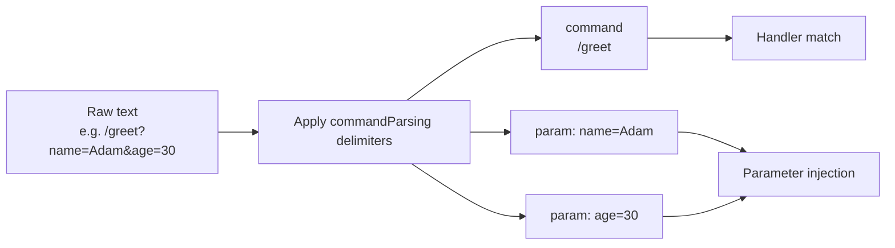

---
---
title: Update Parsing
---

### Text payload

Beberapa pembaruan mungkin memiliki muatan teks yang dapat diurai untuk pemrosesan lebih lanjut. Mari kita lihat mereka:

* `MessageUpdate` -> `message.text`
* `EditedMessageUpdate` -> `editedMessage.text`
* `ChannelPostUpdate` -> `channelPost.text`
* `EditedChannelPostUpdate` -> `editedChannelPost.text`
* `InlineQueryUpdate` -> `inlineQuery.query`
* `ChosenInlineResultUpdate` -> `chosenInlineResult.query`
* `CallbackQueryUpdate` -> `callbackQuery.data`
* `ShippingQueryUpdate` -> `shippingQuery.invoicePayload`
* `PreCheckoutQueryUpdate` -> `preCheckoutQuery.invoicePayload`
* `PollUpdate` -> `poll.question`
* `PurchasedPaidMediaUpdate` -> `purchasedPaidMedia.paidMediaPayload`

Dari pembaruan yang terdaftar, parameter tertentu dipilih dan diambil sebagai [`TextReference`](https://vendelieu.github.io/telegram-bot/telegram-bot/eu.vendeli.tgbot.types.component/-text-reference/index.html), untuk penguraian lebih lanjut.

### Parsing

Parameter yang dipilih diurai dengan delimiter yang telah dikonfigurasi secara tepat menjadi perintah dan parameternya.

Lihat blok konfigurasi [`commandParsing`](https://vendelieu.github.io/telegram-bot/telegram-bot/eu.vendeli.tgbot.types.configuration/-bot-configuration/command-parsing.html).

Anda dapat melihat pada diagram di bawah ini komponen mana yang dipetakan ke bagian mana dari fungsi target.



<p align="center">
  
</p>

### @ParamMapping

Ada juga anotasi bernama [`@ParamMapping`](https://vendelieu.github.io/telegram-bot/telegram-bot/eu.vendeli.tgbot.annotations/-param-mapping/index.html) untuk kenyamanan atau untuk kasus khusus apa pun.

Ini memungkinkan Anda memetakan nama parameter dari teks masuk ke parameter apa pun.

Hal ini juga berguna ketika data masuk Anda terbatas, misalnya, `CallbackData` (64 karakter).

Lihat contoh penggunaan:
`greeting?name=Adam`

```kotlin
@CommandHandler(["greeting"])
suspend fun greeting(@ParamMapping("name") anyParameterName: String, user: User, bot: TelegramBot) {
    message { "Hello, $anyParameterName" }.send(to = user, via = bot)
}
```

Dan juga dapat digunakan untuk menangkap parameter tanpa nama, dalam kasus di mana parser disetel sehingga nama parameter dilewati atau bahkan tidak ada, yang akan menggunakan pola 'param_n', di mana `n` adalah urutan parametriknya.

Sebagai contoh teks berikut - `myCommand?p1=v1&v2&p3=&p4=v4&p5=`, akan diurai menjadi:
* command - `myCommand`
* parameters
  * `p1` = `v1`
  * `param_2` = `v2`
  * `p3` = ``
  * `p4` = `v4`
  * `p5` = ``

Seperti yang Anda lihat, karena parameter kedua tidak memiliki nama yang dideklarasikan, ia direpresentasikan sebagai `param_2`.

Jadi Anda dapat menyingkat nama variabel dalam callback itu sendiri dan menggunakan nama yang jelas dan terbaca dalam kode.

### Deeplink

Mengingat informasi di atas, jika Anda mengharapkan deeplink dalam perintah start Anda dapat menangkapnya dengan:

```kotlin
@CommandHandler(["/start"])
suspend fun start(@ParamMapping("param_1") deeplink: String?, user: User, bot: TelegramBot) {
    message { "deeplink is $deeplink" }.send(to = user, via = bot)
}
```

### Group commands

Dalam konfigurasi `commandParsing` kami memiliki parameter [`useIdentifierInGroupCommands`](https://vendelieu.github.io/telegram-bot/telegram-bot/eu.vendeli.tgbot.types.configuration/-command-parsing-configuration/use-identifier-in-group-commands.html) ketika diaktifkan, kami dapat menggunakan `TelegramBot.identifier` (jangan lupa mengubahnya jika Anda menggunakan parameter yang dijelaskan) dalam proses pencocokan perintah, ini membantu memisahkan perintah serupa di antara beberapa bot, jika tidak bagian `@MyBot` hanya akan diabaikan. 

### See also

* [Activity invocation](Activity-invocation.md)
* [Activities & Processors](Activites-and-Processors.md)
* [Actions](Actions.md)

---