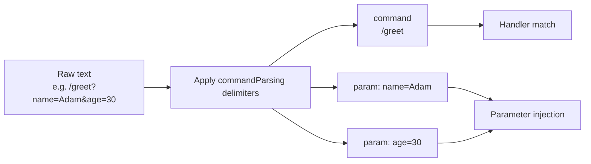

---
---
title: Update Parsing
---

### Text payload

특정 업데이트는 추가 처리를 위해 구문 분석될 수 있는 텍스트 페이로드를 가질 수 있습니다. 살펴보겠습니다:

* `MessageUpdate` -> `message.text`
* `EditedMessageUpdate` -> `editedMessage.text`
* `ChannelPostUpdate` -> `channelPost.text`
* `EditedChannelPostUpdate` -> `editedChannelPost.text`
* `InlineQueryUpdate` -> `inlineQuery.query`
* `ChosenInlineResultUpdate` -> `chosenInlineResult.query`
* `CallbackQueryUpdate` -> `callbackQuery.data`
* `ShippingQueryUpdate` -> `shippingQuery.invoicePayload`
* `PreCheckoutQueryUpdate` -> `preCheckoutQuery.invoicePayload`
* `PollUpdate` -> `poll.question`
* `PurchasedPaidMediaUpdate` -> `purchasedPaidMedia.paidMediaPayload`

목록에 있는 업데이트 중에서 특정 파라미터가 선택되어 [`TextReference`](https://vendelieu.github.io/telegram-bot/telegram-bot/eu.vendeli.tgbot.types.component/-text-reference/index.html) 로 가져와 추가 구문 분석에 사용됩니다.

### Parsing

선택된 파라미터는 적절히 구성된 구분자를 사용하여 명령과 해당 파라미터로 구문 분석됩니다.

구성 블록 [`commandParsing`](https://vendelieu.github.io/telegram-bot/telegram-bot/eu.vendeli.tgbot.types.configuration/-bot-configuration/command-parsing.html) 을 확인하세요.

아래 다이어그램에서 어떤 컴포넌트가 대상 함수의 어떤 부분에 매핑되는지 볼 수 있습니다.



<p align="center">
  
</p>

### @ParamMapping

편의성이나 특수한 경우를 위해 [`@ParamMapping`](https://vendelieu.github.io/telegram-bot/telegram-bot/eu.vendeli.tgbot.annotations/-param-mapping/index.html) 라는 애노테이션도 제공됩니다.

이 애노테이션을 사용하면 들어오는 텍스트의 파라미터 이름을任意の 파라미터에 매핑할 수 있습니다.

예를 들어 들어오는 데이터가 제한된 경우, `CallbackData` (64자) 와 같은 상황에서도 유용합니다.

사용 예시:
`greeting?name=Adam`

```kotlin
@CommandHandler(["greeting"])
suspend fun greeting(@ParamMapping("name") anyParameterName: String, user: User, bot: TelegramBot) {
    message { "Hello, $anyParameterName" }.send(to = user, via = bot)
}
```

또한 파라미터 이름이 건너뛰어지거나 존재하지 않을 경우, `param_n` 패턴(`n`은 순서)으로 전달되는 이름 없는 파라미터를 잡을 수도 있습니다.

예를 들어 다음 텍스트 - `myCommand?p1=v1&v2&p3=&p4=v4&p5=` 는 다음과 같이 구문 분석됩니다:
* command - `myCommand`
* parameters
  * `p1` = `v1`
  * `param_2` = `v2`
  * `p3` = ``
  * `p4` = `v4`
  * `p5` = ``

두 번째 파라미터에 선언된 이름이 없으므로 `param_2` 로 표시되는 것을 확인할 수 있습니다.

따라서 콜백 자체에서는 변수 이름을 줄이고, 코드에서는 명확하고 읽기 쉬운 이름을 사용할 수 있습니다.

### Deeplink

위의 정보를 고려하여 시작 명령에서 딜링크를 기대한다면 다음과 같이 잡을 수 있습니다:

```kotlin
@CommandHandler(["/start"])
suspend fun start(@ParamMapping("param_1") deeplink: String?, user: User, bot: TelegramBot) {
    message { "deeplink is $deeplink" }.send(to = user, via = bot)
}
```

### Group commands

`commandParsing` 구성에서 파라미터 [`useIdentifierInGroupCommands`](https://vendelieu.github.io/telegram-bot/telegram-bot/eu.vendeli.tgbot.types.configuration/-command-parsing-configuration/use-identifier-in-group-commands.html) 가 활성화된 경우, 명령 매칭 과정에서 `TelegramBot.identifier` (설정한 파라미터를 변경하는 것을 잊지 마세요)를 사용할 수 있으며, 이를 통해 여러 봇 사이에서 유사한 명령을 구분할 수 있습니다. 그렇지 않으면 `@MyBot` 부분이 단순히 무시됩니다.

### See also

* [Activity invocation](Activity-invocation.md)
* [Activities & Processors](Activites-and-Processors.md)
* [Actions](Actions.md)

---