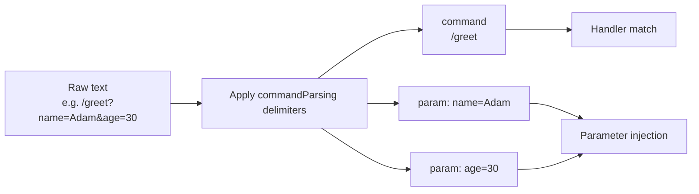

---
---
title: Update Parsing
---

### Payload de texto

Algumas atualizações podem ter payload de texto que pode ser analisado para processamento adicional. Vamos dar uma olhada nelas:

* `MessageUpdate` -> `message.text`
* `EditedMessageUpdate` -> `editedMessage.text`
* `ChannelPostUpdate` -> `channelPost.text`
* `EditedChannelPostUpdate` -> `editedChannelPost.text`
* `InlineQueryUpdate` -> `inlineQuery.query`
* `ChosenInlineResultUpdate` -> `chosenInlineResult.query`
* `CallbackQueryUpdate` -> `callbackQuery.data`
* `ShippingQueryUpdate` -> `shippingQuery.invoicePayload`
* `PreCheckoutQueryUpdate` -> `preCheckoutQuery.invoicePayload`
* `PollUpdate` -> `poll.question`
* `PurchasedPaidMediaUpdate` -> `purchasedPaidMedia.paidMediaPayload`

Das atualizações listadas, um determinado parâmetro é selecionado e tomado como [`TextReference`](https://vendelieu.github.io/telegram-bot/telegram-bot/eu.vendeli.tgbot.types.component/-text-reference/index.html) para análise posterior.

### Análise

Os parâmetros selecionados são analisados com os delimitadores configurados apropriados, convertendo‑os no comando e nos parâmetros correspondentes.

Veja o bloco de configuração [`commandParsing`](https://vendelieu.github.io/telegram-bot/telegram-bot/eu.vendeli.tgbot.types.configuration/-bot-configuration/command-parsing.html).

Você pode ver no diagrama abaixo quais componentes são mapeados para quais partes da função de destino.



<p align="center">
  
</p>

### @ParamMapping

Existe também uma anotação chamada [`@ParamMapping`](https://vendelieu.github.io/telegram-bot/telegram-bot/eu.vendeli.tgbot.annotations/-param-mapping/index.html) para conveniência ou para casos especiais.

Ela permite mapear o nome do parâmetro do texto recebido para qualquer parâmetro.

Isso também é conveniente quando seus dados de entrada são limitados, por exemplo, `CallbackData` (64 caracteres).

Veja um exemplo de uso:
`greeting?name=Adam`

```kotlin
@CommandHandler(["greeting"])
suspend fun greeting(@ParamMapping("name") anyParameterName: String, user: User, bot: TelegramBot) {
    message { "Hello, $anyParameterName" }.send(to = user, via = bot)
}
```

E também pode ser usada para capturar parâmetros não nomeados, em casos onde o analisador está configurado de modo que os nomes dos parâmetros são ignorados ou mesmo ausentes, passando pelo padrão `param_n`, onde `n` é a sua ordem.

Por exemplo, o texto `myCommand?p1=v1&v2&p3=&p4=v4&p5=` será analisado para:
* command - `myCommand`
* parameters
  * `p1` = `v1`
  * `param_2` = `v2`
  * `p3` = ``
  * `p4` = `v4`
  * `p5` = ``

Como pode ver, como o segundo parâmetro não tem nome declarado ele é representado como `param_2`.

Assim você pode abreviar os nomes de variáveis no próprio callback e usar nomes claros e legíveis no código.

### Deeplink

Considerando as informações acima, se você esperar um deeplink no seu comando de início, pode capturá‑lo com:

```kotlin
@CommandHandler(["/start"])
suspend fun start(@ParamMapping("param_1") deeplink: String?, user: User, bot: TelegramBot) {
    message { "deeplink is $deeplink" }.send(to = user, via = bot)
}
```

### Comandos de grupo

Na configuração `commandParsing` temos o parâmetro [`useIdentifierInGroupCommands`](https://vendelieu.github.io/telegram-bot/telegram-bot/eu.vendeli.tgbot.types.configuration/-command-parsing-configuration/use-identifier-in-group-commands.html) que, quando ativado, permite usar `TelegramBot.identifier` (não se esqueça de alterá‑lo se estiver usando o parâmetro descrito) no processo de correspondência de comandos, ajudando a separar comandos semelhantes entre vários bots; caso contrário, a parte `@MyBot` será simplesmente ignorada.

### Veja também

* [Activity invocation](Activity-invocation.md)
* [Activities & Processors](Activites-and-Processors.md)
* [Actions](Actions.md)

---