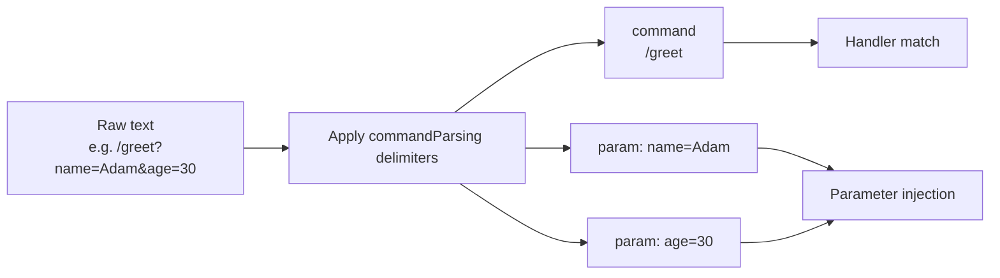

---
---
title: Update Parsing
---

### Text payload

Một số bản cập nhật có thể chứa payload dạng văn bản có thể được phân tích để xử lý tiếp theo. Hãy xem xét chúng:

* `MessageUpdate` -> `message.text`
* `EditedMessageUpdate` -> `editedMessage.text`
* `ChannelPostUpdate` -> `channelPost.text`
* `EditedChannelPostUpdate` -> `editedChannelPost.text`
* `InlineQueryUpdate` -> `inlineQuery.query`
* `ChosenInlineResultUpdate` -> `chosenInlineResult.query`
* `CallbackQueryUpdate` -> `callbackQuery.data`
* `ShippingQueryUpdate` -> `shippingQuery.invoicePayload`
* `PreCheckoutQueryUpdate` -> `preCheckoutQuery.invoicePayload`
* `PollUpdate` -> `poll.question`
* `PurchasedPaidMediaUpdate` -> `purchasedPaidMedia.paidMediaPayload`

Từ các bản cập nhật được liệt kê, một tham số nhất định được chọn và lấy làm [`TextReference`](https://vendelieu.github.io/telegram-bot/telegram-bot/eu.vendeli.tgbot.types.component/-text-reference/index.html) để phân tích tiếp.

### Parsing

Các tham số được chọn sẽ được phân tích bằng các dấu phân cách được cấu hình phù hợp thành lệnh và các tham số của nó.

Xem khối cấu hình [`commandParsing`](https://vendelieu.github.io/telegram-bot/telegram-bot/eu.vendeli.tgbot.types.configuration/-bot-configuration/command-parsing.html).

Bạn có thể thấy trong sơ đồ bên dưới các thành phần được ánh xạ tới các phần của hàm mục tiêu.



<p align="center">
  
</p>

### @ParamMapping

Cũng có một annotation gọi là [`@ParamMapping`](https://vendelieu.github.io/telegram-bot/telegram-bot/eu.vendeli.tgbot.annotations/-param-mapping/index.html) để tiện lợi hoặc cho bất kỳ trường hợp đặc biệt nào.

Nó cho phép bạn ánh xạ tên của tham số từ văn bản đến bất kỳ tham số nào.

Điều này cũng tiện lợi khi dữ liệu đầu vào của bạn bị giới hạn, ví dụ `CallbackData` (64 ký tự).

Xem ví dụ sử dụng:
`greeting?name=Adam`

```kotlin
@CommandHandler(["greeting"])
suspend fun greeting(@ParamMapping("name") anyParameterName: String, user: User, bot: TelegramBot) {
    message { "Hello, $anyParameterName" }.send(to = user, via = bot)
}
```

Và nó cũng có thể được dùng để bắt các tham số không có tên, trong các trường hợp mà bộ phân tích được thiết lập sao cho tên tham số bị bỏ qua hoặc thậm chí không tồn tại, điều này sẽ theo mẫu 'param_n', trong đó `n` là chỉ số thứ tự của nó.

Ví dụ văn bản như sau - `myCommand?p1=v1&v2&p3=&p4=v4&p5=`, sẽ được phân tích thành:
* command - `myCommand`
* parameters
  * `p1` = `v1`
  * `param_2` = `v2`
  * `p3` = ``
  * `p4` = `v4`
  * `p5` = ``

Như bạn thấy vì tham số thứ hai không có tên được khai báo nên nó được biểu diễn dưới dạng `param_2`.

Vì vậy bạn có thể rút gọn tên biến trong callback và sử dụng các tên rõ ràng, dễ đọc trong mã.

### Deeplink

Xét xét thông tin ở trên, nếu bạn mong đợi deeplink trong lệnh start, bạn có thể bắt nó bằng:

```kotlin
@CommandHandler(["/start"])
suspend fun start(@ParamMapping("param_1") deeplink: String?, user: User, bot: TelegramBot) {
    message { "deeplink is $deeplink" }.send(to = user, via = bot)
}
```

### Group commands

Trong cấu hình `commandParsing` chúng ta có tham số [`useIdentifierInGroupCommands`](https://vendelieu.github.io/telegram-bot/telegram-bot/eu.vendeli.tgbot.types.configuration/-command-parsing-configuration/use-identifier-in-group-commands.html) khi bật lên, chúng ta có thể sử dụng `TelegramBot.identifier` (đừng quên thay đổi nó nếu bạn đang sử dụng tham số đã mô tả) trong quá trình khớp lệnh, nó giúp tách các lệnh tương tự giữa nhiều bot, nếu không phần `@MyBot` sẽ chỉ bị bỏ qua.

### See also

* [Activity invocation](Activity-invocation.md)
* [Activities & Processors](Activites-and-Processors.md)
* [Actions](Actions.md)

---