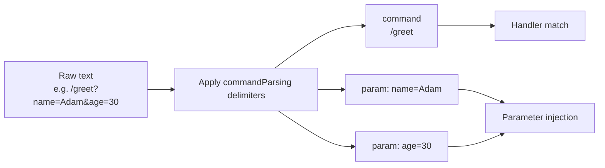

---
---
title: Update Parsing
---

### Text payload

某些更新可能包含可供进一步处理的文本负载。让我们来看一下：

* `MessageUpdate` -> `message.text`
* `EditedMessageUpdate` -> `editedMessage.text`
* `ChannelPostUpdate` -> `channelPost.text`
* `EditedChannelPostUpdate` -> `editedChannelPost.text`
* `InlineQueryUpdate` -> `inlineQuery.query`
* `ChosenInlineResultUpdate` -> `chosenInlineResult.query`
* `CallbackQueryUpdate` -> `callbackQuery.data`
* `ShippingQueryUpdate` -> `shippingQuery.invoicePayload`
* `PreCheckoutQueryUpdate` -> `preCheckoutQuery.invoicePayload`
* `PollUpdate` -> `poll.question`
* `PurchasedPaidMediaUpdate` -> `purchasedPaidMedia.paidMediaPayload`

从列出的更新中，会选择特定参数并将其作为[`TextReference`](https://vendelieu.github.io/telegram-bot/telegram-bot/eu.vendeli.tgbot.types.component/-text-reference/index.html)进行后续解析。

### Parsing

选中的参数会使用已配置的分隔符进行解析，得到命令及其参数。

请参阅配置块[`commandParsing`](https://vendelieu.github.io/telegram-bot/telegram-bot/eu.vendeli.tgbot.types.configuration/-bot-configuration/command-parsing.html)。

下面的示意图展示了哪些组件映射到目标函数的哪些部分。



<p align="center">
  
</p>

### @ParamMapping

还有一个注解[`@ParamMapping`](https://vendelieu.github.io/telegram-bot/telegram-bot/eu.vendeli.tgbot.annotations/-param-mapping/index.html)可供便利使用或处理特殊情况。

它允许你将来自文本的参数名称映射到任意参数。

当你的输入数据受限时（例如 `CallbackData` 仅 64 个字符），这也很方便。

使用示例：
`greeting?name=Adam`

```kotlin
@CommandHandler(["greeting"])
suspend fun greeting(@ParamMapping("name") anyParameterName: String, user: User, bot: TelegramBot) {
    message { "Hello, $anyParameterName" }.send(to = user, via = bot)
}
```

它也可以用于捕获未命名的参数，在解析器设置为跳过参数名称或根本不存在时，参数将采用 `param_n` 模式，其中 `n` 为序号。

例如下面的文本 - `myCommand?p1=v1&v2&p3=&p4=v4&p5=`，将被解析为：
* command - `myCommand`
* parameters
  * `p1` = `v1`
  * `param_2` = `v2`
  * `p3` = ``
  * `p4` = `v4`
  * `p5` = ``

正如你所见，由于第二个参数没有声明名称，它被表示为 `param_2`。

因此，你可以在回调中使用简写变量名，并在代码中使用清晰可读的名称。

### Deeplink

基于上述信息，如果你在启动命令中期望 deeplink，可以这样捕获：

```kotlin
@CommandHandler(["/start"])
suspend fun start(@ParamMapping("param_1") deeplink: String?, user: User, bot: TelegramBot) {
    message { "deeplink is $deeplink" }.send(to = user, via = bot)
}
```

### Group commands

在 `commandParsing` 配置中有参数[`useIdentifierInGroupCommands`](https://vendelieu.github.io/telegram-bot/telegram-bot/eu.vendeli.tgbot.types.configuration/-command-parsing-configuration/use-identifier-in-group-commands.html)，当它开启时，我们可以在命令匹配过程中使用 `TelegramBot.identifier`（如果你使用了描述的参数，请别忘了更改它），这有助于在多个 bot 之间区分相似命令，否则 `@MyBot` 部分将被直接跳过。

### See also

* [Activity invocation](Activity-invocation.md)
* [Activities & Processors](Activites-and-Processors.md)
* [Actions](Actions.md)

---