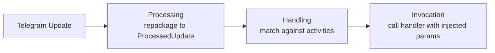
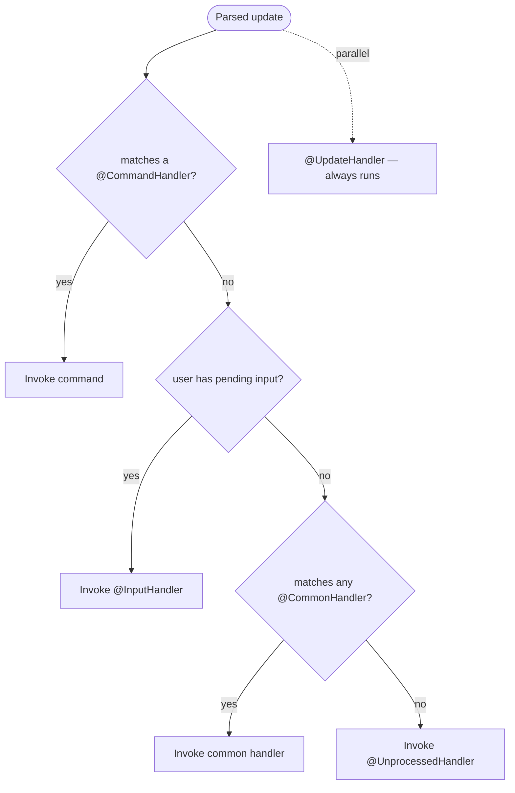
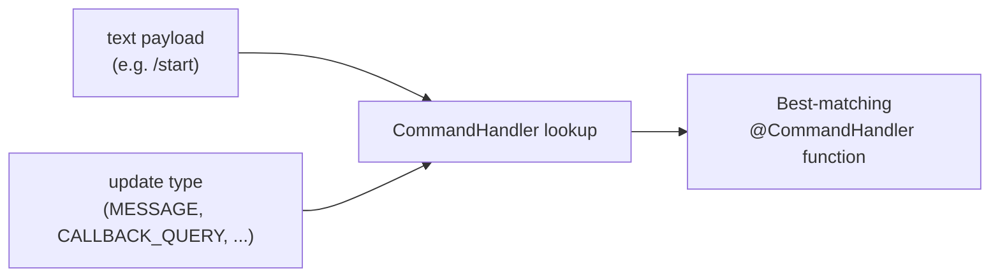
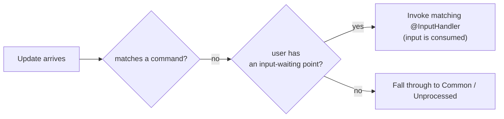

---
---
title: Home
---

### Intro
بیایید نگاهی کلی به نحوهٔ پردازش به‌روزرسانی‌ها توسط کتابخانه داشته باشیم:

پس از دریافت یک به‌روزرسانی، کتابخانه سه مرحلهٔ اصلی را اجرا می‌کند، همان‌طور که می‌بینیم.

### Processing

پردازش به معنای بازبسته‌بندی به‌روزرسانی دریافت‌شده به زیرکلاس مناسب [`ProcessedUpdate`](https://vendelieu.github.io/telegram-bot/telegram-bot/eu.vendeli.tgbot.types.component/-processed-update/index.html) بسته به محتوای حامل آن است.

این مرحله برای ساده‌تر کردن کار با به‌روزرسانی و گسترش قابلیت‌های پردازشی لازم است.

### Handling

در ادامه مرحلهٔ اصلی می‌آید، اینجا به خود پردازش می‌پردازیم.

### Global RateLimiter

اگر در به‌روزرسانی کاربری وجود داشته باشد، برای عبور از محدودیت‌ساز سراسری بررسی می‌کنیم.

### Parse text

سپس، بسته به محتوای حامل، یک مؤلفه خاص از به‌روزرسانی حاوی متن را می‌گیریم و مطابق پیکربندی آن را تجزیه می‌کنیم.

جزییات بیشتر را می‌توانید در [مقالهٔ تجزیه به‌روزرسانی](Update-parsing.md) ببینید.

### Find Activity

سپس، بر اساس اولویت پردازش:

ما به دنبال مطابقت بین داده‌های تجزیه‌شده و فعالیت‌هایی که بر روی آن‌ها کار می‌کنیم، هستیم.
همان‌طور که در نمودار اولویت می‌بینید، `Commands` همیشه نخستین هستند.

به‌عبارت دیگر، اگر محتوای متنی در به‌روزرسانی با هر دستوری منطبق باشد، جستجوی بعدی برای `Inputs`، `Common` و اجرای عمل `Unprocessed` انجام نخواهد شد.

تنها موردی که باقی می‌ماند این است که `UpdateHandlers` به‌صورت موازی فعال می‌شوند.

#### Commands

بیایید نگاهی دقیق‌تر به دستورات و پردازش آن‌ها داشته باشیم.

همان‌طور که ممکن است متوجه شده باشید، اگرچه انوتیشنی که برای پردازش دستورات استفاده می‌شود [`CommandHandler`](https://vendelieu.github.io/telegram-bot/telegram-bot/eu.vendeli.tgbot.annotations/-command-handler/index.html) نام دارد، نسبت به مفهوم کلاسیک در ربات‌های تلگرام انعطاف‌پذیرتر است.

##### Scopes

این به این دلیل است که دامنهٔ پردازشی وسیع‌تری دارد؛ یعنی تابع هدف نه تنها می‌تواند بر اساس تطبیق متن، بلکه بر اساس نوع به‌روزرسانی مناسب نیز تعریف شود؛ این مفهوم «قالب‌ها» (scopes) است.

به‌این ترتیب، هر دستور می‌تواند برای فهرست متفاوتی از قالب‌ها پردازشگرهای مختلفی داشته باشد یا بالعکس، یک دستور برای چندین قالب.

در ادامه می‌توانید ببینید که نگاشت بر پایهٔ محتوای متنی و قالب چگونه انجام می‌شود:

  

#### Inputs

در ادامه، اگر محتوای متنی با هیچ دستوری مطابقت نداشته باشد، نقاط ورودی (input points) جستجو می‌شوند.

این مفهوم شباهت زیادی به انتظار ورودی در برنامه‌های خط فرمان دارد؛ شما برای یک کاربر خاص در زمینهٔ ربات نقطه‌ای تعریف می‌کنید که ورودی بعدی او را پردازش کند، مهم نیست محتوا چیست، نکتهٔ اصلی این است که به‌روزرسانی بعدی دارای `User` باشد تا بتوان آن را به نقطهٔ انتظار ورودی مرتبط کرد.

در ادامه یک مثال از پردازش به‌روزرسانی زمانی که هیچ دستوری یافت نشد را می‌توانید ببینید:

#### Commons

اگر پردازشگر هیچ `command` یا `input`‌ای پیدا نکند، محتوای متنی را در برابر پردازشگرهای `common` بررسی می‌کند.

توصیه می‌کنیم بدون بیش از حد استفاده از آن استفاده کنید، زیرا شامل تکرار بر روی تمام ورودی‌ها می‌شود.

#### Unprocessed

و در قدم نهایی، اگر پردازشگر هیچ فعالیت مطابقتی نبیند ([`UpdateHandler`](https://vendelieu.github.io/telegram-bot/telegram-bot/eu.vendeli.tgbot.annotations/-update-handler/index.html) به‌صورت کامل موازی کار می‌کند و به‌عنوان فعالیت معمولی محسوب نمی‌شود)، `UnprocessedHandler` وارد عمل می‌شود؛ اگر تنظیم شده باشد، این مورد را مدیریت می‌کند و می‌تواند برای هشدار دادن به کاربر مبنی بر بروز خطا مفید باشد.

جزئیات بیشتر را می‌توانید در [مقالهٔ Handlers](Handlers.md) مطالعه کنید.

### Activity RateLimiter

پس از پیدا کردن یک فعالیت، محدودیت‌های نرخ کاربر برای آن نیز بررسی می‌شود، بر اساس پارامترهای مشخص‌شده در پارامترهای فعالیت.

### Activity

Activity به انواع مختلفی از پردازشگرهایی که کتابخانهٔ ربات تلگرام می‌تواند مدیریت کند، اشاره دارد؛ شامل Commands، Inputs، Regexes و پردازشگر Unprocessed.

### Invocation

مرحلهٔ نهایی پردازش، فراخوانی فعالیت یافت‌شده است.

جزئیات بیشتر را می‌توانید در [مقالهٔ invocation](Activity-invocation.md) بیابید.

### See also

* [Update parsing](Update-parsing.md)
* [Activity invocation](Activity-invocation.md)
* [Handlers](Handlers.md)
* [Sessions](Sessions.md)
* [Bot configuration](Bot-configuration.md)
* [Web starters (Spring, Ktor)](Web-starters-(Spring-and-Ktor.md))
---