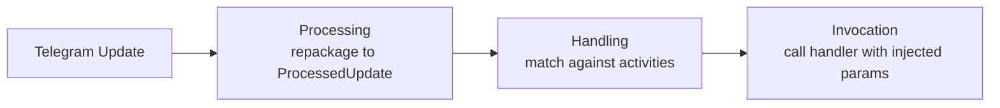
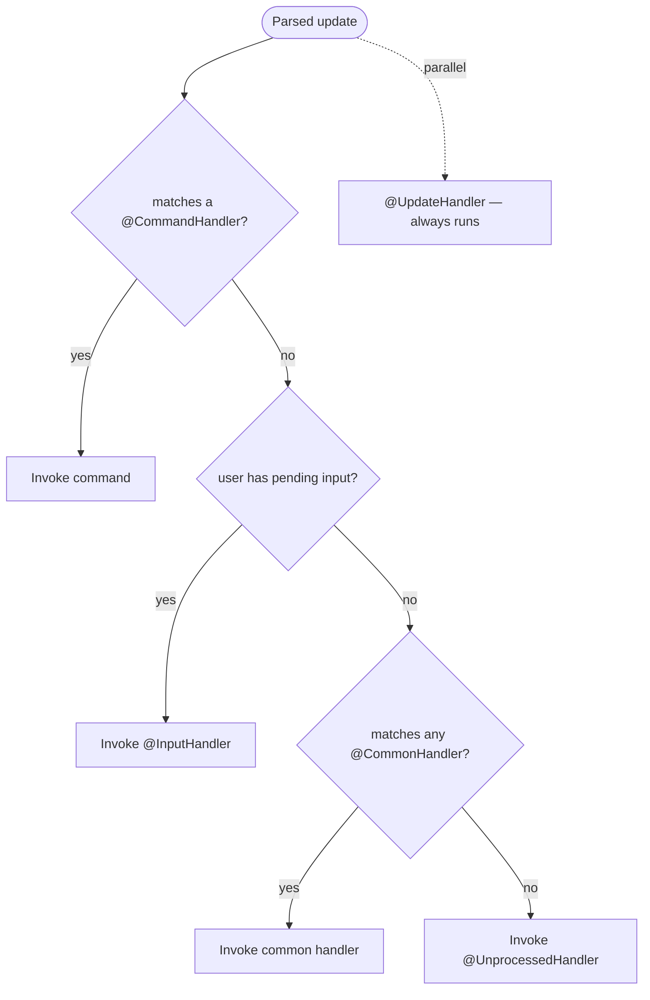
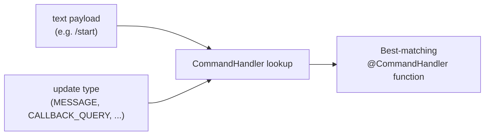
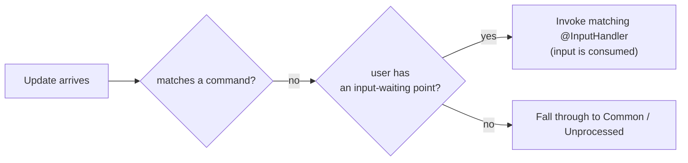

---
---
title: Home
---

### Intro
आइए देखें कि लाइब्रेरी सामान्य रूप से अपडेट्स को कैसे संभालती है:

एक अपडेट प्राप्त करने के बाद, लाइब्रेरी तीन मुख्य चरणों को निष्पादित करती है, जैसा कि हम देख सकते हैं।

### Processing

प्रोसेसिंग प्राप्त अपडेट को उपयुक्त सबक्लास में रीपैकेज करने के लिए किया जाता है, जो [`ProcessedUpdate`](https://vendelieu.github.io/telegram-bot/telegram-bot/eu.vendeli.tgbot.types.component/-processed-update/index.html) है, यह इस पर निर्भर करता है कि किस प्रकार का पेलोड लाया गया है।

यह चरण अपडेट को आसानी से संभालने और प्रोसेसिंग क्षमताओं को विस्तारित करने के लिए आवश्यक है।

### Handling

इसके बाद मुख्य चरण आता है, यहाँ हम वास्तविक हैंडलिंग तक पहुँचते हैं।

### Global RateLimiter

यदि अपडेट में कोई उपयोगकर्ता है, तो हम ग्लोबल रेट लिमिटर की सीमा को पार करने की जाँच करते हैं।

### Parse text

अगला, पेलोड के अनुसार, हम टेक्स्ट वाले विशिष्ट अपडेट कंपोनेंट को लेते हैं और कॉन्फ़िगरेशन के अनुसार उसे पार्स करते हैं।

और अधिक विस्तृत जानकारी आप [update parsing article](Update-parsing.md) में देख सकते हैं।

### Find Activity

अब, प्रोसेसिंग प्रायोरिटी के अनुसार:

हम पार्स किए हुए डेटा और उन एक्टिविटीज़ के बीच मेल ढूँढ रहे हैं जिनपर हम कार्य कर रहे हैं। जैसा कि प्रायोरिटी डायग्राम में दिखाया गया है, `Commands` हमेशा पहले आते हैं।

अर्थात् यदि अपडेट में टेक्स्ट लोड किसी कमांड से मेल खाती है, तो आगे `Inputs`, `Common` और निश्चित रूप से `Unprocessed` एक्शन की खोज नहीं की जाती।

एकमात्र बात यह है कि यदि `UpdateHandlers` होते हैं तो वे समानांतर में ट्रिगर हो जाते हैं।

#### Commands

आइए कमांड्स और उनके प्रोसेसिंग को करीब से देखें।

जैसा कि आपने देखा होगा, भले ही कमांड प्रोसेस करने के लिए एनोटेशन को [`CommandHandler`](https://vendelieu.github.io/telegram-bot/telegram-bot/eu.vendeli.tgbot.annotations/-command-handler/index.html) कहा जाता है, यह टेलीग्राम बॉट्स के क्लासिक कॉन्सेप्ट से अधिक बहुमुखी है।

##### Scopes

यह इसलिए है क्योंकि इसके पास प्रोसेसिंग विकल्पों की विस्तृत रेंज है, यानी लक्ष्य फ़ंक्शन केवल टेक्स्ट मिलान पर ही नहीं, बल्कि उपयुक्त अपडेट के प्रकार पर भी निर्भर हो सकता है; इसे स्कोप्स का कॉन्सेप्ट कहा जाता है।

तदनुसार, प्रत्येक कमांड के पास विभिन्न स्कोप्स की सूची के लिए अलग‑अलग हैंडलर हो सकते हैं, या इसके विपरीत, एक कमांड कई स्कोप्स के लिए हो सकता है।

नीचे आप देख सकते हैं कि टेक्स्ट पेलोड और स्कोप के अनुसार मैपिंग कैसे की जाती है:

  

#### Inputs

अगला, यदि टेक्स्ट पेलोड किसी भी कमांड से मेल नहीं खाता है तो इनपुट पॉइंट्स की खोज की जाती है।

यह कॉन्सेप्ट कमांड‑लाइन एप्लिकेशन्स में इनपुट वेटिंग के समान है; आप किसी विशेष उपयोगकर्ता के बॉट कॉन्टेक्स्ट में एक पॉइंट सेट करते हैं जो उसकी अगली इनपुट को संभालेगा, चाहे वह कुछ भी हो; मुख्य बात यह है कि अगला अपडेट एक `User` रखता हो ताकि उसे सेट इनपुट वेटिंग पॉइंट से जोड़ा जा सके।

नीचे आप एक उदाहरण देख सकते हैं जहाँ `Commands` पर कोई मिलान नहीं होने पर अपडेट प्रोसेस किया जाता है:

#### Commons

यदि हैंडलर को कोई `commands` या `inputs` नहीं मिलता, तो वह टेक्स्ट लोड को `common` हैंडलर्स के विरुद्ध जाँचता है।

हम सलाह देते हैं कि इसे अत्यधिक उपयोग न करें, क्योंकि यह सभी एंट्रीज़ पर इटरशन करता है।

#### Unprocessed

और अंतिम चरण, यदि हैंडलर को कोई भी मेल खाने वाली एक्टिविटी नहीं मिलती ([`UpdateHandler`](https://vendelieu.github.io/telegram-bot/telegram-bot/eu.vendeli.tgbot.annotations/-update-handler/index.html) पूरी तरह समानांतर में काम करता है और सामान्य एक्टिविटी के रूप में गिना नहीं जाता), तो [`UnprocessedHandler`](https://vendelieu.github.io/telegram-bot/telegram-bot/eu.vendeli.tgbot.annotations/-unprocessed-handler/index.html) सक्रिय होता है; यदि यह सेट किया गया है, तो यह केस को संभालता है, और यह उपयोगकर्ता को यह चेतावनी देने में उपयोगी हो सकता है कि कुछ गलत हो गया है।

और अधिक विस्तृत जानकारी के लिए [Handlers article](Handlers.md) देखें।

### Activity RateLimiter

एक एक्टिविटी मिलने के बाद, यह उपयोगकर्ता की रेट लिमिट्स को भी जाँचता है, जैसा कि एक्टिविटी पैरामीटर में निर्दिष्ट किया गया है।

### Activity

एक्टिविटी का मतलब टेलीग्राम बॉट लाइब्रेरी द्वारा संभाली जा सकने वाली विभिन्न प्रकार की हैंडलर्स से है, जैसे Commands, Inputs, Regexes, और Unprocessed हैंडलर।

### Invocation

अंतिम प्रोसेसिंग चरण पाया गया एक्टिविटी को इनवोक करने का है।

और अधिक विवरण आप [invocation article](Activity-invocation.md) में पा सकते हैं।

### See also

* [Update parsing](Update-parsing.md)
* [Activity invocation](Activity-invocation.md)
* [Handlers](Handlers.md)
* [Sessions](Sessions.md)
* [Bot configuration](Bot-configuration.md)
* [Web starters (Spring, Ktor)](Web-starters-(Spring-and-Ktor.md))
---