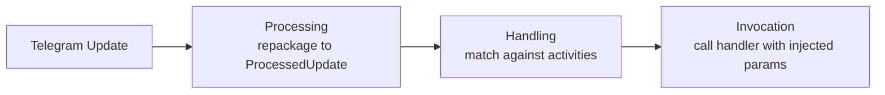
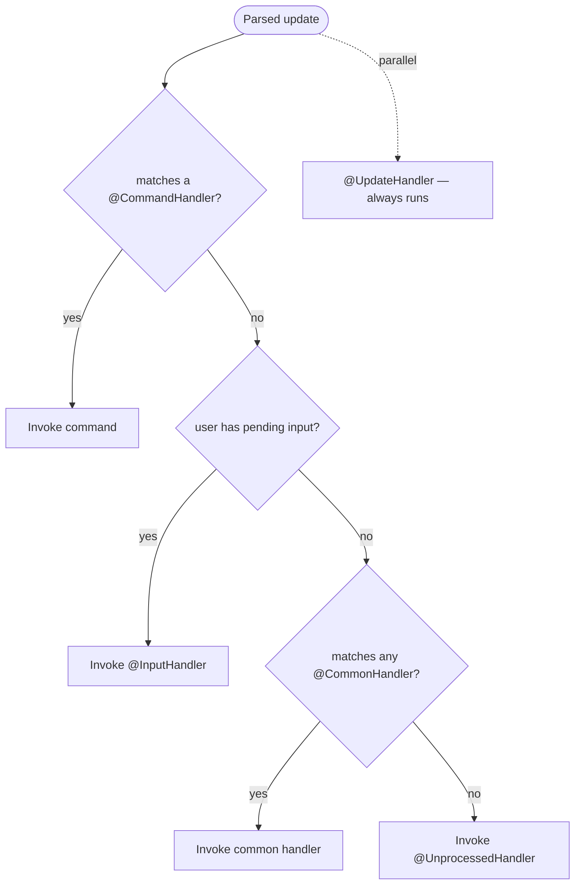
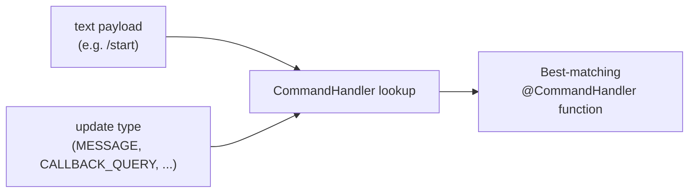
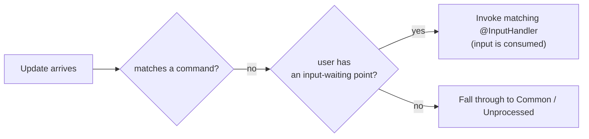

---
---
title: Home
---

### Intro
Mari kita dapatkan gambaran tentang bagaimana library menangani pembaruan secara umum:

Setelah menerima sebuah pembaruan, library melakukan tiga langkah utama, seperti yang dapat kita lihat.

### Processing

Processing adalah untuk mengemas ulang pembaruan yang diterima ke dalam subclass yang sesuai dari [`ProcessedUpdate`](https://vendelieu.github.io/telegram-bot/telegram-bot/eu.vendeli.tgbot.types.component/-processed-update/index.html) tergantung pada payload yang dibawa.

Langkah ini diperlukan agar lebih mudah mengoperasikan pembaruan dan memperluas kemampuan pemrosesan.

### Handling

Selanjutnya datang langkah utama, di sini kita sampai pada penanganan itu sendiri.

### Global RateLimiter

Jika ada pengguna dalam pembaruan, kami memeriksa apakah melebihi global rate limiter.

### Parse text

Selanjutnya, tergantung pada payload, kami mengambil komponen pembaruan tertentu yang berisi teks dan mengurai nya sesuai konfigurasi.

Lebih detail dapat Anda lihat di [update parsing article](Update-parsing.md).

### Find Activity

Selanjutnya, menurut prioritas pemrosesan:

Kami mencari kecocokan antara data yang diurai dan aktivitas yang kami operasikan.
Seperti yang dapat kita lihat pada diagram prioritas, `Commands` selalu datang pertama.

Misalnya, jika beban teks dalam pembaruan sesuai dengan perintah apapun, pencarian lebih lanjut untuk `Inputs`, `Common` dan tentu saja eksekusi aksi `Unprocessed` tidak akan dilakukan.

Satu-satunya hal adalah bahwa `UpdateHandlers` akan dipicu secara paralel terlepas dari itu.

#### Commands

Mari kita lihat lebih dekat perintah dan pemrosesannya.

Seperti yang mungkin Anda perhatikan, meskipun anotasi untuk memproses perintah disebut [`CommandHandler`](https://vendelieu.github.io/telegram-bot/telegram-bot/eu.vendeli.tgbot.annotations/-command-handler/index.html), ia lebih fleksibel daripada konsep klasik di Telegram Bots.

##### Scopes

Hal ini karena ia memiliki rentang kemungkinan pemrosesan yang lebih luas, yaitu fungsi target dapat didefinisikan tidak hanya bergantung pada kecocokan teks, tetapi juga pada tipe pembaruan yang sesuai, ini adalah konsep scopes.

Dengan demikian, setiap perintah dapat memiliki handler yang berbeda untuk daftar scopes yang berbeda, atau sebaliknya, satu perintah untuk beberapa scopes.

Di bawah ini Anda dapat melihat bagaimana pemetaan berdasarkan payload teks dan scope dilakukan:

  

#### Inputs

Selanjutnya, jika payload teks tidak cocok dengan perintah apapun, titik input akan dicari.

Konsep ini sangat mirip dengan menunggu input dalam aplikasi commandline, Anda menempatkan dalam konteks bot untuk pengguna tertentu sebuah titik yang akan menangani input berikutnya, tidak penting apa isinya, yang penting adalah pembaruan berikutnya memiliki `User` agar dapat dihubungkan dengan titik menunggu input yang telah ditetapkan.

Di bawah ini Anda dapat melihat contoh pemrosesan sebuah pembaruan ketika tidak ada kecocokan pada `Commands`.

#### Commons

Jika handler tidak menemukan `commands` atau `inputs`, ia memeriksa beban teks terhadap handler `common`.

Kami menyarankan untuk menggunakannya tanpa penyalahgunaan, karena hal ini melakukan iterasi pada semua entri.

#### Unprocessed

Dan langkah terakhir, jika handler tidak menemukan aktivitas yang cocok ([`UpdateHandler`](https://vendelieu.github.io/telegram-bot/telegram-bot/eu.vendeli.tgbot.annotations/-update-handler/index.html) bekerja sepenuhnya secara paralel dan tidak dihitung sebagai aktivitas biasa), maka [`UnprocessedHandler`](https://vendelieu.github.io/telegram-bot/telegram-bot/eu.vendeli.tgbot.annotations/-unprocessed-handler/index.html) akan masuk, jika disetel, ia akan menangani kasus ini, mungkin berguna untuk memperingatkan pengguna bahwa sesuatu telah gagal.

Baca lebih detail di [Handlers article](Handlers.md).

### Activity RateLimiter

Setelah menemukan sebuah aktivitas, ia juga memeriksa batas kecepatan pengguna pada aktivitas tersebut, menurut parameter yang ditentukan dalam parameter aktivitas.

### Activity

Activity mengacu pada jenis-jenis handler yang dapat ditangani oleh library bot telegram, termasuk Commands, Inputs, Regexes, dan handler Unprocessed.

### Invocation

Langkah pemrosesan terakhir adalah pemanggilan aktivitas yang ditemukan.

Lebih detail dapat ditemukan di artikel [invocation article](Activity-invocation.md).

### See also

* [Update parsing](Update-parsing.md)
* [Activity invocation](Activity-invocation.md)
* [Handlers](Handlers.md)
* [Sessions](Sessions.md)
* [Bot configuration](Bot-configuration.md)
* [Web starters (Spring, Ktor)](Web-starters-(Spring-and-Ktor.md))
---