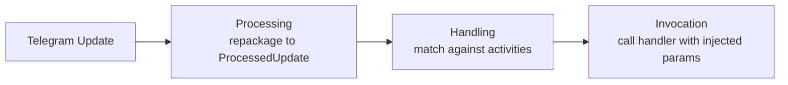
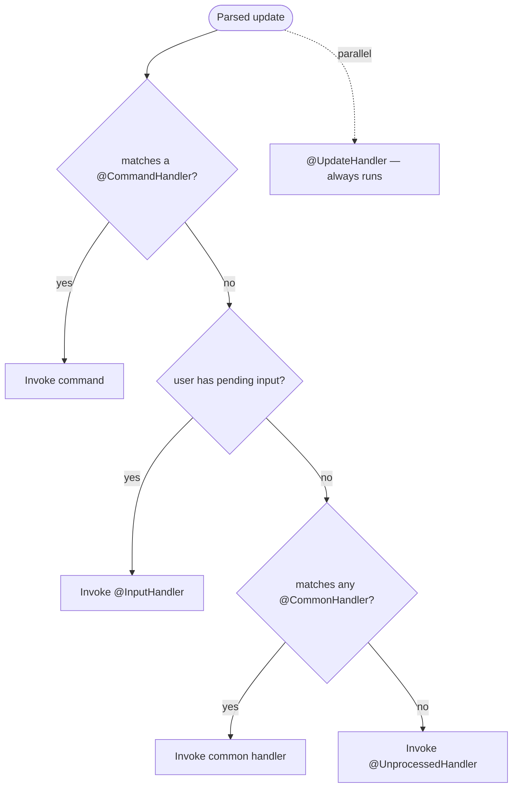
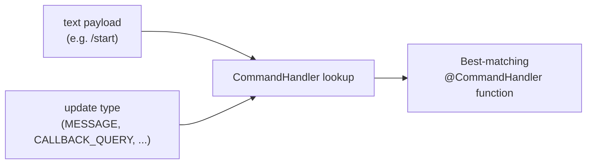
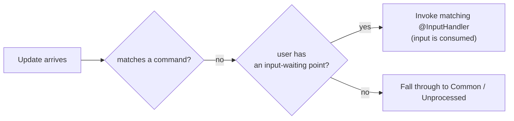

---
---
title: Home
---

### Intro
라이브러리가 업데이트를 일반적으로 처리하는 방식을 살펴보겠습니다:

업데이트를 수신한 뒤, 라이브러리는 세 가지 주요 단계를 수행합니다.

### Processing

Processing은 수신한 업데이트를 페이로드에 따라 적절한 [`ProcessedUpdate`](https://vendelieu.github.io/telegram-bot/telegram-bot/eu.vendeli.tgbot.types.component/-processed-update/index.html) 하위 클래스에 재패키징합니다.

이 단계는 업데이트를 보다 쉽게 조작하고 처리 기능을 확장하기 위해 필요합니다.

### Handling

다음은 본격적인 처리 단계입니다.

### Global RateLimiter

업데이트에 사용자가 있으면 전역 RateLimiter를 초과했는지 확인합니다.

### Parse text

다음으로, 페이로드에 따라 텍스트를 포함하는 특정 업데이트 컴포넌트를 가져와 설정에 따라 파싱합니다.

자세한 내용은 [update parsing article](Update-parsing.md)에서 확인할 수 있습니다.

### Find Activity

다음은 처리 우선순위에 따라 진행됩니다:

구문 분석된 데이터와 우리가 운영 중인 활동 간의 매칭을 찾고 있습니다.
우선순위 다이어그램에서 볼 수 있듯이 `Commands`는 항상 가장 먼저 처리됩니다.

즉, 업데이트의 텍스트 로드가 어떤 명령어와 일치하면, `Inputs`, `Common` 및 물론 `Unprocessed` 액션의 추가 검색은 수행되지 않습니다.

단, `UpdateHandlers`가 병렬로 트리거됩니다.

#### Commands

명령어와 그 처리 방식을 자세히 살펴보겠습니다.

명령어 처리를 위한 어노테이션은 [`CommandHandler`](https://vendelieu.github.io/telegram-bot/telegram-bot/eu.vendeli.tgbot.annotations/-command-handler/index.html)이며, 이는 전통적인 Telegram Bot 개념보다 더 유연합니다.

##### Scopes

이것은 텍스트 매칭뿐 아니라 적절한 업데이트 타입에 따라 대상 함수를 정의할 수 있는 스코프 개념을 포함합니다.

따라서 각 명령어는 다른 스코프 리스트에 대해 별도의 핸들러를 가질 수 있고, 반대로 한 명령어가 여러 개를 가질 수 있습니다.

아래는 텍스트 페이로드와 스코프에 따른 매핑 방법입니다:

  

#### Inputs

다음은 텍스트 페이로드가 어떤 명령어와도 일치하지 않을 때, 입력 포인트를 검색하는 단계입니다.

개념은 커맨드라인 애플리케이션의 입력 대기와 매우 유사합니다. 특정 사용자에 대해 다음 입력을 처리할 포인트를 보드에 등록해 두면,
다음 업데이트가 `User`를 포함하고 있으면 해당 포인트에 연결됩니다.

아래 예시는 `Commands`에 매칭되지 않을 때 업데이트를 처리하는 예시입니다:

#### Commons

핸들러가 `commands`나 `inputs`를 찾지 못하면, 텍스트 로드를 `common` 핸들러와 비교합니다.

과도하게 사용하지 않도록 권장합니다. 모든 항목을 순회하기 때문입니다.

#### Unprocessed

마지막 단계는 핸들러가 매칭되는 활동을 찾지 못했을 때입니다 (**[UpdateHandler](https://vendelieu.github.io/telegram-bot/telegram-bot/eu.vendeli.tgbot.annotations/-update-handler/index.html)는 완전히 병렬로 동작하며 일반 활동에 포함되지 않음**). 이 경우, [`UnprocessedHandler`](https://vendelieu.github.io/telegram-bot/telegram-bot/eu.vendeli.tgbot.annotations/-unprocessed-handler/index.html)가 설정되어 있으면 이 케이스를 처리합니다. 사용자가 무언가 잘못되었음을 경고하는 데 유용할 수 있습니다.

자세한 내용은 [Handlers article](Handlers.md)를 읽으십시오.

### Activity RateLimiter

활동을 찾은 후에도 사용자의 레이트 리미트를 확인합니다. 이는 활동 매개변수에 지정된 값에 따라 달라집니다.

### Activity

Activity는 라이브러리가 처리할 수 있는 다양한 핸들러 타입을 의미하며, 명령어, 입력, 정규식, 그리고 Unprocessed 핸들러를 포함합니다.

### Invocation

마지막 처리 단계는 찾은 활동을 호출하는 것입니다.

자세한 내용은 [invocation article](Activity-invocation.md)를 참조하십시오.

### See also

* [Update parsing](Update-parsing.md)
* [Activity invocation](Activity-invocation.md)
* [Handlers](Handlers.md)
* [Sessions](Sessions.md)
* [Bot configuration](Bot-configuration.md)
* [Web starters (Spring, Ktor)](Web-starters-(Spring-and-Ktor.md))