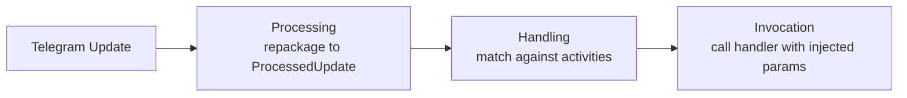
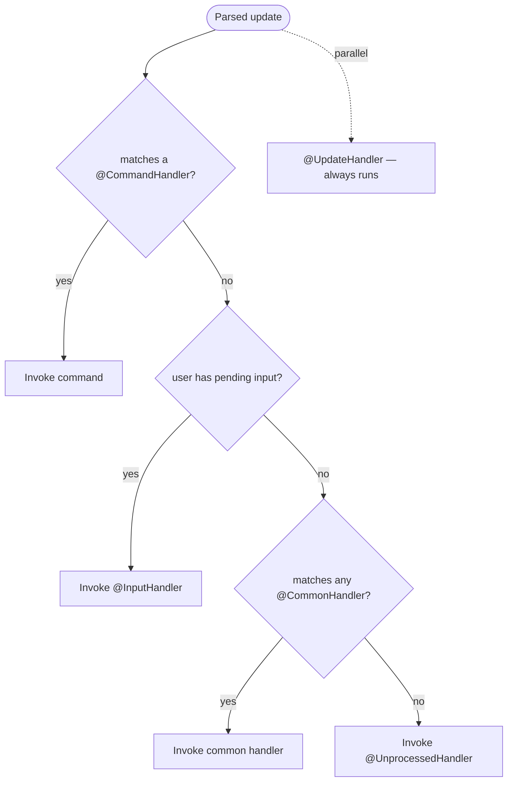
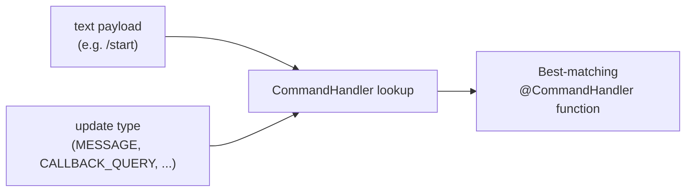
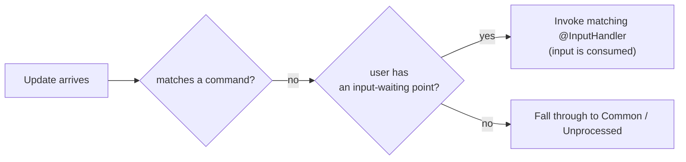

---
---
title: Home
---

### Intro
Vamos ter uma ideia de como a biblioteca lida com atualizações em geral:

Depois de receber uma atualização, a biblioteca executa três etapas principais, como podemos ver.

### Processing

Processing é reempacotar a atualização recebida na subclasse apropriada de [`ProcessedUpdate`](https://vendelieu.github.io/telegram-bot/telegram-bot/eu.vendeli.tgbot.types.component/-processed-update/index.html) dependendo da carga útil transportada.

Essa etapa é necessária para facilitar a operação da atualização e ampliar as capacidades de processamento.

### Handling

A seguir vem a etapa principal, aqui chegamos ao próprio tratamento.

### Global RateLimiter

Se houver um usuário na atualização, verificamos se o limitador de taxa global foi excedido.

### Parse text

Em seguida, dependendo da carga útil, pegamos um componente de atualização que contém texto e o analisamos de acordo com a configuração.

Mais detalhes podem ser vistos no [artigo de parsing de atualização](Update-parsing.md).

### Find Activity

Em seguida, de acordo com a prioridade de processamento:

Estamos procurando uma correspondência entre os dados analisados e as atividades que estamos operando.
Como podemos ver no diagrama de prioridade, `Commands` sempre vêm primeiro.

Ou seja, se a carga de texto na atualização corresponder a algum comando, a busca posterior por `Inputs`, `Common` e, claro, a execução da ação `Unprocessed` não será realizada.

A única exceção é que os `UpdateHandlers` serão acionados em paralelo independentemente.

#### Commands

Vamos analisar mais de perto os comandos e seu processamento.

Como você deve ter notado, embora a anotação para processar comandos se chame [`CommandHandler`](https://vendelieu.github.io/telegram-bot/telegram-bot/eu.vendeli.tgbot.annotations/-command-handler/index.html), ela é mais versátil que o conceito clássico em Telegram Bots.

##### Scopes

Isso ocorre porque ela possui um leque maior de possibilidades de processamento, ou seja, a função alvo pode ser definida não apenas dependendo da correspondência de texto, mas também do tipo de atualização adequado, esse é o conceito de scopes.

Consequentemente, cada comando pode ter diferentes handlers para diferentes listas de scopes, ou vice‑versa, um comando para vários.

Abaixo você pode ver como o mapeamento por carga de texto e scope é feito:

  

#### Inputs

Em seguida, se a carga de texto não corresponder a nenhum comando, os pontos de entrada são pesquisados.

O conceito é muito similar ao aguardo de entrada em aplicações de linha de comando, você coloca no contexto do bot para um usuário específico um ponto que tratará sua próxima entrada, não importa o que contenha, o importante é que a próxima atualização tenha um `User` para poder relacioná‑la ao ponto de espera de entrada definido.

Abaixo você pode ver um exemplo de processamento de uma atualização quando não há correspondência em `Commands`.

#### Commons

Se o handler não encontrar `commands` nem `inputs`, ele verifica a carga de texto contra handlers `common`.

Recomendamos usar isso com moderação, já que ele faz iteração sobre todas as entradas.

#### Unprocessed

E a etapa final, se o handler não encontrar nenhuma atividade correspondente ([`UpdateHandler`](https://vendelieu.github.io/telegram-bot/telegram-bot/eu.vendeli.tgbot.annotations/-update-handler/index.html) funciona completamente em paralelo e não conta como atividade usual), então o [`UnprocessedHandler`](https://vendelieu.github.io/telegram-bot/telegram-bot/eu.vendeli.tgbot.annotations/-unprocessed-handler/index.html) entra em ação; se ele estiver configurado, tratará esse caso, podendo ser útil avisar o usuário que algo deu errado.

Leia mais detalhes no [artigo Handlers](Handlers.md).

### Activity RateLimiter

Após encontrar uma atividade, também são verificados os limites de taxa do usuário nela, de acordo com os parâmetros especificados nos parâmetros da atividade.

### Activity

Activity refere‑se aos diferentes tipos de handlers que a biblioteca de bot do Telegram pode manipular, incluindo Commands, Inputs, Regexes e o handler Unprocessed.

### Invocation

A etapa final de processamento é a invocação da atividade encontrada.

Mais detalhes podem ser encontrados no [artigo de invocação](Activity-invocation.md).

### See also

* [Update parsing](Update-parsing.md)
* [Activity invocation](Activity-invocation.md)
* [Handlers](Handlers.md)
* [Sessions](Sessions.md)
* [Bot configuration](Bot-configuration.md)
* [Web starters (Spring, Ktor)](Web-starters-(Spring-and-Ktor.md))
---