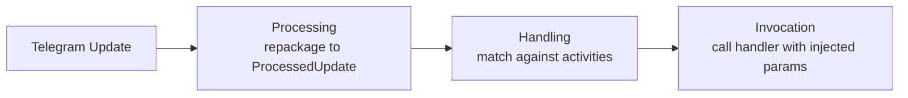
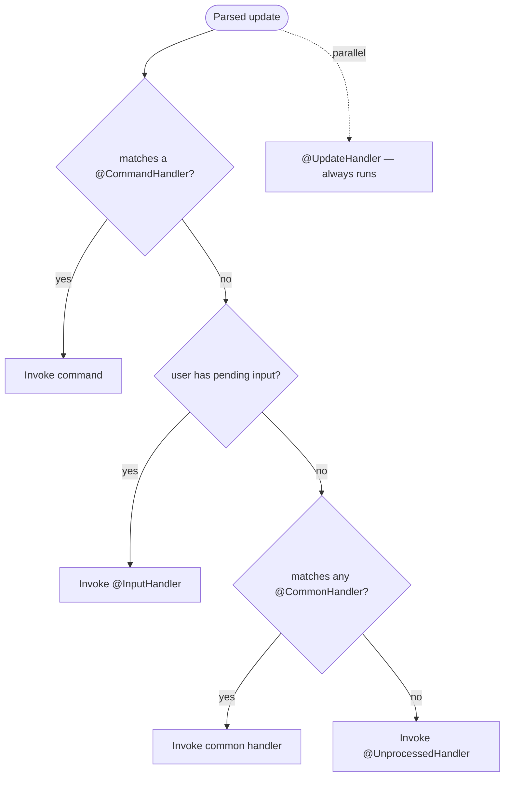
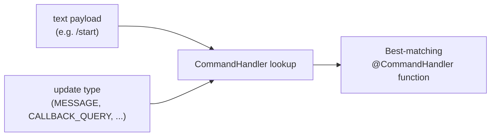
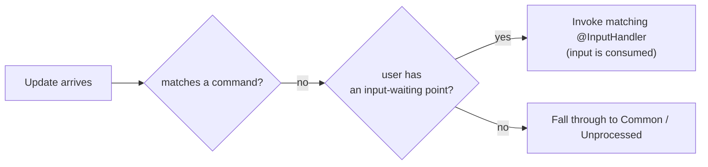

---
---
title: Home
---

### Intro
Давайте получим представление о том, как библиотека в целом обрабатывает обновления:

После получения обновления библиотека выполняет три основных шага, как мы видим.

### Processing

Processing — это переупаковка полученного обновления в соответствующий подкласс [`ProcessedUpdate`](https://vendelieu.github.io/telegram-bot/telegram-bot/eu.vendeli.tgbot.types.component/-processed-update/index.html) в зависимости от передаваемой полезной нагрузки.

Этот шаг необходим, чтобы упростить работу с обновлением и расширить возможности обработки.

### Handling

Далее следует основной шаг — непосредственно обработка.

### Global RateLimiter

Если в обновлении присутствует пользователь, мы проверяем превышение глобального ограничителя скорости.

### Parse text

Затем, в зависимости от полезной нагрузки, мы берём конкретный компонент обновления, содержащий текст, и разбираем его согласно конфигурации.

Более подробно см. в статье [update parsing article](Update-parsing.md).

### Find Activity

Далее, согласно приоритету обработки:

Мы ищем соответствие между разобранными данными и действиями, которые обрабатываем.
Как видно из диаграммы приоритетов, `Commands` всегда идут первыми.

То есть, если текстовая нагрузка в обновлении соответствует какой‑нибудь команде, дальнейший поиск `Inputs`, `Common` и, конечно, выполнение действия `Unprocessed` не будет выполнено.

Единственное, что `UpdateHandlers` будет запущен параллельно независимо от этого.

#### Commands

Давайте более детально рассмотрим команды и их обработку.

Как вы могли заметить, хотя аннотация для обработки команд называется [`CommandHandler`](https://vendelieu.github.io/telegram-bot/telegram-bot/eu.vendeli.tgbot.annotations/-command-handler/index.html), она более универсальна, чем классическое понятие в Telegram‑ботах.

##### Scopes

Это связано с более широким набором возможностей обработки, т.е. целевая функция может определяться не только по совпадению текста, но и по типу подходящего обновления — это и есть концепция областей (scopes).

Соответственно, каждая команда может иметь разные обработчики для разных списков областей, или наоборот, одна команда может обслуживать несколько областей.

Ниже показано, как происходит сопоставление по текстовой нагрузке и области:

  

#### Inputs

Далее, если текстовая нагрузка не совпадает с любой командой, ищутся точки ввода.

Концепция схожа с ожиданием ввода в командных приложениях: вы помещаете в контекст бота для конкретного пользователя точку, которая будет обрабатывать его следующий ввод, не важно, что он содержит, главное, чтобы следующее обновление имело `User`, позволяющий связать его с установленной точкой ожидания ввода.

Ниже пример обработки обновления, когда нет совпадения по `Commands`.

#### Commons

Если обработчик не находит `commands` или `inputs`, он проверяет текстовую нагрузку против `common`‑обработчиков.

Мы советуем использовать это без злоупотреблений, поскольку происходит итерация по всем записям.

#### Unprocessed

И окончательный шаг: если обработчик не нашёл ни одного подходящего действия ([`UpdateHandler`](https://vendelieu.github.io/telegram-bot/telegram-bot/eu.vendeli.tgbot.annotations/-update-handler/index.html) работает полностью параллельно и не считается обычным действием), то вступает в действие [`UnprocessedHandler`](https://vendelieu.github.io/telegram-bot/telegram-bot/eu.vendeli.tgbot.annotations/-unprocessed-handler/index.html); если он установлен, он обработает этот случай, что может быть полезно для предупреждения пользователя о том, что что‑то пошло не так.

Более подробно — в статье [Handlers article](Handlers.md).

### Activity RateLimiter

После нахождения действия также проверяются ограничения скорости пользователя для него, согласно параметрам, указанным в параметрах действия.

### Activity

Activity относится к различным типам обработчиков, которые может обрабатывать библиотека telegram‑bot, включая Commands, Inputs, Regexes и Unprocessed‑handler.

### Invocation

Последний шаг обработки — вызов найденного действия.

Подробнее см. в статье [invocation article](Activity-invocation.md).

### See also

* [Update parsing](Update-parsing.md)
* [Activity invocation](Activity-invocation.md)
* [Handlers](Handlers.md)
* [Sessions](Sessions.md)
* [Bot configuration](Bot-configuration.md)
* [Web starters (Spring, Ktor)](Web-starters-(Spring-and-Ktor.md)
---