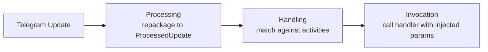
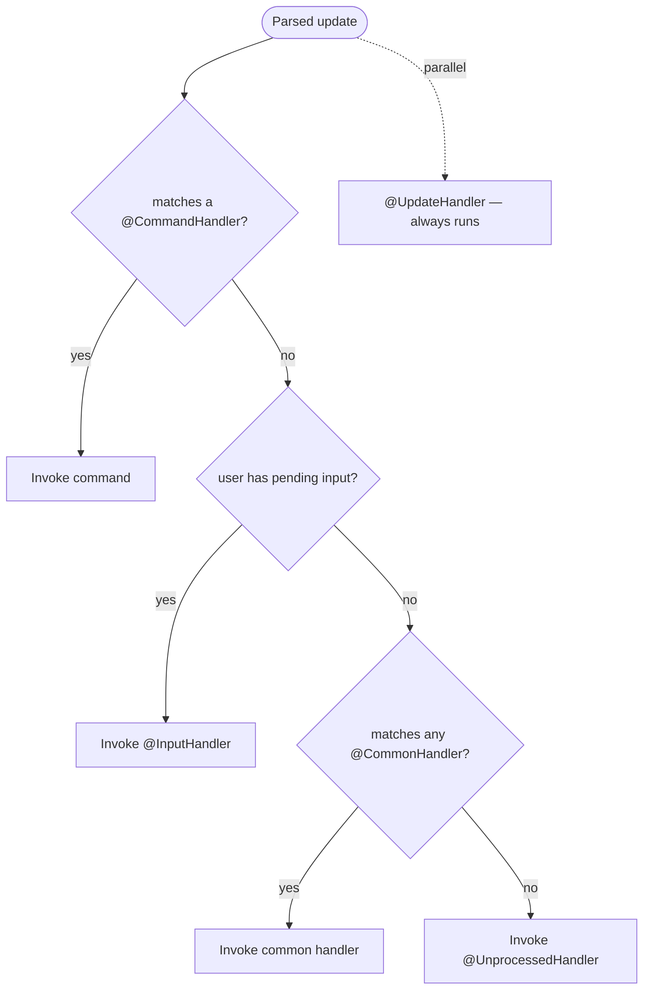
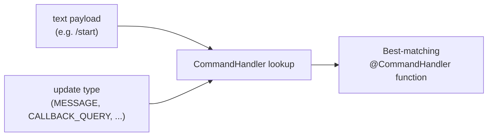
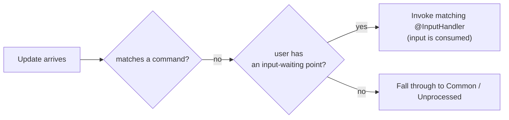

---
---
title: Home
---

### Intro
Hãy nắm bắt cách thư viện xử lý các cập nhật nói chung:

Sau khi nhận được một cập nhật, thư viện thực hiện ba bước chính, như chúng ta có thể thấy.

### Processing

Processing là việc đóng gói lại cập nhật nhận được thành lớp con thích hợp của [`ProcessedUpdate`](https://vendelieu.github.io/telegram-bot/telegram-bot/eu.vendeli.tgbot.types.component/-processed-update/index.html) tùy thuộc vào tải trọng được mang theo.

Bước này cần thiết để việc thao tác với cập nhật trở nên dễ dàng hơn và để mở rộng khả năng xử lý.

### Handling

Tiếp theo là bước chính, ở đây chúng ta thực hiện việc xử lý thực tế.

### Global RateLimiter

Nếu có người dùng trong cập nhật, chúng ta sẽ kiểm tra việc vượt quá giới hạn tốc độ toàn cục.

### Parse text

Tiếp theo, tùy thuộc vào tải trọng, chúng ta lấy một thành phần cập nhật chứa văn bản và phân tích nó theo cấu hình.

Bạn có thể xem chi tiết hơn trong [bài viết phân tích cập nhật](Update-parsing.md).

### Find Activity

Tiếp theo, theo mức độ ưu tiên xử lý:

Chúng ta đang tìm kiếm sự tương đồng giữa dữ liệu đã phân tích và các hoạt động chúng ta đang thực thi.
Như chúng ta thấy trong sơ đồ ưu tiên, `Commands` luôn đứng đầu.

Nghĩa là nếu nội dung văn bản trong cập nhật khớp với bất kỳ lệnh nào, việc tìm kiếm tiếp theo cho `Inputs`, `Common` và tất nhiên việc thực thi hành động `Unprocessed` sẽ không được thực hiện.

Điều duy nhất là nếu có `UpdateHandlers` sẽ được kích hoạt song song bất kể.

#### Commands

Hãy nhìn kỹ hơn vào các lệnh và quá trình xử lý của chúng.

Như bạn có thể đã nhận thấy, mặc dù chú thích để xử lý lệnh được gọi là [`CommandHandler`](https://vendelieu.github.io/telegram-bot/telegram-bot/eu.vendeli.tgbot.annotations/-command-handler/index.html), nó linh hoạt hơn so với khái niệm cổ điển trong Telegram Bots.

##### Scopes

Điều này là vì nó có phạm vi xử lý rộng hơn, tức là hàm mục tiêu có thể được xác định không chỉ dựa trên sự khớp văn bản, mà còn dựa trên loại cập nhật phù hợp, đây là khái niệm về scopes.

Do đó, mỗi lệnh có thể có các handler khác nhau cho một danh sách scopes khác nhau, hoặc ngược lại, một lệnh có thể áp dụng cho nhiều scopes.

Dưới đây là cách ánh xạ theo tải trọng văn bản và scope được thực hiện:

  

#### Inputs

Tiếp theo, nếu tải trọng văn bản không khớp với bất kỳ lệnh nào, các điểm nhập sẽ được tìm kiếm.

Khái niệm này rất giống với việc chờ nhập trong các ứng dụng dòng lệnh, bạn đặt trong ngữ cảnh bot cho một người dùng cụ thể một điểm sẽ xử lý nhập tiếp theo của họ, không quan trọng nội dung là gì, điều quan trọng là cập nhật tiếp theo có một `User` để có thể liên kết với điểm chờ nhập đã đặt.

Dưới đây là một ví dụ về xử lý một cập nhật khi không có khớp với `Commands`.

#### Commons

Nếu handler không tìm thấy `commands` hoặc `inputs`, nó sẽ kiểm tra tải trọng văn bản với các handler `common`.

Chúng tôi khuyên bạn nên sử dụng một cách hợp lý, vì nó sẽ lặp qua tất cả các mục nhập.

#### Unprocessed

Và bước cuối cùng, nếu handler không tìm thấy bất kỳ hoạt động nào phù hợp ([`UpdateHandler`](https://vendelieu.github.io/telegram-bot/telegram-bot/eu.vendeli.tgbot.annotations/-update-handler/index.html) hoạt động hoàn toàn song song và không được tính như hoạt động thường), thì [`UnprocessedHandler`](https://vendelieu.github.io/telegram-bot/telegram-bot/eu.vendeli.tgbot.annotations/-unprocessed-handler/index.html) sẽ được kích hoạt, nếu được thiết lập, nó sẽ xử lý trường hợp này, có thể hữu ích để cảnh báo người dùng rằng đã có điều gì đó sai lệch.

Đọc chi tiết hơn trong [bài viết Handlers](Handlers.md).

### Activity RateLimiter

Sau khi tìm thấy một hoạt động, nó cũng sẽ kiểm tra giới hạn tốc độ của người dùng đối với hoạt động đó, theo các tham số được chỉ định trong tham số hoạt động.

### Activity

Activity đề cập đến các loại handler khác nhau mà thư viện bot telegram có thể xử lý, bao gồm Commands, Inputs, Regexes và Unprocessed handler.

### Invocation

Bước xử lý cuối cùng là việc gọi hoạt động đã tìm thấy.

Bạn có thể tìm thêm chi tiết trong [bài viết invocation](Activity-invocation.md).

### See also

* [Update parsing](Update-parsing.md)
* [Activity invocation](Activity-invocation.md)
* [Handlers](Handlers.md)
* [Sessions](Sessions.md)
* [Bot configuration](Bot-configuration.md)
* [Web starters (Spring, Ktor)](Web-starters-(Spring-and-Ktor.md)
---