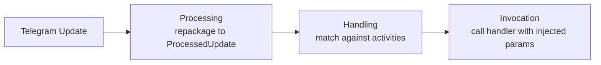
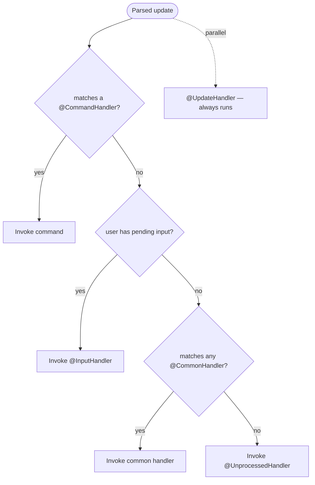
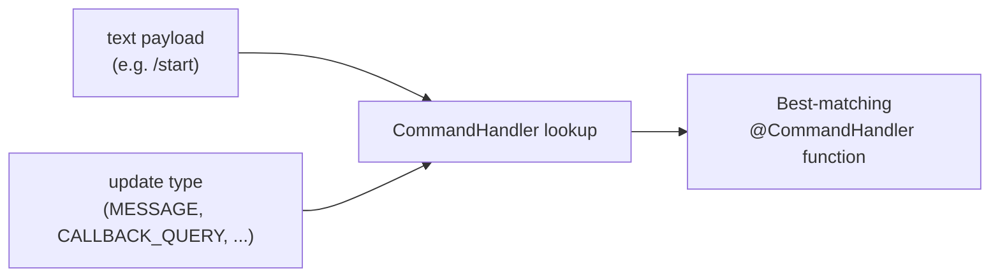
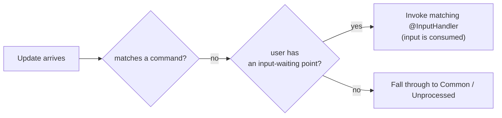

---
---
title: Home
---

### Intro
让我们了解一下库在一般情况下如何处理更新：

在接收到更新后，库会执行三个主要步骤，正如我们所见。

### Processing

Processing 是将接收到的更新重新封装成适当的 [`ProcessedUpdate`](https://vendelieu.github.io/telegram-bot/telegram-bot/eu.vendeli.tgbot.types.component/-processed-update/index.html) 子类，具体取决于所携带的负载。

此步骤有助于更方便地操作更新并扩展处理能力。

### Handling

接下来是主要步骤，即处理本身。

### Global RateLimiter

如果更新中包含用户，我们会检查是否超过全局速率限制器。

### Parse text

随后，根据负载，我们获取包含文本的特定更新组件并根据配置进行解析。

更详细的内容请参见 [update parsing article](Update-parsing.md)。

### Find Activity

接下来，按照处理优先级：

我们在寻找解析数据与我们正在操作的活动之间的对应关系。
正如在优先级图中所示，`Commands` 始终优先。

也就是说，如果更新中的文本负载对应任何命令，则不会再搜索 `Inputs`、`Common`，当然也不会执行 `Unprocessed` 操作。

唯一需要注意的是，`UpdateHandlers` 会并行触发，且不受此影响。

#### Commands

让我们更仔细地查看命令及其处理过程。

正如你可能已经注意到的，尽管用于处理命令的注解叫做 [`CommandHandler`](https://vendelieu.github.io/telegram-bot/telegram-bot/eu.vendeli.tgbot.annotations/-command-handler/index.html)，但它比 Telegram Bot 中的经典概念更具多样性。

##### Scopes

这是因为它具有更广泛的处理可能性，即目标函数不仅可以根据文本匹配来定义，还可以根据合适的更新类型来定义，这就是作用域的概念。

因此，每个命令可以针对不同的作用域列表拥有不同的处理器，或者相反，一个命令可以对应多个作用域。

下面展示了如何通过文本负载和作用域进行映射：

  

#### Inputs

接下来，如果文本负载未匹配到任何命令，则会搜索输入点。

其概念非常类似于命令行应用中的输入等待，你为特定用户在 bot 上下文中设置一个点来处理其下一次输入，内容是什么并不重要，关键是下一条更新必须包含 `User`，以便将其关联到已设置的输入等待点。

下面展示了在没有匹配到 `Commands` 时处理更新的示例：

#### Commons

如果处理器既未找到 `commands` 也未找到 `inputs`，它会将文本负载与 `common` 处理器进行匹配。

我们建议适度使用，因为它会遍历所有条目。

#### Unprocessed

最后一步，如果处理器未找到任何匹配的活动（[`UpdateHandler`](https://vendelieu.github.io/telegram-bot/telegram-bot/eu.vendeli.tgbot.annotations/-update-handler/index.html) 完全并行运行且不计入常规活动），则会启动 [`UnprocessedHandler`](https://vendelieu.github.io/telegram-bot/telegram-bot/eu.vendeli.tgbot.annotations/-unprocessed-handler/index.html)。如果已设置，它将处理此情况，可用于提醒用户出现了错误。

更详细的阅读请参见 [Handlers article](Handlers.md)。

### Activity RateLimiter

在找到活动后，它还会检查用户对该活动的速率限制，依据活动参数中指定的参数进行检查。

### Activity

Activity 指的是 telegram bot 库能够处理的不同类型的处理器，包括 Commands、Inputs、Regexes 和 Unprocessed handler。

### Invocation

最后的处理步骤是调用已找到的活动。

更多细节请参见 [invocation article](Activity-invocation.md)。

### See also

* [Update parsing](Update-parsing.md)
* [Activity invocation](Activity-invocation.md)
* [Handlers](Handlers.md)
* [Sessions](Sessions.md)
* [Bot configuration](Bot-configuration.md)
* [Web starters (Spring, Ktor)](Web-starters-(Spring-and-Ktor.md)
---